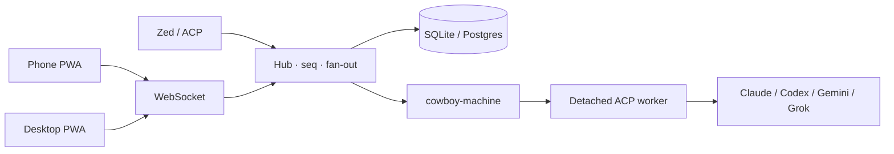

<p align="center">
  
</p>

<h1 align="center">Cowboy</h1>

<p align="center">
  <strong>Drive Claude Code, Codex, Gemini, and Grok from your phone or desktop.</strong><br>
  One control plane. One live session. Close the tab — the agent keeps working.
</p>

<p align="center">
  
  
  
</p>

## Product tour

<p align="center">
  
</p>

<p align="center"><sub>Desktop · the full control plane, with a live transcript, tool states, tables, and code blocks in one view.</sub></p>

<div style="overflow-x:auto; padding: 4px 0 16px;">
  <table>
    <tr>
      <td align="center" valign="top">
        <br>
        <sub><b>Agent</b><br>tool calls + composer</sub>
      </td>
      <td align="center" valign="top">
        <br>
        <sub><b>Code</b><br>syntax + LSP symbols</sub>
      </td>
      <td align="center" valign="top">
        <br>
        <sub><b>Worktree</b><br>files + Git context</sub>
      </td>
      <td align="center" valign="top">
        <br>
        <sub><b>Sessions</b><br>switch agents anywhere</sub>
      </td>
    </tr>
  </table>
</div>

<p align="center"><sub>Light theme shown. On narrow screens, the feature strip stays one row and can be swiped horizontally; each view also reads well on its own.</sub></p>

## Why Cowboy exists

Coding agents are powerful CLIs. They are not a UI. Cowboy is the missing control plane:

- **Don't shrink the agent.** [ACP](https://agentclientprotocol.com) is the transport. Anything the protocol cannot model still rides through as an opaque update. Cowboy is a conduit, not a reduced reimplementation.
- **One shared timeline.** Phone, laptop, and ACP clients subscribe to the same Hub. Approving a permission on one device clears it everywhere.
- **Detached workers.** Each session is a Machine-hosted ACP worker. Close the browser. The turn continues.

Desktop and Mobile are separate products on the same protocol: keyboard-first density on a large screen, touch-first focus on a phone. They are not a squeezed layout of each other.

## What you get

| Surface | What it is |
| --- | --- |
| **Agent** | Live transcript, thinking, tools, plans, permissions, queue, and a CodeMirror composer (including Vim). |
| **Code** | Mobile-first review: worktree, Git changes, file view, syntax highlighting, LSP diagnostics, and symbol navigation. Long source lines remain horizontally scrollable, so a tree fetch never blocks a turn. |
| **Sessions** | Create, rename, reorder, pause, resume. Codex, Claude Code, Gemini, Grok — side by side. |
| **Machines** | Agents run on hosts you enroll. The controller is not the worker. |

Providers are independently versioned packages (`providers/*/provider.json`), not hardcoded adapters in the UI.

## Quick start

```sh
nix develop          # pinned Rust 1.97 + Deno + just
just build           # web bundle + release binaries
./target/release/cowboy serve \
  --database-url sqlite:///tmp/cowboy.sqlite3
```

Open `http://127.0.0.1:3333`. Point a Machine at the controller so sessions can actually spawn agents — see [machine operations](docs/machine-operations.md).

```sh
just check           # fmt, clippy, tsc, tests, release build
```

SQLite is the zero-ops local store. PostgreSQL speaks the same `Store` API (`--database-url postgresql://…`). Omit the URL and the daemon runs in-memory.

## How it is put together



The **Hub** (`src/core.rs`) is the only writer of `seq`. Live clients receive compact deltas; durable history is canonicalized and large images become `/api/artifacts/…` before they clone across the persist queue and WebSocket fan-out.

Rolling updates keep workers alive across controller restarts: [architecture/12-rolling-updates.md](docs/architecture/12-rolling-updates.md).

## Documentation

| Start here | |
| --- | --- |
| [Architecture overview](docs/architecture/00-overview.md) | Topology, Hub, workers |
| [Requirements](docs/requirements.md) | Provider packages, auth, uninstall |
| [Code review](docs/architecture/13-code-review.md) | Worktree / Git data plane |
| [Multi-machine](docs/architecture/15-multi-machine.md) | Enrollment and placement |
| [Operations](docs/architecture/11-operations.md) | Runbooks |
| [Index](docs/INDEX.md) | Everything else |

## Status

Working multi-agent panel. Persistence, resume, history pagination, queue/draft sync, Code review, and Machine enrollment are in tree. The web UI is a separately switched immutable bundle, so a frontend-only rollout does not recycle agents.

## License

[MIT](LICENSE)
