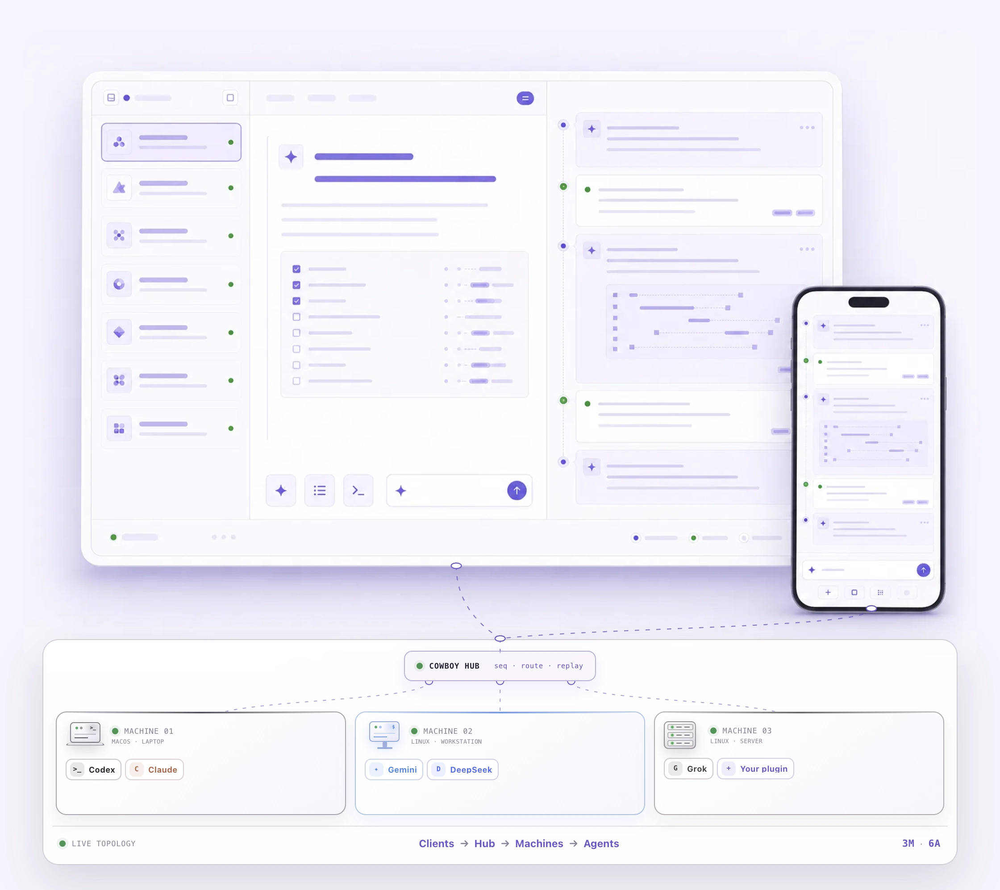
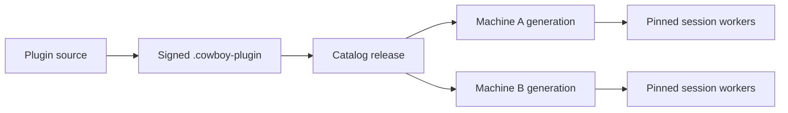

<p align="center">
  <a href="https://dravengarden.github.io/cowboy/">
    <picture>
      <source media="(prefers-color-scheme: dark)" srcset="site/assets/cowboy-readme-mark-dark-v2.png">
      
    </picture>
  </a>
</p>

<h1 align="center">Cowboy</h1>

<p align="center">
  <strong>The self-hosted remote Agent IDE.</strong><br>
  Direct coding agents across every machine you control from one live desktop or mobile workspace.
</p>

<p align="center">
  <a href="https://dravengarden.github.io/cowboy/">
    
  </a>
  <a href="https://github.com/dravengarden/cowboy/actions/workflows/website.yml">
    
  </a>
  <a href="LICENSE">
    
  </a>
  
  <a href="https://agentclientprotocol.com/">
    
  </a>
</p>

<p align="center">
  <a href="https://dravengarden.github.io/cowboy/"><strong>Website</strong></a>
  · <a href="#quick-start">Quick start</a>
  · <a href="#plugin-ecosystem">Plugins</a>
  · <a href="#architecture">Architecture</a>
  · <a href="docs/INDEX.md">Documentation</a>
</p>

<p align="center">
  <a href="https://dravengarden.github.io/cowboy/">
    
  </a>
</p>

<p align="center"><sub>One self-hosted control plane. Many Machines. Every Agent stays on the infrastructure you choose.</sub></p>

## What Cowboy is

Cowboy is a self-hosted control plane for long-running coding agents. A Cowboy
Hub coordinates durable sessions while each enrolled Machine owns its workspace,
agent process, and execution lifetime. Close the browser, move from desktop to
phone, or reconnect later—the worker keeps running on its Machine.

Cowboy is an IDE for agent work, not a generic chat wrapper:

| Principle                      | What it means                                                                                               |
| ------------------------------ | ----------------------------------------------------------------------------------------------------------- |
| **One surface, many Machines** | Enroll Linux and macOS hosts, place sessions remotely, and switch without juggling IDEs or SSH tabs.        |
| **Agent-native visibility**    | Plans, thinking, tools, permissions, code, diffs, queues, and runtime state remain visible in one timeline. |
| **Durable remote work**        | Machine-owned workers survive browser disconnects and Controller restarts, then replay state on reconnect.  |
| **Purpose-built clients**      | Desktop is dense and keyboard/Vim-first; Mobile is touch-first and progressively disclosed.                 |
| **Plugin ecosystem**           | Agent Providers and code intelligence ship as independently versioned, signed, Machine-scoped Plugins.      |
| **Always yours**               | Run the Hub, storage, Machines, credentials, and release policy on infrastructure you control.              |

> [!NOTE]
> Cowboy is in active, pre-stable development. There are no published stable
> binaries yet; build from source and expect interfaces to evolve before 1.0.

## Quick start

### Prerequisites

- [Nix](https://nixos.org/download/) with flakes enabled
- Linux or macOS
- Git

Clone Cowboy, enter the pinned development environment, install the
checkout-local frontend dependencies, and build the release:

```sh
git clone https://github.com/dravengarden/cowboy.git
cd cowboy
nix develop
just install
just build
```

Start a local self-hosted Hub with SQLite persistence:

```sh
./target/release/cowboy serve \
  --database-url sqlite:///tmp/cowboy.sqlite3
```

Open <http://127.0.0.1:3333>. Product login is off by default for local
development. SQLite is the zero-operations store; PostgreSQL implements the same
Store API for larger deployments.

To attach another Linux or macOS computer, build the target-platform bootstrap
with <code>just build-machine-bootstrap</code> and keep the resulting
<code>cowboy</code>, <code>cowboy-machine</code>, and
<code>cowboy-machine-install</code> commands together. Create a one-time
enrollment code in Cowboy, then run the generated command on that Machine:

```sh
cowboy register https://cowboy.example --background
```

The token is entered through a masked prompt and never needs to appear in shell
history. See [Machine operations](docs/machine-operations.md) for installation,
identity verification, background services, and multi-Service isolation.

## Product surfaces

<table>
  <tr>
    <td width="64%" align="center">
      
    </td>
    <td width="36%" align="center">
      
    </td>
  </tr>
  <tr>
    <td valign="top">
      <strong>Desktop</strong><br>
      Dense session navigation, split workspaces, visible tool output, and
      keyboard/Vim control for sustained engineering work.
    </td>
    <td valign="top">
      <strong>Mobile</strong><br>
      Touch-first session control, Agent follow-up, and code review that
      reconnect to the same durable worker.
    </td>
  </tr>
</table>

The shared domain model does not force both clients into one compromised
responsive UI. Each surface is optimized for its input model while observing the
same authoritative session state.

## Architecture

<p align="center">
  
</p>

1. Desktop and Mobile connect to the Hub over HTTP and WebSocket.
2. The Hub owns durable ordering, persistence, routing, and client fan-out.
3. Each outbound-only Machine connection owns isolated worktrees and detached
   workers for the sessions placed there.
4. Workers speak [ACP](https://agentclientprotocol.com/) to the exact Provider
   generation selected for that session.
5. Reconnect and rolling-update paths use fencing, snapshots, replay, and
   idempotent commands rather than silently moving an active worker.

Read the [architecture overview](docs/architecture/00-overview.md) for the
component map and end-to-end request flow.

## Plugin ecosystem

A **Plugin** is Cowboy's only discoverable, installable, upgradable, rollback,
and uninstall unit. Installation is scoped to a Machine; publishing a release
does not silently activate it anywhere.

| Kind              | First-party Plugins                                                   |
| ----------------- | --------------------------------------------------------------------- |
| Agent Provider    | Codex, Claude Code, Gemini, Grok, Codex + DeepSeek, Claude + DeepSeek |
| Code intelligence | Zed                                                                   |

The platform keeps the extension boundary explicit:

- releases are immutable, signed, and bound to exact platform artifacts;
- each Machine stages and probes a generation before activation;
- incompatible packages fail closed before replacing the active generation;
- Provider UI is typed, data-only IR rendered by Cowboy—Plugins do not inject
  arbitrary JavaScript, HTML, CSS, or DOM access;
- old and new generations can drain concurrently, so a running session does not
  silently adopt new runtime bytes.



Start with [Installable Plugin packages](docs/plugin-packages.md), then read
[Plugins and shared components](docs/plugin-components.md) and the normative
[core requirements](docs/requirements.md).

## Safety and ownership

Cowboy is designed around local ownership and explicit trust boundaries:

- the Hub and SQLite/PostgreSQL data are self-hosted;
- remote Machines initiate authenticated outbound WebSocket connections;
- an Ed25519 private key stays on its Machine;
- enrollment codes are single-use, expire after 15 minutes, and are stored by
  digest only;
- Provider credentials are Service-scoped and projected only to compatible,
  installed Machine generations;
- package, schema, signature, digest, and platform mismatches fail closed;
- typed Plugin UI cannot access ambient DOM, filesystem, process, network,
  credential, clock, or randomness capabilities.

The detailed contracts live in [core requirements](docs/requirements.md) and
[operations](docs/architecture/11-operations.md).

## Repository map

| Path                               | Responsibility                                                         |
| ---------------------------------- | ---------------------------------------------------------------------- |
| <code>src/</code>                  | Rust Hub, API, persistence, Machine routing, workers, and CLI          |
| <code>web/</code>                  | React Desktop, Mobile, Agent, Code, setup, and admin surfaces          |
| <code>plugins/</code>              | First-party Agent Provider and code-intelligence Plugins               |
| <code>components/</code>           | Versioned Plugin, Provider, state, UI, and code-intelligence contracts |
| <code>apps/macos-installer/</code> | Native macOS menu-bar installer and Machine manager                    |
| <code>site/</code>                 | Public product website and privacy-safe artwork                        |
| <code>docs/</code>                 | Architecture, product contracts, deployment, and operations            |

## Development

Run project commands inside the pinned Nix shell:

```sh
nix develop
just install
just check
```

<code>just check</code> runs formatting, Clippy, dependency policy, Rust tests,
Web typechecking/lint/tests, Plugin conformance, site tests, and release builds.
For local HMR, run <code>just dev</code> and <code>just dev-web</code> in
separate terminals.

Keep consolidated SQL baselines immutable after deployment; add a new migration
instead of editing one that has shipped. Significant Provider or architecture
changes must preserve the contracts in
[docs/requirements.md](docs/requirements.md).

## Documentation

| Start here                                                | Covers                                                           |
| --------------------------------------------------------- | ---------------------------------------------------------------- |
| [Documentation index](docs/INDEX.md)                      | Complete architecture and product documentation                  |
| [Architecture overview](docs/architecture/00-overview.md) | Hub, Machines, workers, storage, and clients                     |
| [Machine operations](docs/machine-operations.md)          | Enrollment, identity, services, and Provider installation        |
| [Plugin packages](docs/plugin-packages.md)                | Package, typed UI, runtime, authentication, and release contract |
| [Code review](docs/architecture/13-code-review.md)        | Worktree, Git, file, diff, and language-intelligence data plane  |
| [Build and deploy](docs/architecture/10-deploy-build.md)  | Pinned builds and component-scoped releases                      |

## Contributing

Issues and pull requests are welcome. Read [CONTRIBUTING.md](CONTRIBUTING.md)
for environment setup, project contracts, verification expectations, and the
information to include with a change.

- Use [GitHub Issues](https://github.com/dravengarden/cowboy/issues) for
  reproducible bugs and focused feature proposals.
- Run <code>just check</code> before requesting review.
- Include screenshots for visual changes and regression coverage for behavior
  changes.

## License

Cowboy is available under the [MIT License](LICENSE).
