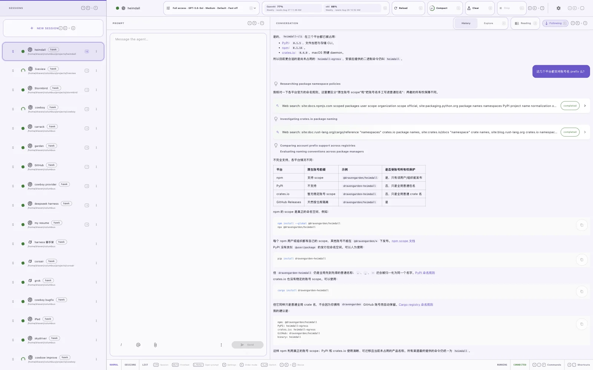
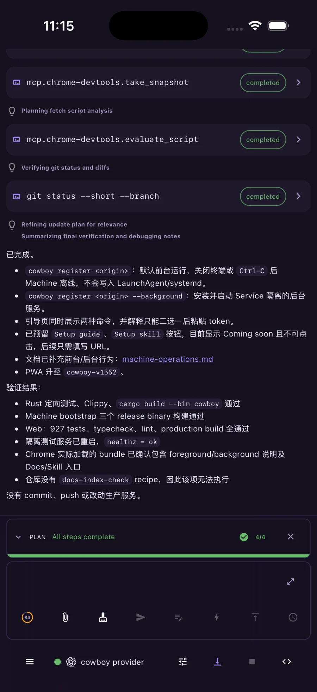
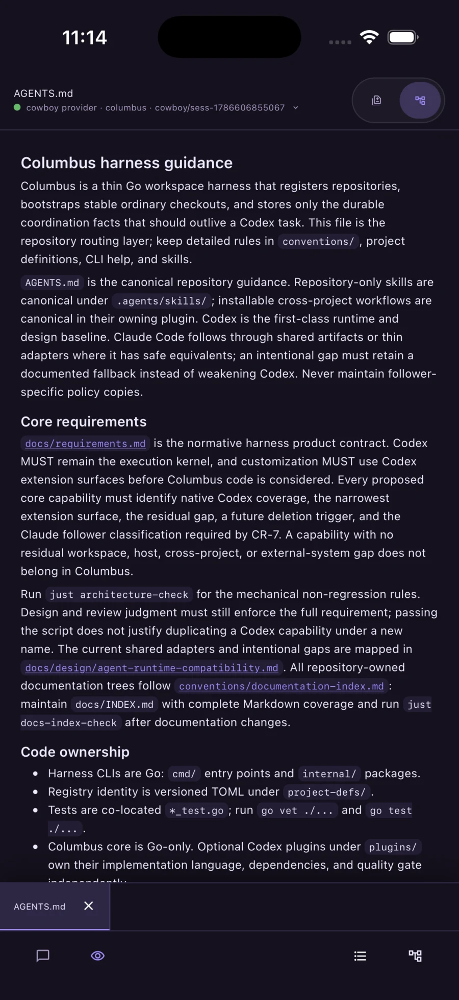
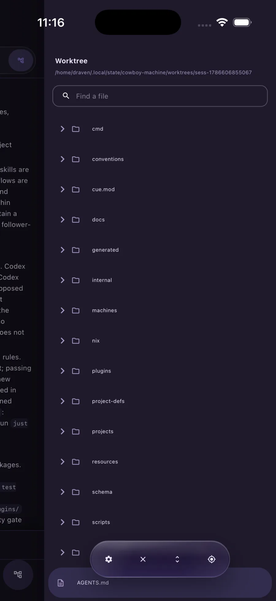
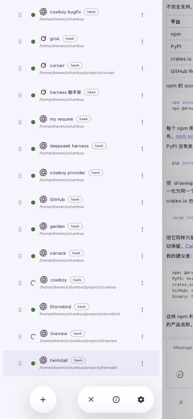
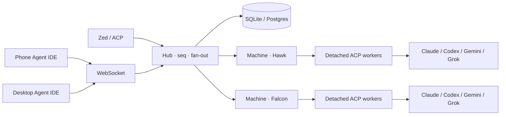

<p align="center">
  
</p>

<h1 align="center">Cowboy</h1>

<p align="center">
  <strong>A remote Agent IDE for controlling multiple machines.</strong><br>
  Run Claude Code, Codex, Gemini, and Grok across your machines from one live workspace.
</p>

<p align="center">
  
  
  
</p>

## Product tour

<p align="center">
  
</p>

<p align="center"><sub>Desktop · the remote IDE for switching machines, directing agents, and watching tools, tables, and code in one view.</sub></p>

<div style="overflow-x:auto; padding: 4px 0 16px;">
  <table>
    <tr>
      <td align="center" valign="top">
        <br>
        <sub><b>Agent</b><br>tool calls + composer</sub>
      </td>
      <td align="center" valign="top">
        <br>
        <sub><b>Code</b><br>syntax + LSP symbols</sub>
      </td>
      <td align="center" valign="top">
        <br>
        <sub><b>Worktree</b><br>files + Git context</sub>
      </td>
      <td align="center" valign="top">
        <br>
        <sub><b>Sessions</b><br>switch agents anywhere</sub>
      </td>
    </tr>
  </table>
</div>

<p align="center"><sub>Light theme shown. On narrow screens, the feature strip stays one row and can be swiped horizontally; each view also reads well on its own.</sub></p>

## The remote Agent IDE

Cowboy gives you one IDE for the agents running across your machines. Connect to a
machine, open its workspace, and keep directing the work from wherever you are:

- **Control many machines.** Enroll remote hosts and switch between their workspaces without changing IDEs or SSH tabs.
- **Keep the whole agent visible.** Follow plans, thinking, tool calls, permissions, code, and diffs in one timeline instead of a terminal stream.
- **Stay connected to the work.** Machine-hosted workers keep running when your browser closes; reconnect later to the same session and state.
- **Use the protocol, not a replica.** [ACP](https://agentclientprotocol.com) carries the agent surface, so Cowboy remains a conduit for Claude Code, Codex, Gemini, Grok, and future Providers.

Desktop and Mobile are two focused shells for the same remote IDE: keyboard-first on a large screen, touch-first on a phone.

## What you get

| Surface | What it is |
| --- | --- |
| **Machines** | Enroll hosts, see their health and capacity, and place work on the right remote machine. |
| **Agent** | Live transcript, thinking, tools, plans, permissions, queue, and a CodeMirror composer (including Vim). |
| **Code** | Review each machine's worktree and Git changes with syntax highlighting, LSP diagnostics, and symbol navigation. Long source lines remain horizontally scrollable. |
| **Sessions** | Create, rename, reorder, pause, resume, and reconnect to agent sessions across machines. |

Providers are independently versioned packages (`providers/*/provider.json`), not hardcoded adapters in the UI.

## Quick start

```sh
nix develop          # pinned Rust 1.97 + Deno + just
just build           # web bundle + release binaries
./target/release/cowboy serve \
  --database-url sqlite:///tmp/cowboy.sqlite3
```

Open `http://127.0.0.1:3333`, enroll one or more Machines, and start directing agents from the IDE — see [machine operations](docs/machine-operations.md).

```sh
just check           # fmt, clippy, tsc, tests, release build
```

SQLite is the zero-ops local store. PostgreSQL speaks the same `Store` API (`--database-url postgresql://…`). Omit the URL and the daemon runs in-memory.

## How it is put together



The **Hub** (`src/core.rs`) is the only writer of `seq`. Live clients receive compact deltas; durable history is canonicalized and large images become `/api/artifacts/…` before they clone across the persist queue and WebSocket fan-out.

Rolling updates keep workers alive across controller restarts: [architecture/12-rolling-updates.md](docs/architecture/12-rolling-updates.md).

## Documentation

| Start here | |
| --- | --- |
| [Architecture overview](docs/architecture/00-overview.md) | Topology, Hub, workers |
| [Requirements](docs/requirements.md) | Provider packages, auth, uninstall |
| [Code review](docs/architecture/13-code-review.md) | Worktree / Git data plane |
| [Multi-machine](docs/architecture/15-multi-machine.md) | Enrollment and placement |
| [Operations](docs/architecture/11-operations.md) | Runbooks |
| [Index](docs/INDEX.md) | Everything else |

## Status

Remote Agent IDE in active development. Persistence, resume, history pagination, queue/draft sync, Code review, multi-machine enrollment, and detached workers are in tree. The web UI is a separately switched immutable bundle, so a frontend-only rollout does not recycle agents.

## License

[MIT](LICENSE)
