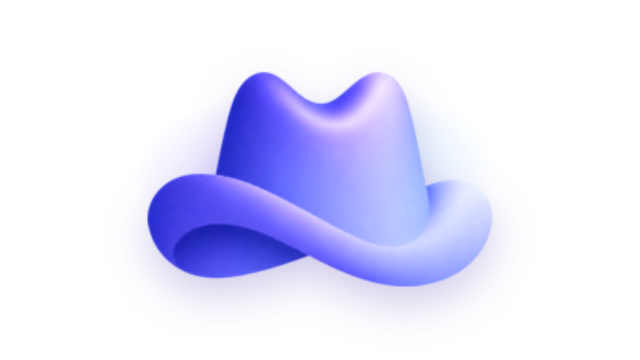
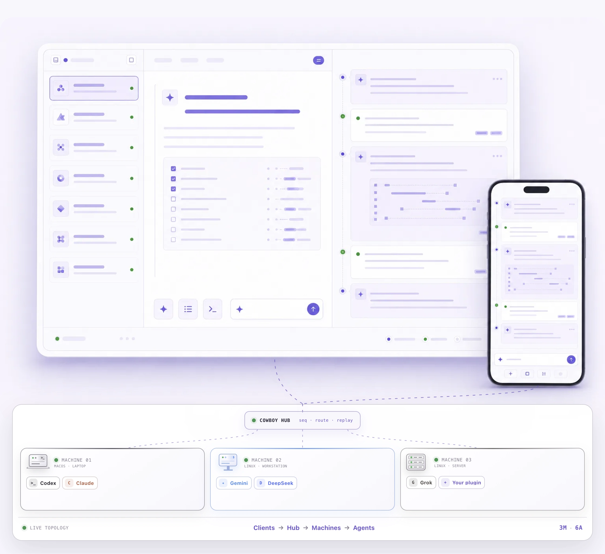
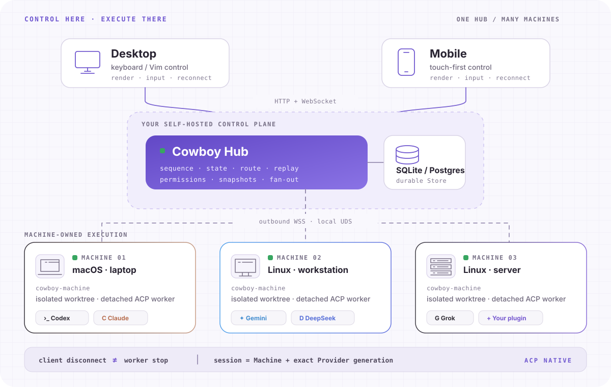
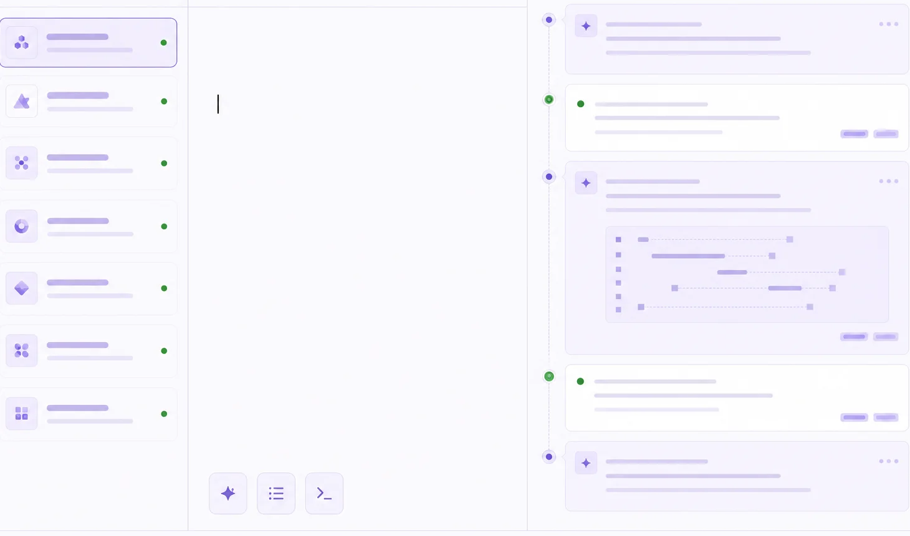
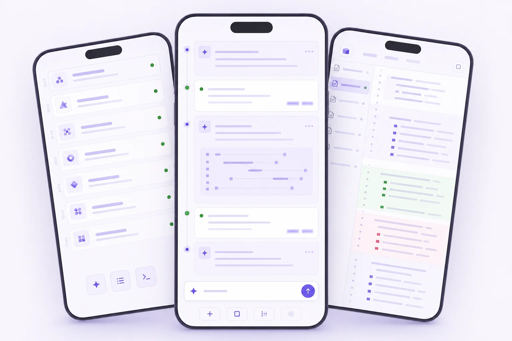

<p align="center">
  <a href="https://dravengarden.github.io/cowboy/">
    <picture>
      <source media="(prefers-color-scheme: dark)" srcset="site/assets/cowboy-readme-mark-dark-v2.png">
      
    </picture>
  </a>
</p>

<h1 align="center">Cowboy</h1>

<p align="center">
  <strong>Run coding agents on your machines. Control them from anywhere.</strong><br>
  A self-hosted remote Agent IDE for durable work across desktop, mobile, and every Machine you control.
</p>

<p align="center">
  <a href="https://dravengarden.github.io/cowboy/">
    
  </a>
  <a href="https://github.com/dravengarden/cowboy/actions/workflows/website.yml">
    
  </a>
  <a href="LICENSE">
    
  </a>
  <a href="https://agentclientprotocol.com/">
    
  </a>
</p>

<p align="center">
  <a href="https://dravengarden.github.io/cowboy/"><strong>Website</strong></a>
  · <a href="#quick-start">Quick start</a>
  · <a href="#architecture">Architecture</a>
  · <a href="#plugin-ecosystem">Plugins</a>
  · <a href="docs/INDEX.md">Documentation</a>
</p>

<p align="center">
  <a href="https://dravengarden.github.io/cowboy/">
    <picture>
      <source media="(prefers-color-scheme: dark)" srcset="site/assets/cowboy-remote-topology-dark-v3.webp">
      
    </picture>
  </a>
</p>

<p align="center"><sub>Clients control. The Hub remembers. Your Machines execute.</sub></p>

Cowboy keeps long-running coding agents close to the work. Self-host one Hub,
enroll Linux and macOS Machines, and direct Codex, Claude Code, Gemini, Grok,
DeepSeek, or your own Plugin from a keyboard-first desktop or touch-first mobile
workspace. Reconnect later without moving the worktree, credentials, or agent
process away from the Machine where it started.

> [!IMPORTANT]
> Cowboy is active, pre-1.0, and source-first. There is no stable binary release
> yet; build from source and expect interfaces to evolve.

## Why Cowboy

- **One Hub, many Machines.** Place sessions on any enrolled host and switch
  between them without changing IDEs or juggling SSH tabs.
- **Workers outlive clients.** Closing a browser or restarting a Controller does
  not stop the detached, Machine-owned ACP worker.
- **Agent work stays legible.** Plans, tool calls, permissions, code, diffs,
  queues, and runtime state remain visible instead of collapsing into chat.
- **Each surface fits its input model.** Desktop is dense and keyboard/Vim-first;
  Mobile is touch-first and progressively disclosed.
- **Plugins are releases, not scripts.** Signed, immutable, Machine-scoped
  generations stage, probe, activate, drain, and roll back explicitly.
- **The control plane is yours.** Run the Hub, database, Machines, credentials,
  and release policy on infrastructure you control—there is no shared Cowboy
  cloud.

## Quick start

### Prerequisites

- [Nix](https://nixos.org/download/) with flakes enabled
- Linux or macOS
- Git

Clone Cowboy, enter its pinned environment, install checkout-local frontend
dependencies, and build a release:

```sh
git clone https://github.com/dravengarden/cowboy.git
cd cowboy
nix develop
just install
just build
```

Start a local Hub with SQLite persistence:

```sh
./target/release/cowboy serve \
  --database-url sqlite:///tmp/cowboy.sqlite3
```

Open <http://127.0.0.1:3333>. Product login is off by default for local
development. SQLite is the zero-operations store; PostgreSQL implements the
same Store API for larger deployments.

To add another Linux or macOS host, build the target-platform bootstrap with
<code>just build-machine-bootstrap</code>. Create a one-time enrollment code in
Cowboy, then run the generated command on that Machine:

```sh
cowboy register https://cowboy.example --background
```

The token is entered through a masked prompt and never needs to appear in shell
history. See [Machine operations](docs/machine-operations.md) for installation,
identity verification, background services, and multi-Service isolation.

## Architecture

<p align="center">
  
</p>

| Boundary              | Owns                                                                 | Does not own                                      |
| --------------------- | -------------------------------------------------------------------- | ------------------------------------------------- |
| **Desktop / Mobile**  | Input, navigation, rendering, and reconnect                           | Worker lifetime or authoritative session state    |
| **Self-hosted Hub**   | Sequence, persistence, routing, permissions, snapshots, and fan-out   | Worktrees, Provider processes, or Machine secrets |
| **Enrolled Machine**  | Identity, worktrees, detached ACP workers, and installed generations  | Global ordering or cross-client presentation      |
| **Plugin generation** | Exact Provider runtime, typed UI, components, and capability contract | Ambient browser or host capabilities              |

Remote Machines initiate authenticated outbound WebSocket connections, so a
development host needs no public inbound listener. A local Machine can use UDS.
Every session records its Machine and exact Provider generation; fencing,
snapshots, replay, and idempotent commands make reconnect and rolling updates
explicit rather than silently moving or replacing active work.

Read the [architecture overview](docs/architecture/00-overview.md) for the
component map and end-to-end request flow.

## Product surfaces

### Desktop — keyboard first

Dense session navigation, split workspaces, visible tool output, and
keyboard/Vim control for sustained engineering work.

<p align="center">
  <picture>
    <source media="(prefers-color-scheme: dark)" srcset="site/assets/cowboy-desktop-surface-dark-v2.webp">
    
  </picture>
</p>

### Mobile — touch first

Touch-first session control, Agent follow-up, and code review reconnect to the
same durable worker.

<p align="center">
  <picture>
    <source media="(prefers-color-scheme: dark)" srcset="site/assets/cowboy-mobile-dark-v2.webp">
    
  </picture>
</p>

Both clients observe the same server-authoritative model without forcing a
desktop IDE into a stretched mobile layout—or a mobile workflow into desktop
chrome.

## Plugin ecosystem

A **Plugin** is Cowboy's only discoverable, installable, upgradable, rollback,
and uninstall unit. Publishing makes an immutable release available; it never
silently installs or activates that release on a Machine.

```text
source → signed .cowboy-plugin → Catalog → stage + probe → atomic activation → pinned sessions
```

| Kind              | First-party Plugins                                                   |
| ----------------- | --------------------------------------------------------------------- |
| Agent Provider    | Codex, Claude Code, Gemini, Grok, Codex + DeepSeek, Claude + DeepSeek |
| Code intelligence | Zed                                                                   |

The extension boundary is deliberately narrow:

- package identity binds the manifest, payload, contract fingerprint, runtime
  artifacts, and publisher signature;
- each Machine stages and probes a complete generation before activation;
- failure leaves the previous generation active, while old and new generations
  can drain side by side;
- sessions stay pinned to their exact Provider and authentication generations;
- Provider UI is typed, data-only IR rendered by Cowboy—Plugins cannot inject
  arbitrary JavaScript, HTML, CSS, or DOM access.

Start with [Installable Plugin packages](docs/plugin-packages.md), then read
[Plugins and shared components](docs/plugin-components.md) and the normative
[core requirements](docs/requirements.md).

## Safety and ownership

| Invariant                       | Cowboy's contract                                                                  |
| ------------------------------- | ---------------------------------------------------------------------------------- |
| **Self-hosted state**           | The Hub and SQLite/PostgreSQL data stay on infrastructure you control.              |
| **Outbound Machine transport**  | Remote Machines dial the Hub; development hosts do not expose a public listener.    |
| **Machine-bound identity**      | The Ed25519 private key remains mode 0600 on its Machine.                            |
| **Bounded enrollment**          | Codes are single-use, expire after 15 minutes, and are stored only by digest.        |
| **Scoped credentials**          | Service credentials reach only compatible, installed Machine generations.           |
| **Fail-closed activation**      | Signature, digest, schema, package, and platform mismatches cannot replace active bytes. |
| **Data-only Plugin UI**         | Plugin surfaces have no ambient DOM, filesystem, process, network, clock, or randomness access. |

The detailed contracts live in [core requirements](docs/requirements.md) and
[operations](docs/architecture/11-operations.md).

## Development

Run project commands inside the pinned Nix shell:

```sh
nix develop
just install
just check
```

<code>just check</code> covers formatting, Clippy, dependency policy, Rust
tests, Web typechecking/lint/tests, Plugin conformance, site tests, and release
builds. For local HMR, run <code>just dev</code> and
<code>just dev-web</code> in separate terminals.

<details>
<summary><strong>Repository layout</strong></summary>

| Path                               | Responsibility                                                         |
| ---------------------------------- | ---------------------------------------------------------------------- |
| <code>src/</code>                  | Rust Hub, API, persistence, Machine routing, workers, and CLI          |
| <code>web/</code>                  | React Desktop, Mobile, Agent, Code, setup, and admin surfaces          |
| <code>plugins/</code>              | First-party Agent Provider and code-intelligence Plugins               |
| <code>components/</code>           | Versioned Plugin, Provider, state, UI, and code-intelligence contracts |
| <code>apps/macos-installer/</code> | Native macOS menu-bar installer and Machine manager                    |
| <code>site/</code>                 | Public product website and privacy-safe artwork                        |
| <code>docs/</code>                 | Architecture, product contracts, deployment, and operations            |

</details>

Keep deployed SQL baselines immutable; add a migration instead of editing one
that has shipped. Significant Provider or architecture changes must preserve
the contracts in [docs/requirements.md](docs/requirements.md).

## Documentation

| Start here                                                | Covers                                                           |
| --------------------------------------------------------- | ---------------------------------------------------------------- |
| [Documentation index](docs/INDEX.md)                      | Complete architecture and product documentation                  |
| [Architecture overview](docs/architecture/00-overview.md) | Hub, Machines, workers, storage, and clients                     |
| [Machine operations](docs/machine-operations.md)          | Enrollment, identity, services, and Provider installation        |
| [Plugin packages](docs/plugin-packages.md)                | Package, typed UI, runtime, authentication, and release contract |
| [Code review](docs/architecture/13-code-review.md)        | Worktree, Git, file, diff, and language-intelligence data plane  |
| [Build and deploy](docs/architecture/10-deploy-build.md)  | Pinned builds and component-scoped releases                      |

## Project status

Cowboy is built in public and remains pre-stable. The architecture and test
suite are substantial, but packaging, compatibility guarantees, and upgrade
policy are still converging toward 1.0. Use it from source today; pin the commit
you deploy and read the repository history before upgrading.

## Contributing

Issues and pull requests are welcome. Read [CONTRIBUTING.md](CONTRIBUTING.md)
for environment setup, project contracts, verification expectations, and the
information to include with a change.

- Use [GitHub Issues](https://github.com/dravengarden/cowboy/issues) for
  reproducible bugs and focused feature proposals.
- Run <code>just check</code> before requesting review.
- Include screenshots for visual changes and regression coverage for behavior
  changes.

## License

Cowboy is available under the [MIT License](LICENSE).
