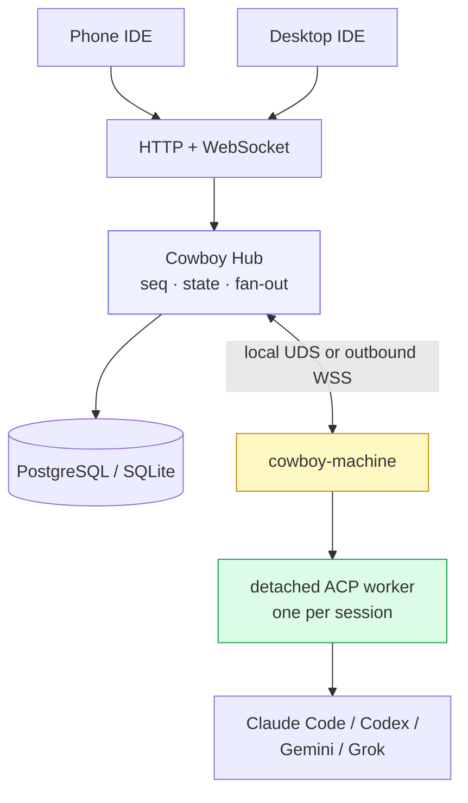
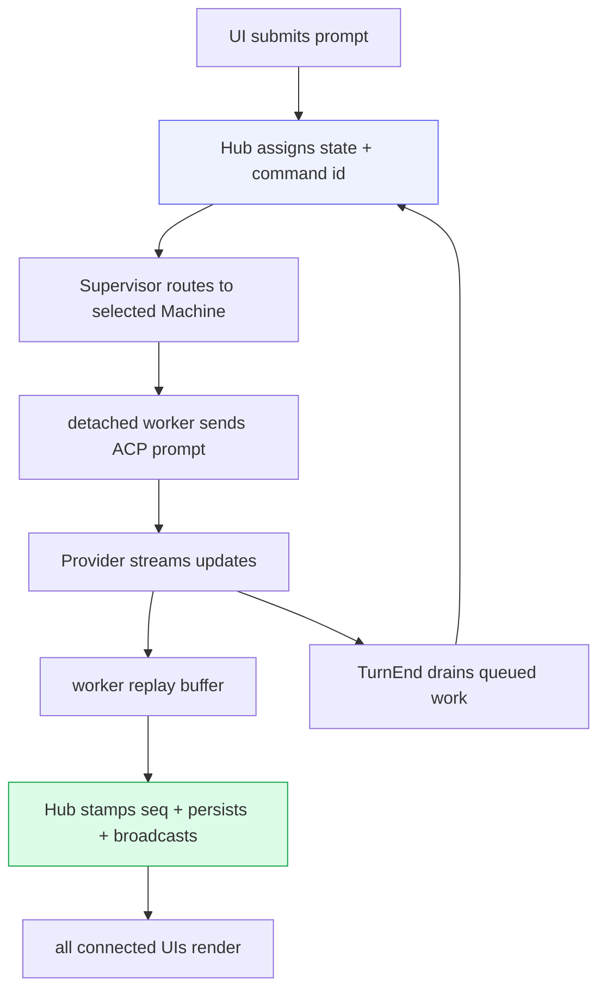

# Cowboy architecture overview

Cowboy is a remote Agent IDE for directing coding agents across multiple
machines. Phone and desktop clients connect to one Rust control plane; the
control plane places each session on an enrolled Machine, and that Machine owns
a detached ACP worker for the session. The agent keeps running when every UI is
closed or the controller is restarted.

This document set describes the implementation as it stands. The normative
Provider package, authentication, installation, and ownership contract is
[Cowboy core requirements](../requirements.md). Operational growth and migration
constraints are in [Operations](11-operations.md).

## The one idea

Cowboy is a **server-authoritative fan-out hub** with Machine-owned execution:

1. The Hub assigns the durable session sequence and broadcasts one shared view
   of progress to every connected UI.
2. A selected `cowboy-machine` prepares an isolated workspace and owns the
   detached worker that speaks ACP to the Provider runtime.
3. Client and controller lifetimes are not agent lifetimes. Closing a tab,
   changing devices, or restarting the controller does not terminate a live
   worker.

ACP remains the agent boundary, not the public product model. Provider-specific
updates can pass through as typed or opaque ACP payloads without reducing the
underlying CLI to a lowest-common-denominator chat API.

## Topology

Remote Machines initiate outbound authenticated WebSocket connections; the
Hawk-local fast path uses a Unix-domain socket. The controller never opens a
public listener on each development host. Machine fencing, command
deduplication, worker snapshots, and event replay preserve ownership across
reconnects and rolling updates.

## Component map

| Layer | Modules | Role |
|---|---|---|
| CLI / controller | `src/main.rs`, `src/cli.rs`, `src/server.rs` | Commands, authenticated REST/WebSocket, and runtime-served SPA |
| Hub | `src/core.rs`, `src/persistence.rs` | Session state, `seq`, fan-out, queueing, and write-behind intents |
| Runtime routing | `src/supervisor.rs`, `src/remote_runtime.rs`, `src/runtime_router.rs` | Machine selection, fencing, replay, and idempotent commands |
| Machine host | `src/machine_*.rs`, `src/bin/cowboy-machine.rs` | Enrollment, workspace preparation, component lifecycle, and detached-worker supervision |
| ACP worker | `src/acp.rs`, `src/worker.rs`, `src/bin/cowboy-acp-worker.rs` | Provider handshake, prompts, permissions, streaming updates, and resume |
| Plugins and components | `src/plugin.rs`, `plugins/*`, `components/*` | Versioned integration manifests, shared contracts, and coordinated release validation |
| Agent Providers | `src/provider/*`, `plugins/*/provider.json` | Signed package contracts, launch generations, Service auth, and usage adapters |
| Storage | `src/store.rs`, `src/store/sqlite.rs`, `migrations/*` | PostgreSQL/SQLite durability, restore, pagination, and retention |
| Code plane | `src/code_review.rs`, `src/code_adapter.rs`, `src/code_cache.rs` | Worktree tree/diff/file/LSP data behind a stable Cowboy API |
| Frontend | `web/src/*` | Desktop, mobile, transcript, composer, Machine, Provider, and code-review surfaces |

The axum process serves both APIs and the files under `--web-root`. Web releases
can therefore atomically switch `/run/cowboy-web` without rebuilding or
restarting the controller.

## End-to-end request flow

## Read next

1. [Transport — ACP](01-acp-transport.md)
2. [Core — the Hub](02-core-hub.md)
3. [Supervisor & lifetime](03-supervisor.md)
4. [Providers](04-providers.md)
5. [Storage](05-storage.md)
6. [Server & wire API](06-server-api.md)
7. [Agent-owned memory boundary](08-memory.md)
8. [Frontend](09-frontend.md)
9. [Build & deploy](10-deploy-build.md)
10. [Operations](11-operations.md)
11. [Zero-interruption rolling updates](12-rolling-updates.md)
12. [Mobile code review](13-code-review.md)
13. [Multi-machine runtime](15-multi-machine.md)
14. [Admin console](14-admin.md)
15. [Product login](16-product-auth.md)
16. [Plugins and shared components](../plugin-components.md)

The stdio ACP bridge and isolated Zed code adapter remain optional compatibility
integrations. They are documented separately in
[Zed ACP integration](../integrations/zed.md) and
[Isolated Zed Code Provider](14-zed-code-provider.md); neither is part of the
primary phone/desktop control-plane topology.
