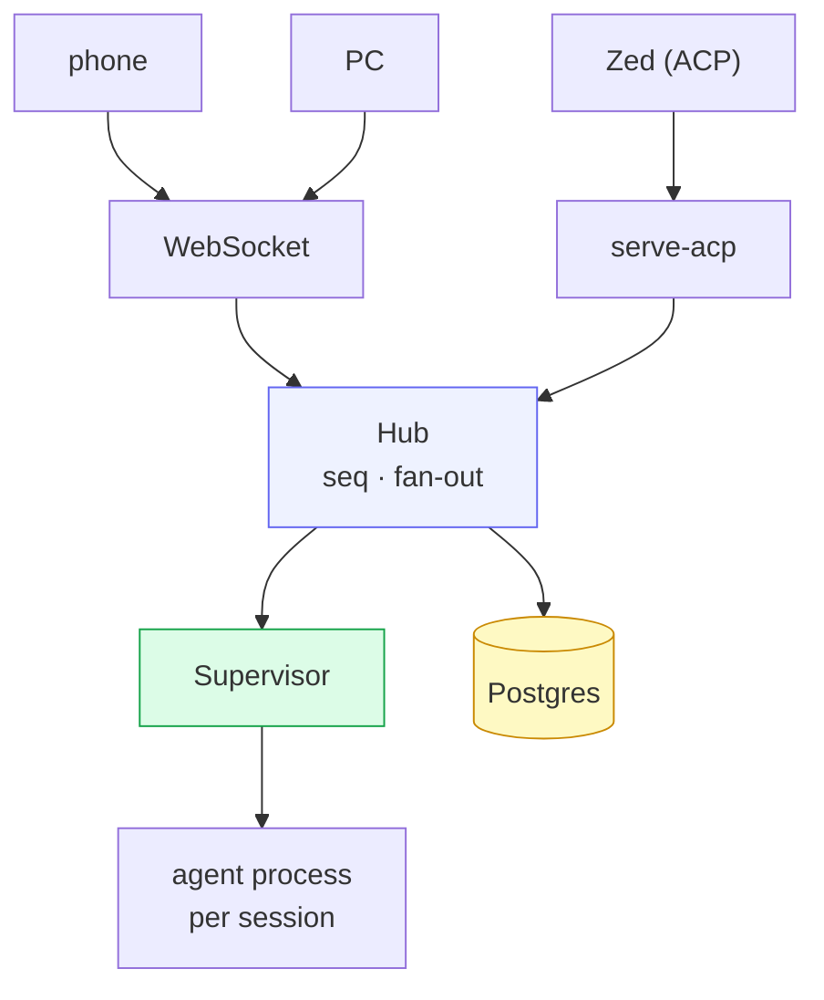
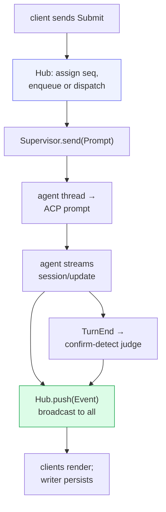

# cowboy — Architecture Overview

cowboy lets you drive coding-agent CLIs — **Claude Code, Codex, Gemini** — over
the **Agent Client Protocol (ACP)** from anywhere: a phone browser, a PC
browser, a Zed agent panel, or another machine. A single Rust (axum) process
serves both the JSON/WebSocket API and the embedded React SPA, and runs **one
agent subprocess per session**. It is deployed as a NixOS service on hawk
(`:3333`).

Operational growth and migration constraints are documented in
[`11-operations.md`](11-operations.md).

This document set is the **source of truth for the implementation as it stands**
— it describes the code, not the original design draft (`design.md`, which
predates the code and reads as a pre-flight plan).

## The one idea

cowboy is a **server-authoritative fan-out hub**. The daemon owns all state; every
client — phone, PC, Zed — is an equal subscriber to the same event stream. There
is no client-vs-client asymmetry, and **agent lifetime is decoupled from any
client connection**: close the phone, the agent keeps running under the
supervisor.

Three hard constraints shape everything:

1. **Don't constrain the agent CLI** more than the transport requires. cowboy is
   a conduit + control plane, not a reduced-feature reimplementation. Anything
   ACP can't model rides through as an opaque `Update` payload.
2. **One shared progress** across all clients, with a single global ordering.
3. **Agent lifetime is owned by cowboy**, not by a socket.

## Topology

The **Hub** is the single source of truth. Every surface (WebSocket clients, the
ACP server face) is a subscriber to the Hub's broadcast channel, so "new session
shows everywhere" and "an approval reflects everywhere" are just internal
broadcasts. The **Supervisor** owns the OS-thread + subprocess per session and
survives daemon restarts by reviving agents from persisted state.

## Component map

| Layer | Module | Role |
|---|---|---|
| Entry / CLI | `src/main.rs`, `src/cli.rs` | clap dispatch: `serve`, `serve-acp`, `try-agent` |
| Core / bus | `src/core.rs` | `Hub`, `Event`/`Inbound`/`Outbound`, `seq`, fan-out |
| Transport | `src/acp.rs` | the **only** module touching `agent-client-protocol` |
| Lifetime | `src/supervisor.rs` | spawn / revive / `ensure_alive` / resume |
| Providers | `src/provider/*` | launch specs + per-provider confirm rules |
| Server | `src/server.rs` | axum REST + WS + embedded SPA |
| Storage | `src/store.rs`, `migrations/*` | Postgres write-behind, restore |
| Confirm | `src/skills/`, `src/inference/` | turn-end L1/L2 judge, DeepSeek |
| Files | `src/files.rs` | gitignore-aware `@` file picker |
| Frontend | `web/src/*` | React SPA, embedded via `rust-embed` |

## End-to-end request flow

Read the chapters in order; each one zooms into a box above:

1. [Transport — ACP](01-acp-transport.md)
2. [Core — the Hub](02-core-hub.md)
3. [Supervisor & lifetime](03-supervisor.md)
4. [Providers](04-providers.md)
5. [Storage](05-storage.md)
6. [Server & wire API](06-server-api.md)
7. [Confirm-detect & inference](07-confirm-inference.md)
8. [Codex-owned memory boundary](08-memory.md)
9. [Frontend](09-frontend.md)
10. [Build & deploy](10-deploy-build.md)
