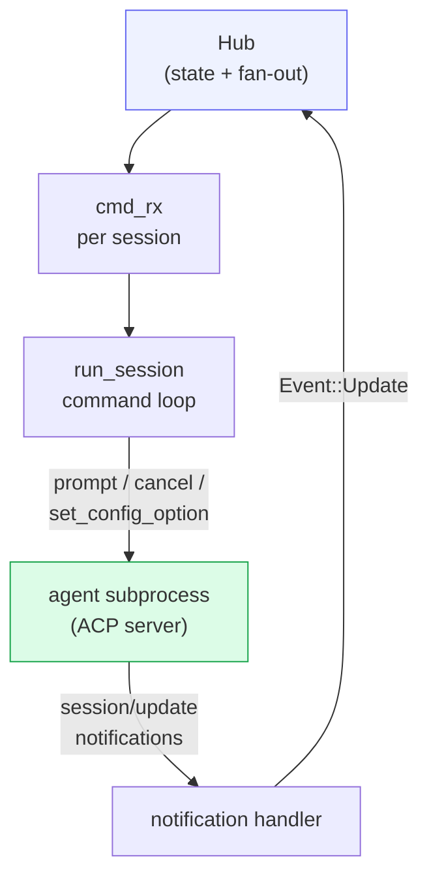
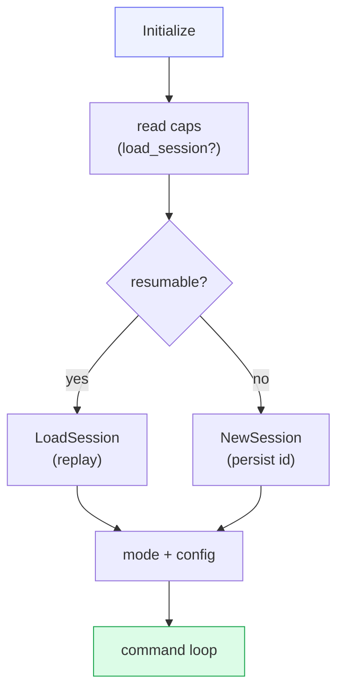

# Transport — ACP

Every agent is driven over the **Agent Client Protocol (ACP)**: JSON-RPC 2.0
over stdio. cowboy depends on the official **`agent-client-protocol`** crate
(the same one Zed uses) — "syncing Zed's protocol changes" is just `cargo
update`. The crate is pre-1.0, so all of its surface is **isolated behind
`src/acp.rs`**; a version bump touches one file.

cowboy implements the crate's **`Client`** trait and connects to each agent (the
agent is the ACP *server*). This is the crate's primary supported use — no
"play both sides" proxy tricks.

## Role split

## One thread per agent

`run_agent()` (`src/acp.rs`) is spawned on its **own OS thread** with a
current-thread Tokio runtime. This is the only place agent I/O happens. The flow
inside `agent_main()`:

1. **Spawn** the subprocess (`Command::new(spec.command).args(spec.args)`), then
   move it into a **per-agent cgroup** (`src/cgroup.rs`) so its entire process
   subtree can be reaped in one shot on teardown/recycle (see *Turn liveness*).
2. **Connect** over the child's stdin/stdout (`ByteStreams`).
3. Build the `Client` with two handlers:
   - **`on_receive_notification`** → `handle_session_notification()`: translate
     each ACP `SessionUpdate` into a Hub `Event` (most pass through verbatim as
     `Event::Update`; `config_option_update` is special-cased).
   - **`on_receive_request`** → the **permission handler**: for *system*
     sessions, auto-approve; for human sessions, enqueue a pending request with a
     oneshot channel so a human (any client) can answer it.
4. **Run** the connection loop (`run_session`) and **race it against
   `child.wait()`** — if the agent *process exits* before yielding control
   (→ `Crashed`), that's caught here. A still-*alive* agent that simply stops
   responding mid-turn is caught separately by the turn watchdog (see *Turn
   liveness* below).

## Capabilities advertised

cowboy advertises a **minimal client**: no `fs`, no `terminal`. Agents that ship
their own tools (Claude Code's Read/Write/Bash, etc.) then operate **directly on
disk themselves** — cowboy never has to build a PTY backend or fs sandbox. This
is the single biggest scope-reducer in the design.

## Handshake & session start

`run_session()` performs the ACP handshake:

- **Resume** uses the agent's own session id (`agent_session_id`, persisted in
  storage). On a daemon restart, if the agent supports `session/load`, cowboy
  re-attaches and replays — updates are suppressed because cowboy already holds
  the event log.
- **Mode setup** uses a Zed-style default: if the agent advertises a
  `bypassPermissions` mode, cowboy selects it to avoid permission UX friction.
- **Config options** (mode / model / effort chips in the UI) come from the agent.
  Codex returns them in the session response; Claude sends them later via a
  notification. **Gemini** uses session *modes* instead of config options for
  approval selection, so cowboy synthesizes a `"mode"` config chip for the UI.

## The command loop

The loop awaits `cmd_rx` (routed from the supervisor) and translates each
`AgentCommand`:

| Command | ACP action |
|---|---|
| `Prompt(blocks, cmid)` | echo each block into the timeline (first tagged with `cmid` for optimistic reconcile), then `PromptRequest` **raced against the wedge watchdog** (see *Turn liveness*). On success push `TurnEnd` + `Running`; on error push `TurnEnd` + `Crashed`. |
| `Cancel` | `CancelNotification` |
| `Permission { request_id, option_id }` | resolve the pending oneshot, push `PermissionResolved` |
| `SetConfigOption { config_id, value }` | if `config_id == "mode"` and a mode-select exists (gemini) → `SetSessionModeRequest`; otherwise the ext method `session/set_config_option`, whose refreshed options are pushed back to the Hub |

**Auto-resume tagging:** a `cmid` starting with the `__cont__` prefix marks an
auto-continued turn — the echoed block is flagged `autoResumed: true` so the UI
renders it as a "↻ resumed turn" note rather than a user bubble.

## Turn liveness: the wedge watchdog

An agent can stay **alive** yet never return a turn's prompt response — e.g. it
spawned a shell command that never exits (an unbounded `until …; do sleep; done`
poll loop) and the CLI blocks at turn-end waiting for that child. `child.wait()`
never fires (the process lives), so `prompt().await` would hang forever and the
session would latch `Busy` — perpetual streaming caret, queue never drains. (The
restart-time `busy→interrupted` recovery only fires on a daemon restart, so
without this a wedge persisted until someone restarted cowboy.)

Each `PromptRequest` is therefore raced (`tokio::select!`, biased to the real
response) against a periodic watchdog:

- **Fire condition** — status `Busy`, no agent update for `WATCHDOG_IDLE` (300s),
  **no open tool** (`Hub::turn_appears_stuck` scans the current turn's log), and
  **no pending permission**. The two guards exclude the legitimate silent cases:
  a long-running tool with no streamed output, and a turn parked on a human.
- **Soft recovery** — `Cancel` + `TurnEnd` + `Running`. Abandons just this turn,
  leaves the agent alive, drains the queue, clears the caret.
- **Hard recycle** — a 2nd back-to-back wedge (`WEDGE_RECYCLE_THRESHOLD`) means
  the agent is persistently stuck, so cowboy SIGKILLs the agent's **cgroup**
  (`cgroup.kill`). That reaps the whole subtree — including `setsid`-detached
  poll loops a process-group kill can't catch — and trips the `child.wait()`
  race above → `Crashed` → the supervisor revives a fresh agent.

The per-agent cgroup needs `Delegate=yes` on `cowboy.service` and is
**fail-open**: any cgroup error logs a warning and the agent runs uncontained,
never blocking spawn. The frontend independently caps the caret after 60s of no
growth as a cosmetic backstop.

The watchdog is **cause-agnostic** — cowboy can't see *why* an agent went silent
(wedged child, a dropped ACP response, …), only that it did, so it keys off the
externally-observable "Busy + silent + nothing pending" rather than guessing the
cause. The real upstream fix lives in the agent: don't write unbounded poll
loops (use a bounded `timeout` / max-iterations).

## Accepted limitation

ACP is a lowest-common-denominator surface; native CLI features it can't express
are not exposed. cowboy mitigates (not eliminates) this by passing
provider-specific `session/update` variants through verbatim as `Event::Update`
and **not over-normalizing** what ACP already gives. Choosing ACP is choosing
this tradeoff deliberately.

## Observed drift

The crate is *strict*: it rejects unknown `sessionUpdate` variants rather than
passing them through. An early observation — the claude adapter's
`usage_update` (token/cost telemetry) was dropped by an older crate version — is
why the design prefers a crate version that models a variant when available, and
treats the verbatim-passthrough path as the escape hatch for the rest.
