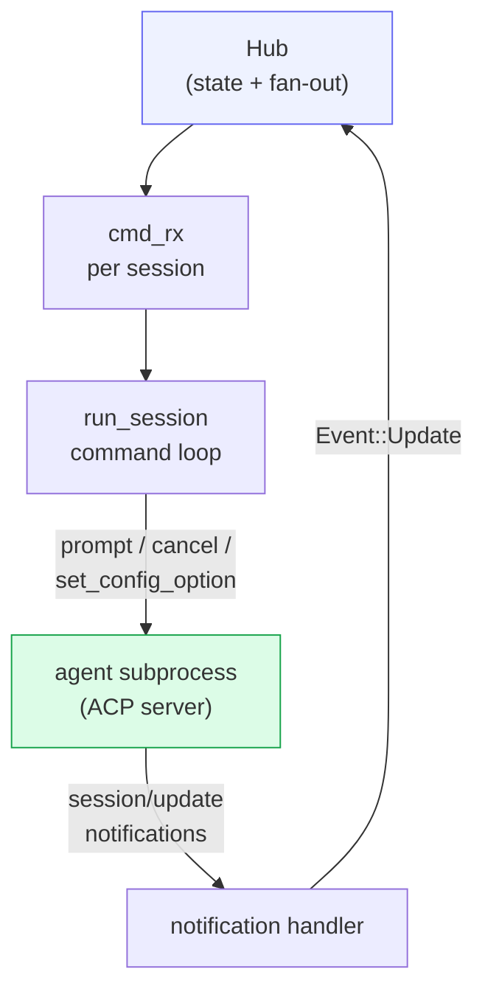
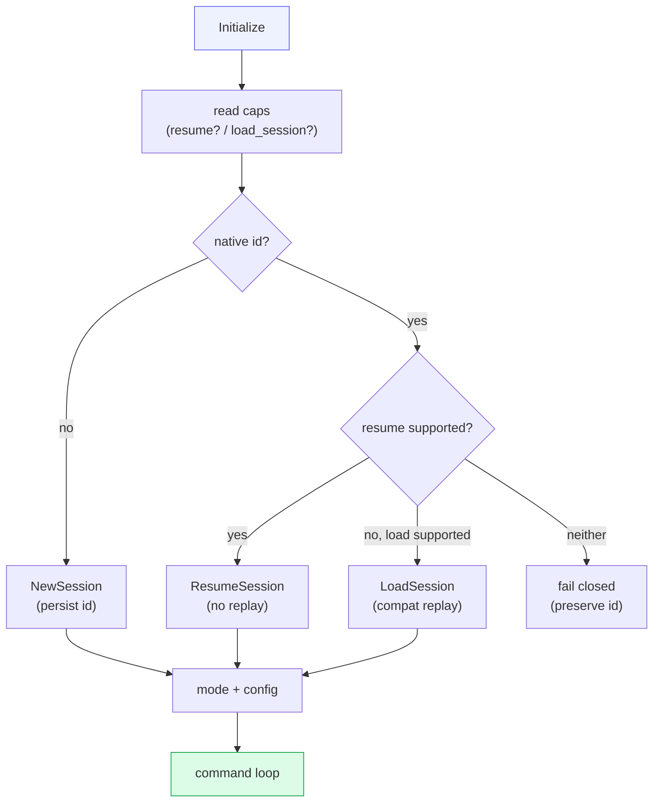
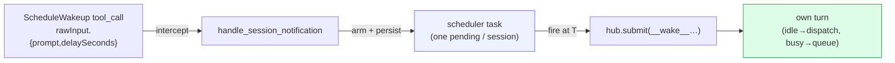

# Transport — ACP

Every agent is driven over the **Agent Client Protocol (ACP)**: JSON-RPC 2.0
over stdio. cowboy depends on the official **`agent-client-protocol`** crate
(the same one Zed uses). The stable ACP v1 wire schema is independent of the
Rust SDK's major version. The SDK surface is isolated behind `src/acp.rs`
(client) and `src/acp_bridge.rs` (server).

cowboy implements the crate's **`Client`** trait and connects to each agent (the
agent is the ACP *server*). This is the crate's primary supported use — no
"play both sides" proxy tricks.

## Role split

## One thread per agent

`run_agent()` (`src/acp.rs`) is spawned on its **own OS thread** with a
current-thread Tokio runtime. This is the only place agent I/O happens. The flow
inside `agent_main()`:

1. **Spawn** the subprocess (`Command::new(spec.command).args(spec.args)`), then
   move it into a **per-agent cgroup** (`src/cgroup.rs`) so its entire process
   subtree can be reaped in one shot on teardown (see *Turn liveness*).
2. **Connect** over the child's stdin/stdout (`ByteStreams`).
3. Build the `Client` with two handlers:
   - **`on_receive_notification`** → `handle_session_notification()`: translate
     each ACP `SessionUpdate` into a Hub `Event` (most pass through verbatim as
     `Event::Update`; `config_option_update` is special-cased).
   - **`on_receive_request`** → the **permission handler**: for *system*
     sessions, auto-approve; for human sessions, enqueue a pending request with a
     oneshot channel so a human (any client) can answer it. The request keeps
     its real JSON-RPC id, and SDK cancellation clears the pending UI request.
4. **Run** the connection loop (`run_session`) and **race it against
   `child.wait()`** — if the agent *process exits* before yielding control
   (→ `Crashed`), that's caught here. A still-*alive* agent that simply stops
   responding mid-turn is caught separately by the turn watchdog (see *Turn
   liveness* below).

## Capabilities advertised

cowboy advertises a **minimal client**: no `fs`, no `terminal`. Agents that ship
their own tools (Claude Code's Read/Write/Bash, etc.) then operate **directly on
disk themselves** — cowboy never has to build a PTY backend or fs sandbox. This
is the single biggest scope-reducer in the design.

## Handshake & session start

`run_session()` performs the ACP handshake:

- **Resume** uses the agent's own session id (`agent_session_id`, persisted in
  storage). Cowboy prefers ACP `session/resume`, which restores native state
  without returning prior messages. Older agents may fall back to
  `session/load`; only that compatibility path suppresses replayed updates
  because Cowboy already holds the event log. If neither capability exists,
  startup fails closed instead of silently replacing the native thread.
- **Startup liveness** is bounded per phase (`initialize`, session
  establishment, configuration). Only a pre-initialize stall is retried; an
  ambiguous session operation is surfaced once with its actual method name.
- **Mode setup** uses a Zed-style default: if the agent advertises a
  provider-specific full-access mode, cowboy selects it to avoid permission UX
  friction (`bypassPermissions` for Claude Code and `yolo` for Gemini; Codex
  exposes the equivalent as a config option).
- **Config options** (mode / model / effort chips in the UI) come from the agent.
  Codex returns them in the session response; Claude sends them later via a
  notification. The Zed bridge waits briefly for the first options before
  completing `session/new`, then continues forwarding live updates. **Gemini**
  uses session *modes* instead of config options for
  approval selection, so cowboy synthesizes a `"mode"` config chip for the UI.
  **Grok** exposes model/reasoning choices through `x.ai/sessionConfig`; Cowboy
  projects them as standard chips and maps its permission extension to a
  dedicated Default / Auto / Always Approve selector.

## The command loop

The loop awaits `cmd_rx` (routed from the supervisor) and translates each
`AgentCommand`:

| Command | ACP action |
|---|---|
| `Prompt(blocks, cmid)` | echo each block into the timeline (first tagged with `cmid` for optimistic reconcile), then `PromptRequest`. On success push `TurnEnd` + `Running`; Grok additionally queues a local `_x.ai/session/info` context refresh. On error (incl. subprocess death) push `TurnEnd` + `Crashed`. A live-but-silent turn is recovered manually (see *Turn liveness*). |
| `Cancel` | `CancelNotification` |
| `Permission { request_id, option_id }` | resolve the pending oneshot, push `PermissionResolved` |
| `SetConfigOption { config_id, value }` | Gemini's synthesized `mode` and Grok's `session_mode` → `SetSessionModeRequest`; Grok `model`/`reasoning_effort` → compatibility `session/set_model`; Grok `permission_mode` → `_x.ai/yolo_mode_changed`; otherwise typed `SetSessionConfigOptionRequest` (string ids and booleans), whose refreshed options are pushed back to the Hub |

**Prompt origin:** every Cowboy-echoed `user_message_chunk` carries a durable
`promptOrigin` object so the timeline can tell senders apart. The role stays
`user` because ACP only has that slot for a prompt; origin names who actually
sent it.

| `actor` | Known `source` values | Who sent it |
|---|---|---|
| `human` | `composer` | The person typed or attached it |
| `cowboy` | `auto-resume`, `schedule` | Cowboy issued the prompt (`__cont__`, `__wake__`, `__sched__`) |
| `agent` | `runtime`, `review` | The agent runtime injected it (a Grok `<system-reminder>`, or Grok Build's design-review writer follow-up) |

New senders add a `source` string under one of those three actors. They do not
invent a fourth actor. Cowboy still writes `autoResumed: true` on non-human
echoes so older clients keep the muted-note path.

Inbound ACP `user_message_chunk` events from the agent are classified the same
way. A Grok background-task reminder is stamped `actor: agent`,
`source: runtime`, `provider: grok`. Grok Build design-review writer
follow-ups (no reminder tags) are stamped `source: review` and never count
as a human question.
Grok also re-emits the accepted prompt as `user_message_chunk`. Cowboy already
echoed that prompt (with `promptOrigin`), so the inbound copy is dropped.
`derive` hides the same replay in already-persisted logs: a `lifecycle: busy`
between the two copies would otherwise become a second user bubble.

**Auto-resume tagging:** a `cmid` starting with the `__cont__` prefix is
`cowboy` / `auto-resume`. The UI renders it as a resumed-turn note rather than a
user bubble.

## Turn liveness: manual recovery, no auto-kill

An agent can stay **alive** yet never return a turn's prompt response — e.g. it
spawned a shell command that never exits (an unbounded `until …; do sleep; done`
poll loop) and the CLI blocks at turn-end waiting for that child, or it's just
slow (a huge context can take minutes to first token, with no streamed output).
`child.wait()` doesn't fire (the process lives), so `prompt().await` keeps
waiting and the session sits `Busy`.

**cowboy does NOT try to auto-detect this.** On a live agent there is no reliable
way to tell a slow-but-working turn from a wedged one: idle time and content are
both guesses, and an earlier idle-timeout watchdog proved the hazard — it
force-ended a real, actively-generating turn (the cancel yielded in ~11ms, a live
query) and the cancel-then-drop crashed the connection. Zed, the protocol's
author, reaches the same conclusion ([zed#52151](https://github.com/zed-industries/zed/issues/52151),
[#56734](https://github.com/zed-industries/zed/issues/56734)) and also does not
auto-kill. So the human stays the judge:

- **Dead subprocess → automatic.** The one unambiguous signal: `agent_main` races
  the connection against `child.wait()` (`d6ee0ca`). If the agent *process* exits,
  that's caught → `Crashed` (queue holds; a resend/open revives). Zero false-pos.
- **Live-but-silent → manual.** The UI surfaces the silence: after 5 minutes of no
  timeline activity on a `Busy` turn, a count-up `⏱ 已等待 Nm` badge appears
  (`web/src/Transcript.tsx`). The user recovers with **Stop** → `AgentCommand::Cancel`
  → `session/cancel`; the agent yields and the prompt resolves as a clean `Running`
  (no crash — the future is never dropped out from under a late response).
- **Subtree containment stays.** Each agent still runs in its own cgroup
  (`Delegate=yes`, fail-open); teardown `cgroup.kill`s the whole subtree so a
  leaked, `setsid`-detached poll loop can't outlive the agent.

The real upstream fix lives in the agent: don't write unbounded poll loops (use a
bounded `timeout` / max-iterations) so turns close on their own.

## Scheduled wakeups (`ScheduleWakeup`)

`ScheduleWakeup` is a built-in Claude Code `/loop` tool: the agent calls it to be
re-invoked at a future time (a loop iteration, a deferred self-check). In a
normal CLI the loop runtime fires it — but under ACP **cowboy is the runtime**,
and it used to ignore the tool, so the wakeup never fired: the deferred work
latched until the user's next message, which it then *consumed* (the user's real
message went unanswered). cowboy now honors it:

- **Intercept** (`handle_session_notification`): the `ScheduleWakeup` `tool_call`
  is still pushed verbatim (timeline unchanged); the side effect is arming
  `crate::scheduler` with `{prompt, delaySeconds}`.
- **Scheduler** (`src/scheduler.rs`): one background task, one pending wakeup per
  session (latest wins — the `/loop` re-arms each turn), `sleep`-until-soonest.
- **Fire**: `hub.submit(…, "__wake__…")` — the wakeup runs as its OWN turn
  (idle → dispatch, busy → queue), so it never piggybacks on a user message
  (fixing the eats-the-turn symptom). The `__wake__` cmid flags the echo so the
  UI shows a "↻" self-fired turn, not a user bubble.
- **Persisted** (migration `0011_scheduled_wakeups`, `ON DELETE CASCADE`):
  upsert on arm, delete on fire; re-armed on startup with overdue ones firing
  immediately (catch-up), so a deploy/restart doesn't drop a pending wakeup.
- **Runaway guard**: a consecutive-fire cap (reset by any human turn) stops a
  self-re-arming loop from burning the token pool unattended.

## Accepted limitation

ACP is a lowest-common-denominator surface; native CLI features it can't express
are not exposed. cowboy mitigates (not eliminates) this by passing
provider-specific `session/update` variants through verbatim as `Event::Update`
and **not over-normalizing** what ACP already gives. Choosing ACP is choosing
this tradeoff deliberately.

## SDK and capability boundary

The crate is strict: it rejects unknown `sessionUpdate` variants rather than
passing them through. Cowboy therefore upgrades the SDK deliberately and uses
typed stable variants where behavior depends on them. `usage_update` is mapped
directly to ephemeral session usage; it is not detected by serialized field
names or appended repeatedly to durable history.

SDK 2's JSON-RPC request cancellation is enabled for permission waits and the
stdio bridge's long-running prompts. Experimental session fork, ACP protocol
v2, and native MCP-over-ACP remain off the production path until their schemas
stabilize and Cowboy has an explicit ownership model for forked sessions and
client-provided MCP lifetimes.
