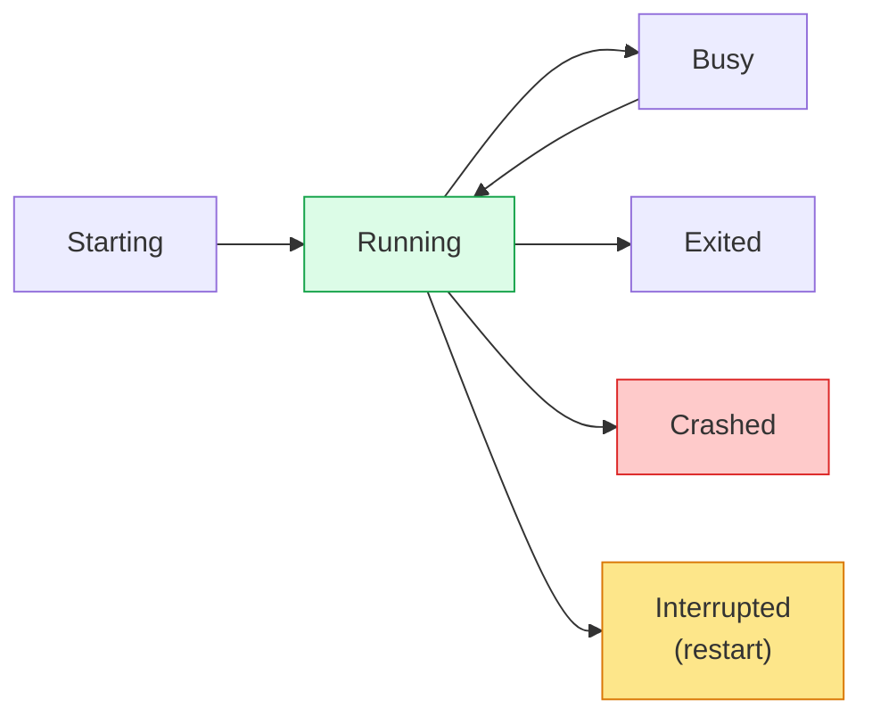
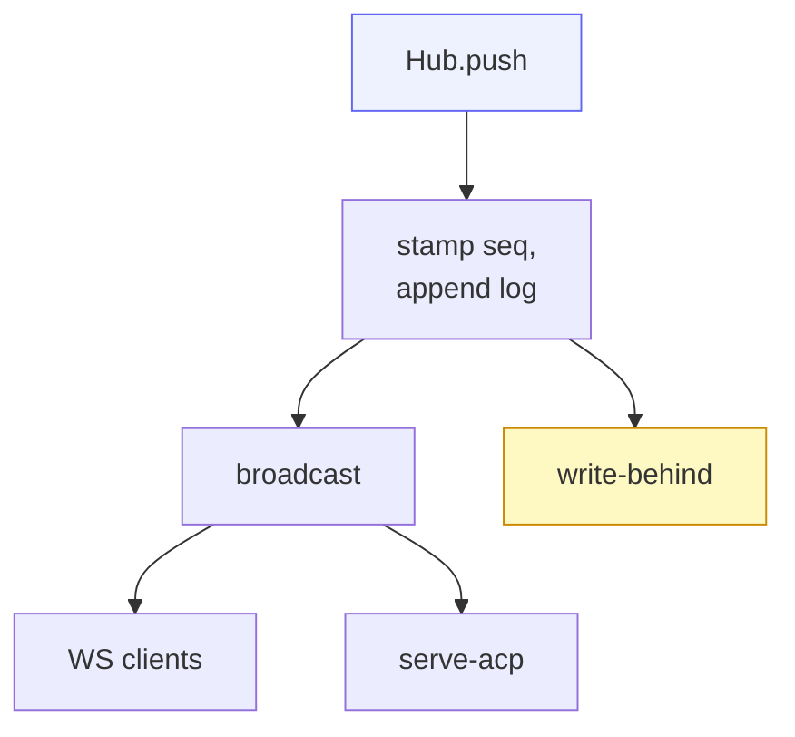

# Core — the Hub

`src/core.rs` is the heart of cowboy. The **Hub** (`Arc<HubInner>`) is the
in-memory arbiter and single source of truth for every session's state. It
assigns the global ordering, fans events out to all clients, and emits
persistence intents to the write-behind writer.

## What a session holds

Each `Session` (private to the Hub) carries:

- **`SessionMeta`** — `id`, `provider`, stable Machine workspace identity,
  isolated runtime `cwd`, `title`, `status`, `origin`,
  `agent_session_id` (for resume), plus `paused` / `system`.
- an **event log** — `Vec<Envelope>` — and the `next_seq` counter.
- per-session **config options**, the **queue** and **drafts**, an editing hold,
  and an `in_flight` flag.

`Status` is a small state machine:

`SessionOrigin` is `Api` (default) or `Web` — which surface opened it.

## Ordering — the `seq`

The Hub is the **sole writer**, so it stamps a monotonic `seq` (u64) per session.
Every event becomes an **`Envelope`**: `Event` + `session_id` + `seq` + optional
`cmid` (a client-message id for optimistic reconcile, live-only). Because one
arbiter assigns `seq`, ordering is global and unambiguous across all clients.

## Events (Hub-internal)

| Event | Meaning |
|---|---|
| `Update { update }` | pass-through ACP `SessionUpdate` (message chunk, tool call, plan, usage, config-option-update) |
| `PermissionRequest { request_id, tool_call, options }` | agent is asking; **first response wins** |
| `PermissionResolved { request_id, option_id }` | a human answered → other clients clear the button |
| `Lifecycle { status, detail }` | process state change + reason |
| `TurnEnd { stop_reason }` | turn finished, carries the ACP stop reason |

## Inbound commands (clients → Hub)

The send path has two doors. **`Prompt`** is the direct/API path (send now).
**`Submit`** is the Web UI path: queue-aware and carries a `cmid`. Beyond those:

- session lifecycle — `NewSession`, `OpenSession`, `DeleteSession`,
  `RenameSession`, `Cancel`, `RetryTurn`
- per-session toggles — `SetPaused`
- queue / draft ops — `RemoveQueued`, `EditQueued`, `ClearQueue`,
  `RequestSendQueued`, `ForcePushQueued`, `QueuedToDraft`, `AddDraft`,
  `EditDraft`, `ActivateDraft`, `MoveDraft`, … (all routed through the sync arbiter)
- config — `SetConfigOption`
- ordering — `ReorderSessions`, `ReorderQueue`, `ReorderDrafts`
- `Sync { state, id, name, args }` — the generic optimistic-sync mutation

## Outbound messages (Hub → clients)

| Outbound | When |
|---|---|
| `Sessions` | session list, on connect + on change |
| `Snapshot` | last ~200 events of a session on connect, with `reached_start` |
| `Event` | a single live envelope |
| `ConfigOptions` | the agent's advertised per-session config (mode / model / effort) |
| `SyncPatch` | generic sync state (queue / drafts / order) |
| `Settings` | empty compatibility tombstone for stale cached clients |
| `Error` | a rejected command, broadcast to all |

## Fan-out & reconnect

Fan-out is a `tokio::sync::broadcast` channel. A client that **lags** is dropped
from the channel; it simply reconnects and gets a fresh `Snapshot` (the last
~200 events) plus a live tail. The snapshot tail bounds reconnect cost while
older history is paged on demand (see [Server & wire API](06-server-api.md)).

## Persistence intent

The Hub never touches the database directly. Each state change emits a
**`StoreWrite`** variant — `InsertSession`, `AppendEvent`, `UpdateStatus`,
`UpdateTitle`, `SetAgentSessionId`, `DeleteSession`, `UpdatePending`,
`UpdateSessionOrder`, and Mobile review state
— onto a bounded mpsc
channel drained in reduced batches by the background writer task
([Storage](05-storage.md)). The hot path never blocks on the DB; overflow and
exhausted retries explicitly degrade health.

## Interrupted turns

On controller startup, a persisted Busy session first remains guarded while
Machine runtimes reconnect. A connected worker snapshot adopts the original
turn without adding an interruption marker. Broker launch-registry placeholders
are not live-owner evidence and cannot settle this reconciliation. Only when the
bounded grace expires without a connected owner does the Hub mark the session
`Interrupted`. It does not enqueue a continuation or revive the provider.
User-authored work remains in the normal durable queue and can be sent next;
opening the session only exposes the interruption state. During restore, legacy
`__cont__` queue and draft rows from older controllers are removed so an upgrade
cannot execute a stale synthetic turn. Their historical transcript rows remain
readable.

Cached clients may still send the retired `SetSessionAutoResume`, `ResumeTurn`,
and `SetSetting` commands during a service-worker rollout. The controller accepts
them as no-ops and sends an empty `Settings` snapshot, preventing the old UI from
re-enabling the behavior.
