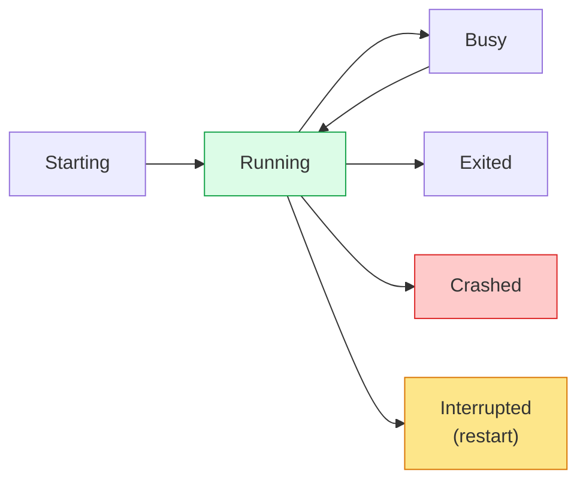
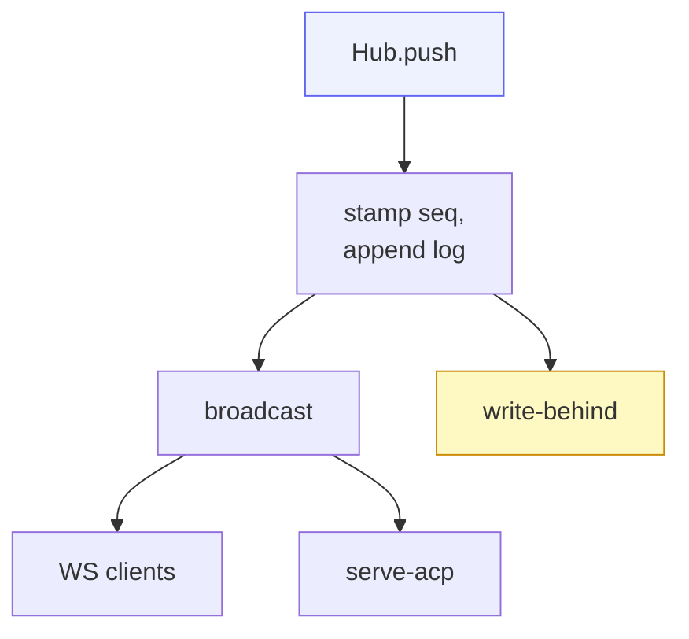

# Core — the Hub

`src/core.rs` is the heart of cowboy. The **Hub** (`Arc<HubInner>`) is the
in-memory arbiter and single source of truth for every session's state. It
assigns the global ordering, fans events out to all clients, and emits
persistence intents to the write-behind writer.

## What a session holds

Each `Session` (private to the Hub) carries:

- **`SessionMeta`** — `id`, `provider`, `cwd`, `title`, `status`, `origin`,
  `agent_session_id` (for resume), `auto_resume` override, and the confirm-detect
  flags `awaiting_user` / `done` / `judging`, plus `paused` / `system`.
- an **event log** — `Vec<Envelope>` — and the `next_seq` counter.
- per-session **config options**, the **queue** and **drafts**, an editing hold,
  an `in_flight` flag, and the **judge runs** history.

`Status` is a small state machine:

`SessionOrigin` is `Api` (default) or `Web` — which surface opened it.

## Ordering — the `seq`

The Hub is the **sole writer**, so it stamps a monotonic `seq` (u64) per session.
Every event becomes an **`Envelope`**: `Event` + `session_id` + `seq` + optional
`cmid` (a client-message id for optimistic reconcile, live-only). Because one
arbiter assigns `seq`, ordering is global and unambiguous across all clients.

## Events (Hub-internal)

| Event | Meaning |
|---|---|
| `Update { update }` | pass-through ACP `SessionUpdate` (message chunk, tool call, plan, usage, config-option-update) |
| `PermissionRequest { request_id, tool_call, options }` | agent is asking; **first response wins** |
| `PermissionResolved { request_id, option_id }` | a human answered → other clients clear the button |
| `Lifecycle { status, detail }` | process state change + reason |
| `TurnEnd { stop_reason }` | turn finished, carries the ACP stop reason |

## Inbound commands (clients → Hub)

The send path has two doors. **`Prompt`** is the direct/API path (send now).
**`Submit`** is the Web UI path: queue-aware, carries a `cmid`, and respects the
queue / awaiting-user hold. Beyond those:

- session lifecycle — `NewSession`, `OpenSession`, `DeleteSession`,
  `RenameSession`, `Cancel`, `ResumeTurn`, `RetryTurn`
- per-session toggles — `SetSessionAutoResume`, `SetAwaiting`, `SetPaused`
- queue / draft ops — `RemoveQueued`, `EditQueued`, `ClearQueue`,
  `RequestSendQueued`, `ForcePushQueued`, `QueuedToDraft`, `AddDraft`,
  `EditDraft`, `ActivateDraft`, `MoveDraft`, … (all routed through the sync arbiter)
- config — `SetConfigOption`, `SetSetting`, `SetInferenceConfig`,
  `SetInferenceSecret`, `InferenceProbe`
- ordering — `ReorderSessions`, `ReorderQueue`, `ReorderDrafts`
- `Sync { state, id, name, args }` — the generic optimistic-sync mutation

## Outbound messages (Hub → clients)

| Outbound | When |
|---|---|
| `Sessions` | session list, on connect + on change |
| `Snapshot` | last ~200 events of a session on connect, with `reached_start` |
| `Event` | a single live envelope |
| `ConfigOptions` | the agent's advertised per-session config (mode / model / effort) |
| `SyncPatch` | generic sync state (queue / drafts / order) |
| `Settings` | global auto-resume default + continuation template |
| `InferenceConfig` | per-provider model + whether a key is set (never the key) |
| `Skills` | the static skill registry |
| `JudgeResult` / `JudgeHistory` | confirm-detect verdict + the capped run history |
| `Error` | a rejected command, broadcast to all |

## Fan-out & reconnect

Fan-out is a `tokio::sync::broadcast` channel. A client that **lags** is dropped
from the channel; it simply reconnects and gets a fresh `Snapshot` (the last
~200 events) plus a live tail. The snapshot tail bounds reconnect cost while
older history is paged on demand (see [Server & wire API](06-server-api.md)).

## Persistence intent

The Hub never touches the database directly. Each state change emits a
**`StoreWrite`** variant — `InsertSession`, `AppendEvent`, `UpdateStatus`,
`UpdateVerdict`, `UpdateTitle`, `SetAgentSessionId`, `DeleteSession`,
`UpdatePending`, `UpdateSessionOrder`, `UpdateAutoResume`, `UpdateJudgeRuns`,
`PutSetting`, `PutInferenceConfig`, `PutInferenceSecret` — onto a bounded mpsc
channel drained in reduced batches by the background writer task
([Storage](05-storage.md)). The hot path never blocks on the DB; overflow and
exhausted retries explicitly degrade health.

## Auto-resume of interrupted turns

If the daemon restarts mid-turn, that session restores as `Interrupted`. When
the session's effective auto-resume setting is on (global default or per-session
override), the Hub enqueues a continuation prompt on restore, tagged with the
`__cont__` cmid prefix so it is deduped and rendered as a resumed-turn note
rather than a user message. A retry template handles the empty-partial case.
