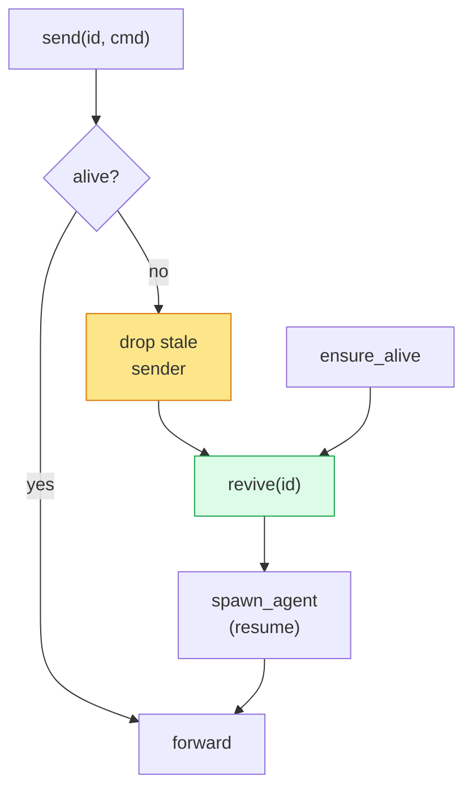
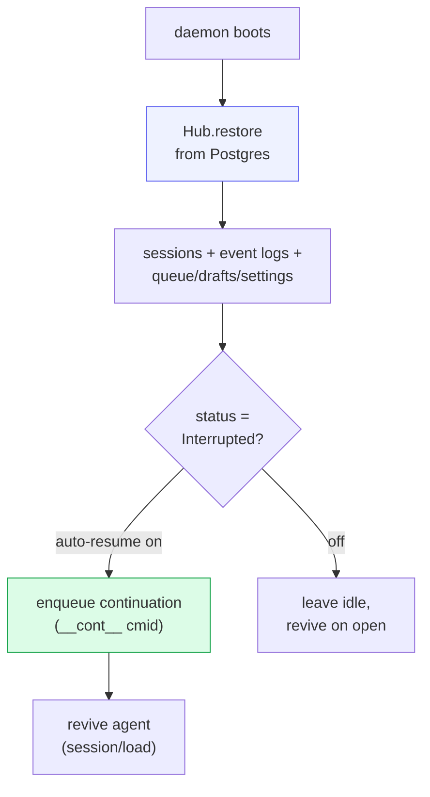

# Supervisor & lifetime

`src/supervisor.rs` owns the **process lifetime** of every agent, decoupled from
any client connection. The `Supervisor` holds the shared Hub, the
`workspace_root`, a `HashMap<session_id, UnboundedSender<AgentCommand>>` (the
channel into each agent's command loop), and a monotonic id counter.

The guiding rule: **a client disconnecting never stops the agent.** Close the
phone, the agent keeps running. Conversely, when the daemon itself restarts, the
supervisor transparently revives agents from persisted state.

## Methods

| Method | What it does |
|---|---|
| `new_session(provider, cwd, origin, system)` | create the session in the Hub, then `spawn_agent()` |
| `spawn_agent(session_id, spec, cwd, resume)` | the **one** place an OS thread starts — idempotent (no-op if a sender already exists). Thread entry is `acp::run_agent()`. |
| `send(session_id, cmd)` | forward a command to the agent's channel; **lazy revive** if the sender is dead |
| `ensure_alive(session_id)` | revive **without** sending a turn — warm the agent on open/reconnect |
| `revive(session_id)` | spawn a fresh agent for a restored session, passing its prior `agent_session_id` for `session/load` |
| `delete_session(session_id)` | best-effort `Cancel`, then drop the sender so the loop terminates |

Session ids are `sess-N`, with `N` seeded **past any restored session's max** so
a fresh daemon never collides on the storage primary key.

## Lazy revive

The supervisor never eagerly keeps dead agents around. Two entry points bring an
agent back:

`ensure_alive` is what makes typing feel instant after a restart: opening a
session warms its agent before the user sends anything, so the first prompt
doesn't pay the spawn + handshake cost.

## Restart recovery

When systemd restarts the cowboy daemon, agent subprocesses (its children) die
with it. Recovery rests on three facts:

1. **Transcripts are on disk** (Postgres) → history is never lost.
2. **Resumable providers** re-attach via ACP `session/load(agent_session_id)` and
   continue — `agent_session_id` is the bridge between storage and resume.
3. **Non-resumable** sessions are marked `Exited`/`Interrupted` and offer a
   one-click restart.

Agents are **not** all revived at boot — that would spawn dozens of subprocesses
for sessions nobody is looking at. They are revived lazily on the first
`send`/`ensure_alive`, except interrupted sessions opted into auto-resume, which
are continued proactively.

## System sessions

The session schema retains a `system` marker for machine-driven, view-only
sessions. They use the same supervisor machinery but can be hidden from normal
interactive surfaces and driven through the backend prompt endpoint. No
production subsystem currently creates one; the marker remains as a generic
control-plane primitive and for persisted-schema compatibility.
