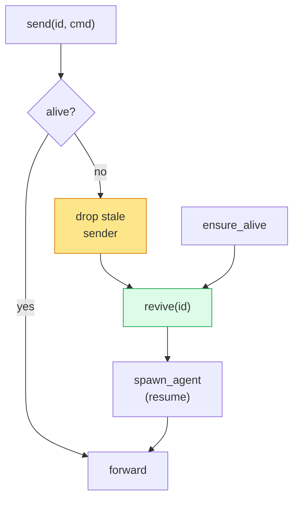
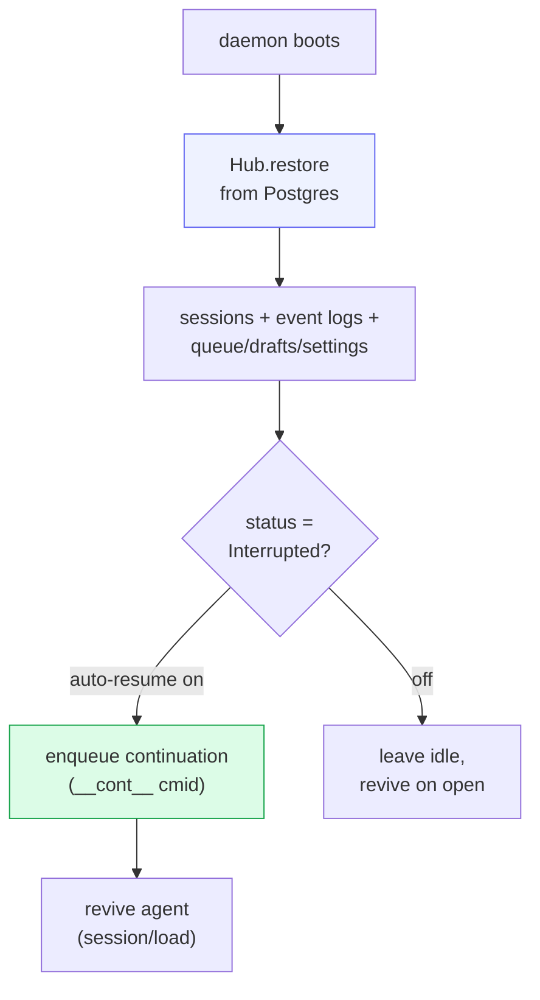

# Supervisor & lifetime

`src/supervisor.rs` is the Hub-facing lifetime API, decoupled from any client
connection. It always routes through a connected `cowboy-machine` runtime to
detached per-session workers. The supervisor also holds the shared Hub,
workspace root, and monotonic id counter.

For HTTP-created Machine sessions, the server reserves that monotonic id first.
The selected Machine uses it as the durable worktree key, then the Supervisor
persists the prepared path and launches the worker. A preparation failure never
falls back to the advertised stable checkout.

The guiding rule: **a client disconnecting never stops the agent.** Close the
phone, the agent keeps running. In production, restarting the HTTP daemon does
not restart a live agent.

## Methods

| Method | What it does |
|---|---|
| `reserve_session_id()` | reserve the stable id before Machine-local workspace preparation |
| `new_session_on_with_id(...)` | persist the prepared path, then create the worker on its Machine |
| `spawn_agent(session_id, spec, cwd, resume)` | send an idempotent `EnsureSession` to the session's Machine runtime |
| `send(session_id, cmd)` | emit an idempotent command through the Machine runtime |
| `ensure_alive(session_id)` | revive **without** sending a turn — warm the agent on open/reconnect |
| `delete_session(session_id)` | stop the detached worker through its Machine runtime |

Session ids are `sess-N`, with `N` seeded **past any restored session's max** so
a fresh daemon never collides on the storage primary key.

## Lazy revive

The supervisor never eagerly keeps dead agents around. Two entry points bring an
agent back:

`ensure_alive` is what makes typing feel instant after a restart: opening a
session warms its agent before the user sends anything, so the first prompt
doesn't pay the spawn + handshake cost.

## Restart recovery

When systemd restarts `cowboy.service`, detached worker units remain alive.
Recovery rests on four facts:

1. **Transcripts are on disk** (Postgres) → history is never lost.
2. **Worker snapshots are authoritative** for whether a persisted Busy turn
   survived; restore does not falsely mark that turn Interrupted.
3. **Unacked runtime events replay** after the new controller takes its fenced
   lease, while command IDs prevent duplicate ACP submission.
4. If a worker really died, **resumable providers** re-attach via ACP
   `session/load(agent_session_id)`; non-resumable failures use the existing
   `Exited`/`Interrupted` recovery.

Workers that survived are adopted at boot. Dead historical sessions are **not**
all revived — that would spawn dozens of subprocesses nobody is using. They are
revived lazily on the first `send`/`ensure_alive`, except interrupted sessions
opted into auto-resume, which are continued proactively.

Generation drain, broker restart, heartbeat isolation, and rollback are covered
in [Zero-interruption rolling updates](12-rolling-updates.md).

## System sessions

The session schema retains a `system` marker for machine-driven, view-only
sessions. They use the same supervisor machinery but can be hidden from normal
interactive surfaces and driven through the backend prompt endpoint. No
production subsystem currently creates one; the marker remains as a generic
control-plane primitive and for persisted-schema compatibility.
