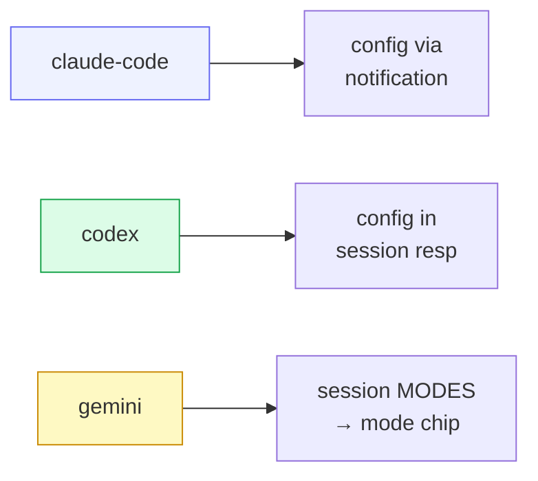

# Providers

A **provider** is the recipe for launching one agent CLI's ACP adapter. All
providers share the single `src/acp.rs` client backend; a provider only declares
**how to spawn its adapter binary**. Adding one is a registry entry plus, where
needed, hand-coded confirm-detection rules — the core never changes.

## Registry

`provider::builtin()` returns the in-tree registry:

| Provider | Launch | ACP on-ramp |
|---|---|---|
| `claude-code` | `npx -y @agentclientprotocol/claude-agent-acp` | Claude Code ACP adapter |
| `claude-deepseek` | the same Claude ACP adapter with an isolated provider-owned `CLAUDE_CONFIG_DIR` | Claude Code over the independent local DeepSeek Anthropic Messages gateway |
| `codex` | `npx -y @agentclientprotocol/codex-acp` plus full-access defaults | adapter over Codex App Server |
| `codex-deepseek` | the same Codex ACP adapter with an isolated provider-owned `CODEX_HOME` | Codex over the independent local DeepSeek Responses gateway |
| `gemini` | `npx -y @google/gemini-cli --acp` | Gemini's native ACP mode |

Each entry is a **`LaunchSpec`**: `id` + `command` + `args` + scoped environment.
That's the whole contract a provider must satisfy to start; everything downstream
(initialize/handshake/command loop) is provider-agnostic and lives in `acp.rs`.

Managed Machine releases also set Codex ACP's `CODEX_PATH` to
`cowboy-codex-app-server`. This transparent NDJSON proxy forwards the selected
Codex CLI unchanged and adds `excludeTurns: true` only to App Server
`thread/resume`. It prevents no-history ACP `session/resume` from hydrating and
serializing the complete rollout while leaving `session/load` intact: the
adapter still performs its explicit `thread/read(includeTurns=true)` afterward.
The shim does not patch or take ownership of the npm-managed adapter and is
idempotent with an upstream adapter that starts sending the option itself.

`codex-deepseek` is a runtime variant, not a second agent implementation. Codex
still owns planning, tools, approvals, goals, memory, and execution; its model
provider points at `codex-deepseek.service` on loopback. The shim owns only wire
compatibility and credential injection and has an independent release profile,
lifecycle, port, credential, and health check. V4 Flash is forwarded byte-for-byte
to DeepSeek's native Responses API; only V4 Pro uses the temporary Chat
compatibility path until DeepSeek enables native Codex support for that model.
Restarting or upgrading the gateway never restarts Cowboy, Cowboy Machine, or
resident ACP workers.

Its `CODEX_HOME` lives under
`~/.local/state/cowboy/providers/codex-deepseek/codex-home` and is generated from
a template. It does not inherit the user's normal Codex config and does not link
`auth.json`, history, sessions, or memories.

Setup that carries no secret is shared rather than re-created, because a DeepSeek
provider should differ from its ordinary counterpart only in which endpoint it
uses and whose credential it presents. The isolated home links `AGENTS.md`,
`skills/`, `plugins/`, and the marketplace snapshot under `.tmp/marketplaces`,
and the generated config copies the `marketplaces`, `plugins`, and `hooks`
tables from the ordinary config. Codex reports a plugin as installed only when
both the tables and the snapshot are present, so neither half is optional.
`mcp_servers` is deliberately excluded: an MCP entry can carry a token in its
command, arguments, or headers. The sharing list is an allowlist, so a new
runtime file that holds a secret stays private until someone adds it
deliberately. A real provider-owned entry is never replaced by a shared link.
The worker also removes inherited OpenAI, Codex, and DeepSeek credential/config
variables;
the DeepSeek secret exists only in the gateway's systemd credential mount.
Standard `codex` sessions therefore keep their ordinary account and state, and
the two runtimes can execute concurrently without influencing one another.
The generated config prefers the independently moved component-profile catalog.
During the one-time rollout only, it may use the DeepSeek-only legacy `/etc`
catalog if the profile has not yet been initialized; this fallback contains no
OpenAI config or credentials and can be deleted after older Machine generations
have drained.

`claude-deepseek` is the corresponding Claude Code runtime variant, not another
agent implementation. It uses `claude-deepseek.service` on loopback and a
provider-owned config directory under
`~/.local/state/cowboy/providers/claude-deepseek/claude-config`. The provider
clears inherited Anthropic, Claude, and DeepSeek configuration before applying
its closed base URL, placeholder client token, V4 Pro 1M main-model, V4 Flash
fast/subagent models, and streaming settings. Claude Code is explicitly marked
as provider-managed-by-host, so project or user settings cannot replace the
endpoint or authentication selected by Cowboy. The real API key exists only in
the gateway's distinct systemd credential. Cowboy also supplies provider-only
`CLAUDE_CODE_SHELL` and `SHELL` values because a detached systemd Machine worker
does not inherit an interactive login shell. Claude Code accepts bash or zsh
specifically, so Cowboy selects an executable absolute path from the host
override, inherited shell, worker `PATH`, or stable platform profile paths in
that order; it never treats generic `/bin/sh` as sufficient. The host override
is `COWBOY_ACP_CLAUDE_DEEPSEEK_SHELL`; it crosses the detached worker boundary
but is removed before Claude Code starts. A Machine advertises this provider as
active only when both the gateway and a supported executable shell are ready.

The isolated directory neither reads nor links top-level Claude instance
metadata, credentials, history, projects, or cache. It links the same non-secret
setup as the Codex variant — `CLAUDE.md`, `skills/`, and `plugins/` — and
generates a provider-owned `settings.json` holding only `enabledPlugins` and
`extraKnownMarketplaces`. Claude keeps plugin enablement in that file, so
linking `plugins/` alone would leave every plugin installed but unloaded; the
rest of the ordinary settings, including model selection, permissions, and MCP
entries, stays private.
Normal Claude and DeepSeek Claude may run concurrently; the npm adapter
executable, the provider-agnostic ACP implementation, and that shared setup are
what they have in common. The
gateway in Columbus has its own process, profile, port, receipt, credential,
tests, and release transaction. It preserves native Anthropic Messages/SSE and
contains only current fixture-backed DeepSeek compatibility repairs; it is not
a shared provider router.

### DeepSeek session context budgets

Cowboy projects a host-owned context option only for a model whose current
DeepSeek capability is known. The Web UI presents it as `Working context` and
shows both the selected window and the runtime's actual compaction point. V4
Flash and V4 Pro both expose the same 1M provider context today, so both
`claude-deepseek` and `codex-deepseek` offer the same `128K`, `256K`, `512K`,
`680K`, and `830K` choices. The option is model-gated rather than a global
gateway setting; future models do not inherit this matrix until their
capability is classified.

The two agent runtimes consume a selected budget differently:

| Agent lane | Default | Runtime projection |
|---|---:|---|
| `claude-deepseek` | `830K` | `CLAUDE_CODE_AUTO_COMPACT_WINDOW` equals the selected budget, except `830K` compacts at the safer `819,200` token line; output remains capped at `128K` |
| `codex-deepseek` | `680K` | `model_context_window` equals the selected budget and `model_auto_compact_token_limit` is 95% of it (`646K` at the default); `830K` remains an explicit large-context choice |

The selection belongs to one Cowboy session. Changing it while the session is
idle persists the preference, recycles only that worker, and resumes the same
native agent session id with the new process-level configuration. Cowboy rejects
the change during a live or dispatching turn. The synthetic option never crosses
ACP, and neither gateway receives invented model aliases or routing parameters.
Older sessions without a stored choice use the lane default above.

### DeepSeek prompt-cache protection

DeepSeek sessions expose a separate `Prompt cache protection` option. It is
enabled by default for new and existing `claude-deepseek` and
`codex-deepseek` sessions, but does no work until a completed interactive
request proves that at least 64,000 input tokens were cache hits at a hit rate
of at least 90%. The controller persists only the policy. The owning gateway
keeps the last eligible upstream request in bounded process memory and never
stores its prompt, response, tools, or reasoning in Cowboy telemetry or logs.

An eligible idle session is refreshed by replaying that exact request with
streaming enabled and the smallest supported output allowance. The replay is a
gateway-internal request: it never enters ACP, the transcript, the session
queue, or the agent process. Any interactive request globally preempts an
in-flight refresh, and agent traffic never waits for the cache protector. A
reset, deletion, provider change, gateway restart, model/configuration change,
or missing exact request snapshot revokes protection rather than guessing a
replacement prompt.

The initial refresh interval is 5 hours 30 minutes with deterministic jitter.
A verified hit increases the interval gradually, up to 5 hours 45 minutes. A
miss or partial hit shortens the learned global interval and stops that
session; retryable transport, rate-limit, and provider failures receive one
bounded retry. These times are operating hypotheses rather than a provider TTL
contract. The gateway caps retained sessions, bytes, attempts, and source age
so abandoned or disconnected sessions cannot create an unbounded background
workload.

The Machine can query content-free protection state through a loopback-only
gateway endpoint. The UI shows status only for DeepSeek sessions whose measured
context has reached 64K. Schema-v4 usage events identify
`request_purpose=cache_keepalive`; their attempts, outcomes, source age,
interval, tokens, and price are reported separately. They never contribute to
interactive request counts, blocking-error rates, cache-miss rates, or agent
spend.

Gemini CLI stopped accepting Google Login for consumer, Google AI Pro, and AI
Ultra accounts on 2026-06-18. Its ACP mode remains usable with a Gemini API key
or Code Assist Standard/Enterprise credentials. Machine authentication therefore
has two explicit paths:

- **Gemini API key** writes `GEMINI_API_KEY` to the target user's
  `~/.gemini/.env` with user-only permissions and selects `gemini-api-key` in
  Gemini settings.
- **Standard/Enterprise Google Login** is offered only when
  `GOOGLE_CLOUD_PROJECT` is configured on the target Machine. The project is the
  non-secret evidence that the OAuth credentials belong to a still-supported
  Code Assist deployment.

An old `oauth-personal` credential file without that project is never reported
as signed in. Cowboy recognizes the upstream retirement response as a terminal
startup error: selecting the crashed session does not create a restart loop,
while an explicit Retry remains available after the user changes credentials.
Personal, Google AI Pro, and AI Ultra accounts belong to Antigravity;
Antigravity CLI is not a drop-in Cowboy provider until it publishes an ACP
server mode.

## Resume is discovered, not declared

There is **no static resume flag**. A provider gains resume support purely by the
agent advertising `agent_capabilities.load_session` in its `initialize`
response. The supervisor reads that at runtime and decides whether to
`session/load` on revive. This keeps the registry honest: capability follows the
adapter, not a hardcoded table.

## Deferred: ephemeral side conversations (`/side`, `/btw`)

Codex itself supports an ephemeral side conversation, but the published
`@agentclientprotocol/codex-acp` adapter does not currently advertise or expose
that operation over ACP. Cowboy intentionally does **not** approximate it with a
normal prompt, the main-session queue, or a visible forked session: all three
would violate the feature's contract by disturbing the active task, polluting
its transcript, or leaving persistent session state.

TODO: add the Desktop and Mobile BTW affordances when the adapter exposes a
structured, capability-negotiated ACP operation with these semantics:

- the active turn continues without interruption;
- the side exchange is isolated from the main transcript and model context;
- the side exchange is ephemeral unless the user explicitly promotes it;
- unsupported providers omit the affordance rather than simulating it;
- capability detection, not a provider/version string, controls availability.

Until then `/side` and `/btw` must not be added to Cowboy's fallback command
list. A future implementation should consume the adapter-advertised capability
and keep the shared domain operation separate from the Desktop and Mobile UI.

## Per-provider quirks the core absorbs

- **claude-code** sends its config options (mode / model) *after* the session is
  created, via a `config_option_update` notification.
- **codex** returns config options in the session-creation response.
- **gemini** has no config-option concept for approvals — it uses ACP session
  **modes**. cowboy synthesizes a `"mode"` config chip so the UI presents one
  uniform control, and routes a change to `SetSessionModeRequest` instead of the
  `session/set_config_option` ext method.

## L1 confirm detection

Each provider also owns deterministic **layer-1** rules for the confirm-detect
skill (`src/provider/confirm.rs`). Given a `TurnEndCtx { stop_reason, final_text }`,
a provider's hand-coded rules (stop-reason markers, text patterns) can decide
"awaiting user" / "done" cheaply, short-circuiting the expensive LLM-based
layer-2 judge. Only an ambiguous `EndTurn` falls through to L2. See
[Confirm-detect & inference](07-confirm-inference.md).

## Toward out-of-process providers

The registry is in-tree today, but the launch-spec shape is deliberately thin so
a provider could later be spawned as its **own subprocess** talking to cowboy
over a local socket — letting third parties add providers without recompiling
cowboy. Not built yet; the interface just doesn't preclude it.

## Verifying a provider

`cowboy try-agent --provider <id>` spawns the adapter end-to-end with no Hub and
no persistence, sends one prompt, and streams the result to stdout. It is the
quickest way to confirm an adapter is installed and the handshake works before
wiring it into a live session.
