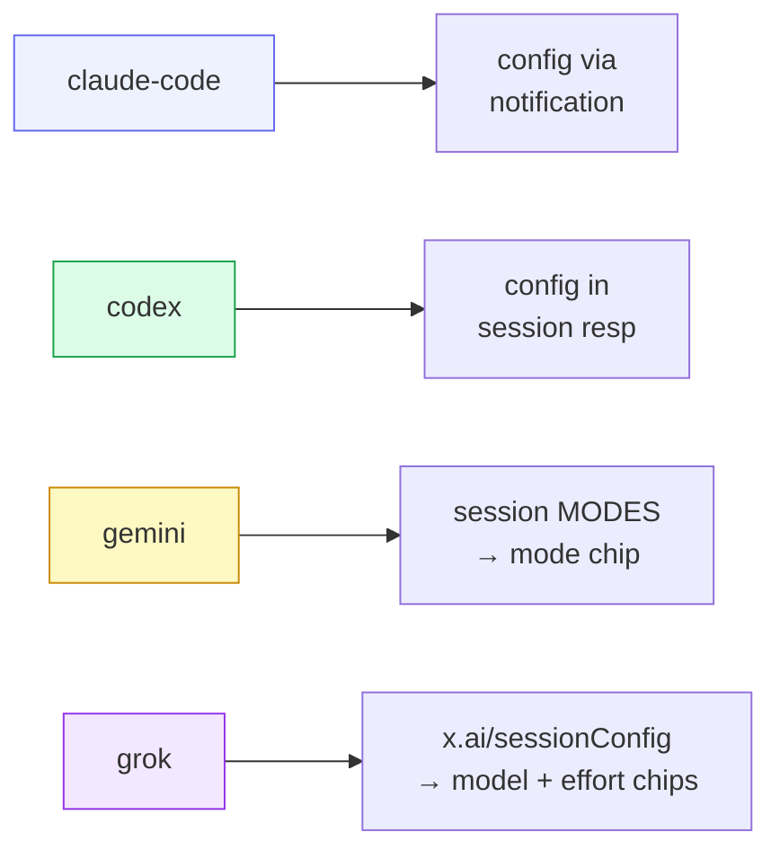

# Providers

> **Current implementation:** signed, independently built Provider packages are
> the product and Machine installation unit. ACP, adapters, gateways, and agent
> CLIs are package-private dependencies and are not ordinary UI concepts.
> Authentication is Cowboy Service-scoped and automatically synchronizes
> encrypted, versioned replicas to Machines. The historical launch-registry
> details retained later in this chapter document only the old-session fallback
> that can be removed after its final generation drains. See
> [Cowboy core requirements](../requirements.md) and
> [Installable Provider packages](../plugin-packages.md).

A **Provider** is a signed package containing typed UI/logic contracts,
content-addressed assets, an exact private runtime dependency graph, platform
payload descriptors, authentication projection, and compatibility claims. All
Providers may use the single `src/acp.rs` client backend internally, but the
transport is not part of the user-facing installation model.

## First-party packages

The first-party Catalog compiles the `agent_provider` plugins under `plugins/`.
Each plugin manifest pins the shared Provider components exactly; its signed
Provider payload remains the Machine installation unit.
They remain visible but non-installable as `unbound` until their complete
multi-platform runtime release is externally published and trusted:

| Provider | Exact private dependencies | Internal on-ramp |
|---|---|---|
| `claude-code` | Claude Agent ACP `0.63.0`; Claude Code `2.1.231` | Claude Code ACP adapter |
| `claude-deepseek` | the same two pins; Anthropic gateway `0.1.0` | Claude Code over the private DeepSeek Anthropic Messages gateway |
| `codex` | Codex ACP `1.1.7`; Codex `0.147.0` | adapter over Codex App Server |
| `codex-deepseek` | the same two pins; Responses gateway `0.2.0` | Codex over the private DeepSeek Responses gateway |
| `gemini` | Gemini CLI `0.55.1` | Gemini's native ACP mode |
| `grok` | Grok Build CLI `0.2.117` | Grok Build's native ACP stdio agent |

Each source compiles to canonical `.cowboy-plugin` bytes; a complete
platform-runtime matrix is bound before the adjacent release envelope can be
signed. Its runtime section contains the exact command, arguments, static
non-secret environment, inherited-environment denylist, dependency versions,
integrity hashes, logical component commands, and host capabilities. The release
binds those logical commands to immutable bytes for every declared platform.
The target Machine revalidates all of them before activation. New Machine-backed
workers construct `LaunchSpec` only from the exact installed package and
generation-local executable; `provider::builtin()` is used only by the legacy
local/drain path.

### Transcript presentation variants

Provider SDK 2.3 moves reasoning-step presentation behind host integration
schema 2. The Provider selects a closed Cowboy component-library variant and
bounded tokens; it does not supply React, HTML, CSS, dimensions, or animation
code. The six first-party packages choose by agent interaction language:

| Provider | Variant | Density | Current surface |
|---|---|---|---|
| `claude-code` | `timeline` | `comfortable` | `plain` |
| `claude-deepseek` | `timeline` | `compact` | `soft` |
| `codex` | `workcell` | `comfortable` | `soft` |
| `codex-deepseek` | `workcell` | `compact` | `soft` |
| `gemini` | `signal` | `comfortable` | `soft` |
| `grok` | `terminal` | `compact` | `plain` |

DeepSeek changes the model/runtime lane, not the agent-family visual grammar,
so its Claude and Codex packages retain their respective base variants while
choosing denser tokens. A session whose exact package predates host schema 2 may
adopt a newer compatible signed presentation for icon, activity, and Transcript
chrome only; its executable and authentication generations remain exact.

### Service authentication presentation

Provider SDK 3.0 adds a closed UI projection over the existing authentication
method graph. An all-`secret_input` Provider renders the `api_key` presentation;
other current method graphs render `account`. The shared Cowboy card shell owns
the logo/title region and one footer containing status, version, and only the
currently valid actions. Consequently Claude and Codex retain account sign-in
language, while both DeepSeek Providers render API-key missing/configured and
add/replace/clear actions without any Provider-ID branch in Web. Their common
`deepseek-api-key-v1` authentication scope means the API key is entered once;
each lane receives its own encrypted projection and keeps its own Provider card.

Grok keeps its own native state under `~/.grok`. Cowboy enables Grok's
cross-session memory but never reads or writes that store. Current Grok releases
enable native subagent tools by default, so Cowboy deliberately does not pass the
removed legacy `--subagents` flag. Machine-created worktrees have already
passed Cowboy's configured trusted-workspace check; only those worker
processes receive `GROK_FOLDER_TRUST=0`, allowing Grok to load repository rules
and hooks without adding persistent entries to the user's folder-trust store.
Grok 1.0.3 also skips automatic project-rule discovery for Machine worktrees
below the hidden `~/.local/state` root. The launch contract therefore appends a
minimal rule telling Grok to read the closest `AGENTS.md`; it contains no copied
project policy and should be deleted once `grok inspect --json` reports the
project instruction directly from those worktrees.

Managed Machine releases also set Codex ACP's `CODEX_PATH` to
`cowboy-codex-app-server`. This transparent NDJSON proxy forwards the selected
Codex CLI unchanged and adds `excludeTurns: true` only to App Server
`thread/resume`. It prevents no-history ACP `session/resume` from hydrating and
serializing the complete rollout while leaving `session/load` intact: the
adapter still performs its explicit `thread/read(includeTurns=true)` afterward.
The shim does not patch or take ownership of the npm-managed adapter and is
idempotent with an upstream adapter that starts sending the option itself.

`codex-deepseek` and `claude-deepseek` are runtime variants, not second agent
implementations. Codex and Claude Code still own planning, tools, approvals,
memory, and execution. Their signed Plugin releases additionally contain the
matching DeepSeek gateway as a private `provider_gateway` component.

An exact package worker never connects to a fixed Machine-global gateway. It
allocates a unique loopback port for that session, starts the generation-local
gateway with `--listen`, requires `/healthz`, and only then resolves the signed
`sidecar_url` argument or environment binding. The sidecar process handle is
owned by the worker, so the exact Provider version, runtime-artifact digest, and
Service auth generation stay together for the complete session. Upgraded and
retained generations can run concurrently while older sessions drain.

The Machine passes a verified command map containing every private component in
the selected content-addressed generation and prepends those component
directories to the worker-only `PATH`. Claude Providers additionally bind
`CLAUDE_CODE_EXECUTABLE` to their exact packaged CLI through the typed
`component_command` value. Codex ACP finds its packaged Codex CLI through the
same generation-local path. Neither variant refers to a Nix profile, `/etc`
catalog, managed Node package, host adapter, or ambient CLI to complete an exact
package launch.

For `codex-deepseek`, the Service's `DEEPSEEK_API_KEY` projection is explicitly
forwarded only to the gateway sidecar; it is not added to the ACP adapter's
environment. For `claude-deepseek`, the same portable bundle is materialized as
the gateway's declared `.config/credentials/deepseek-claude-api-key` file under
the exact auth-generation home because that gateway intentionally accepts a
credential file rather than an environment variable. The Provider clears
inherited OpenAI/Codex or Anthropic/Claude/DeepSeek state before applying its
closed model, routing, and isolation environment.

The old in-tree launch path still describes host-managed fixed-port gateways,
generated homes, and shared adapters so pre-package sessions can drain. Those
services are not dependencies of an installable Plugin release and must not
be used as substitutes when an exact package, component binding, sidecar, auth
projection, or readiness check fails. Once no legacy generation is restorable,
that fallback and its fixed 61137/61138 assumptions can be deleted.

### DeepSeek session context budgets

Cowboy projects a host-owned context option only for a model whose current
DeepSeek capability is known. The Web UI presents it as `Working context` and
shows both the selected window and the runtime's actual compaction point. V4
Flash and V4 Pro both expose the same 1M provider context today, so both
`claude-deepseek` and `codex-deepseek` offer the same `128K`, `256K`, `512K`,
`680K`, and `830K` choices. The option is model-gated rather than a global
gateway setting; future models do not inherit this matrix until their
capability is classified.

The two agent runtimes consume a selected budget differently:

| Agent lane | Default | Runtime projection |
|---|---:|---|
| `claude-deepseek` | `830K` | `CLAUDE_CODE_AUTO_COMPACT_WINDOW` equals the selected budget, except `830K` compacts at the safer `819,200` token line; output remains capped at `128K` |
| `codex-deepseek` | `680K` | `model_context_window` equals the selected budget and `model_auto_compact_token_limit` is 95% of it (`646K` at the default); `830K` remains an explicit large-context choice |

The selection belongs to one Cowboy session. Changing it while the session is
idle persists the preference, recycles only that worker, and resumes the same
native agent session id with the new process-level configuration. Cowboy rejects
the change during a live or dispatching turn. The synthetic option never crosses
ACP, and neither gateway receives invented model aliases or routing parameters.
Older sessions without a stored choice use the lane default above.

### DeepSeek prompt-cache protection

DeepSeek sessions expose a separate `Prompt cache protection` option. It is
enabled by default for new and existing `claude-deepseek` and
`codex-deepseek` sessions, but does no work until a completed interactive
request proves that at least 64,000 input tokens were cache hits at a hit rate
of at least 90%. The controller persists only the policy. The owning gateway
keeps the last eligible upstream request in bounded process memory and never
stores its prompt, response, tools, or reasoning in Cowboy telemetry or logs.

An eligible idle session is refreshed by replaying that exact request with
streaming enabled and the smallest supported output allowance. The replay is a
gateway-internal request: it never enters ACP, the transcript, the session
queue, or the agent process. Any interactive request globally preempts an
in-flight refresh, and agent traffic never waits for the cache protector. A
reset, deletion, provider change, gateway restart, model/configuration change,
or missing exact request snapshot revokes protection rather than guessing a
replacement prompt.

The initial refresh interval is 5 hours 30 minutes with deterministic jitter.
A verified hit increases the interval gradually, up to 5 hours 45 minutes. A
miss or partial hit shortens the learned global interval and stops that
session; retryable transport, rate-limit, and provider failures receive one
bounded retry. These times are operating hypotheses rather than a provider TTL
contract. The gateway caps retained sessions, bytes, attempts, and source age
so abandoned or disconnected sessions cannot create an unbounded background
workload.

The Machine can query content-free protection state through a loopback-only
gateway endpoint. The UI shows status only for DeepSeek sessions whose measured
context has reached 64K. Schema-v4 usage events identify
`request_purpose=cache_keepalive`; their attempts, outcomes, source age,
interval, tokens, and price are reported separately. They never contribute to
interactive request counts, blocking-error rates, cache-miss rates, or agent
spend.

Gemini CLI stopped accepting Google Login for consumer, Google AI Pro, and AI
Ultra accounts on 2026-06-18. Its ACP mode remains usable with a Gemini API key
or Code Assist Standard/Enterprise credentials. The Gemini Provider declares
those two Service-scoped methods:

- **Gemini API key** is captured by a temporary executor, committed to the
  Service vault, then projected to the Provider's private Machine home with
  user-only permissions.
- **Standard/Enterprise Google Login** is offered only when
  `GOOGLE_CLOUD_PROJECT` is configured for the executor. The resulting portable
  bundle follows the same Service generation and replica path.

An old `oauth-personal` credential file without that project is never reported
as signed in. Cowboy recognizes the upstream retirement response as a terminal
startup error: selecting the crashed session does not create a restart loop,
while an explicit Retry remains available after the user changes credentials.
Personal, Google AI Pro, and AI Ultra accounts belong to Antigravity;
Antigravity CLI is not a drop-in Cowboy provider until it publishes an ACP
server mode.

Grok uses the official Grok Build CLI as both private Provider CLI and ACP
agent; there is no second adapter package. Cowboy starts one isolated process
per session and disables its process-local updater. `grok login --device-auth`
runs only as a temporary Service-auth executor: Cowboy exports the declared
portable bundle, commits one encrypted generation, synchronizes it to Machines,
and removes the executor credential after acceptance.

Grok's current ACP compatibility surface returns model and reasoning choices in
`_meta["x.ai/sessionConfig"]` and changes either through `session/set_model`
with `_meta.reasoningEffort`. Cowboy maps those values to ordinary `model` and
`reasoning_effort` config controls, while leaving the selected model dynamic so
a Grok CLI update can replace the default catalog. Cowboy also projects Grok's
logical `x.ai/yolo_mode_changed` extension (wire
`_x.ai/yolo_mode_changed`) as a `permission_mode` selector with Default, Auto,
and Always Approve choices. New sessions use the live model, `high` effort,
and Always Approve as their durable default combination. Native session modes
remain a separate `session_mode` control.

Grok does not emit ACP's standard `usage_update`. Cowboy reads the current
session's exact context snapshot from the adapter-local `x.ai/session/info`
extension (wire `_x.ai/session/info`) after startup, successful turns, and
model/effort changes, then maps
`context.used` / `context.total` into the ordinary session usage channel. The
request is local session inspection and does not run a model turn. Missing or
older extension support degrades to unavailable usage without a user-facing
runtime error.

Account usage is queried only through Grok Build's namespaced
`_x.ai/billing` ACP request. The returned shared weekly/monthly percentage,
reset time, and subscription tier feed the xAI account card. Older CLI versions
that return JSON-RPC `Method not found` show billing as unavailable; Cowboy does
not import browser cookies or call an undocumented web endpoint as a fallback.

## Resume is discovered, not declared

There is **no static resume flag**. A provider gains resume support purely by the
agent advertising `agent_capabilities.load_session` in its `initialize`
response. The supervisor reads that at runtime and decides whether to
`session/load` on revive. This keeps the registry honest: capability follows the
adapter, not a hardcoded table.

## Deferred: ephemeral side conversations (`/side`, `/btw`)

Codex itself supports an ephemeral side conversation, but the published
`@agentclientprotocol/codex-acp` adapter does not currently advertise or expose
that operation over ACP. Cowboy intentionally does **not** approximate it with a
normal prompt, the main-session queue, or a visible forked session: all three
would violate the feature's contract by disturbing the active task, polluting
its transcript, or leaving persistent session state.

TODO: add the Desktop and Mobile BTW affordances when the adapter exposes a
structured, capability-negotiated ACP operation with these semantics:

- the active turn continues without interruption;
- the side exchange is isolated from the main transcript and model context;
- the side exchange is ephemeral unless the user explicitly promotes it;
- unsupported providers omit the affordance rather than simulating it;
- capability detection, not a provider/version string, controls availability.

Until then `/side` and `/btw` must not be added to Cowboy's fallback command
list. A future implementation should consume the adapter-advertised capability
and keep the shared domain operation separate from the Desktop and Mobile UI.

## Package-selected behavior profiles

These mappings are declared by the signed `runtime.behavior` contract. Cowboy
implements a closed, versioned profile union and never selects one by Provider
ID. Adding a Provider may reuse an existing profile without a Cowboy change;
adding genuinely new host semantics requires a new SDK/host contract version,
and older hosts reject it instead of guessing.

- **claude-code** sends its config options (mode / model) *after* the session is
  created, via a `config_option_update` notification.
- **codex** returns config options in the session-creation response.
- **gemini** has no config-option concept for approvals — it uses ACP session
  **modes**. cowboy synthesizes a `"mode"` config chip so the UI presents one
  uniform control, and routes a change to `SetSessionModeRequest` instead of the
  `session/set_config_option` ext method.
- **grok** exposes model and reasoning selectors in `x.ai/sessionConfig`; both
  map to the pre-standard `session/setModel` request, with effort carried in
  request metadata. Its ordinary ACP session modes stay independently routed to
  `session/set_mode`.

## Out-of-process Provider runtime

An installed release supplies its own generation-local executable graph and
launch command. Cowboy starts that runtime as a subprocess and communicates
through the package-declared protocol. A trusted third-party release that uses
the existing schemas and behavior profiles can therefore enter the Catalog and
install without recompiling Cowboy. Its ACP, adapter, gateway, or CLI topology
remains private to the package.

Provider SDK 2.1 adds closed `component_command` and `sidecar_url` runtime
values plus `loopback_http_v1` session sidecars. Links must resolve on every
advertised platform; gateway behavior, capability, component, sidecar, auth
environment forwarding, and readiness must agree or package construction and
Machine installation fail. Prefix/suffix composition is bounded data, not a
shell template.

## Verifying a provider

`cowboy try-agent --provider <id>` remains a local/legacy adapter diagnostic.
Release verification uses `plugin-bind-runtime`, `plugin-sign`,
`plugin-verify`, Catalog ingestion, and the target Machine's staged probes;
the local command is not evidence that the signed release contains the same
runtime bytes.
