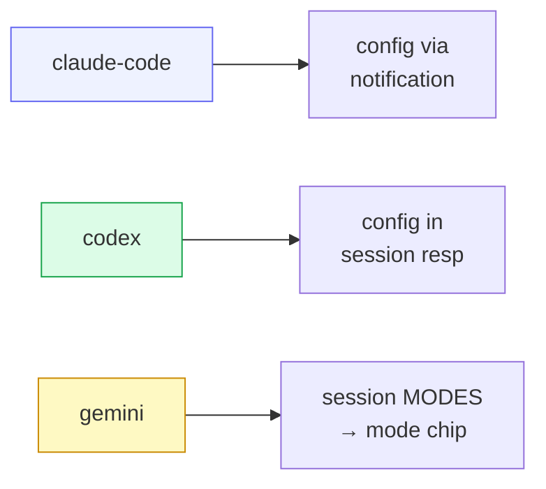

# Providers

A **provider** is the recipe for launching one agent CLI's ACP adapter. All
providers share the single `src/acp.rs` client backend; a provider only declares
**how to spawn its adapter binary**. Adding one is a registry entry plus, where
needed, hand-coded confirm-detection rules — the core never changes.

## Registry

`provider::builtin()` returns the in-tree registry:

| Provider | Launch | ACP on-ramp |
|---|---|---|
| `claude-code` | `npx @agentclientprotocol/claude-agent-acp` | Anthropic's ACP adapter |
| `codex` | `npx @zed-industries/codex-acp` | adapter over the Codex CLI |
| `gemini` | `npx @google/gemini-cli --acp` | Gemini's native ACP mode |

Each entry is a **`LaunchSpec`**: `id` + `command` + `args`. That's the whole
contract a provider must satisfy to start; everything downstream
(initialize/handshake/command loop) is provider-agnostic and lives in `acp.rs`.

## Resume is discovered, not declared

There is **no static resume flag**. A provider gains resume support purely by the
agent advertising `agent_capabilities.load_session` in its `initialize`
response. The supervisor reads that at runtime and decides whether to
`session/load` on revive. This keeps the registry honest: capability follows the
adapter, not a hardcoded table.

## Per-provider quirks the core absorbs

- **claude-code** sends its config options (mode / model) *after* the session is
  created, via a `config_option_update` notification.
- **codex** returns config options in the session-creation response.
- **gemini** has no config-option concept for approvals — it uses ACP session
  **modes**. cowboy synthesizes a `"mode"` config chip so the UI presents one
  uniform control, and routes a change to `SetSessionModeRequest` instead of the
  `session/set_config_option` ext method.

## L1 confirm detection

Each provider also owns deterministic **layer-1** rules for the confirm-detect
skill (`src/provider/confirm.rs`). Given a `TurnEndCtx { stop_reason, final_text }`,
a provider's hand-coded rules (stop-reason markers, text patterns) can decide
"awaiting user" / "done" cheaply, short-circuiting the expensive LLM-based
layer-2 judge. Only an ambiguous `EndTurn` falls through to L2. See
[Confirm-detect & inference](07-confirm-inference.md).

## Toward out-of-process providers

The registry is in-tree today, but the launch-spec shape is deliberately thin so
a provider could later be spawned as its **own subprocess** talking to cowboy
over a local socket — letting third parties add providers without recompiling
cowboy. Not built yet; the interface just doesn't preclude it.

## Verifying a provider

`cowboy try-agent --provider <id>` spawns the adapter end-to-end with no Hub and
no persistence, sends one prompt, and streams the result to stdout. It is the
quickest way to confirm an adapter is installed and the handshake works before
wiring it into a live session.
