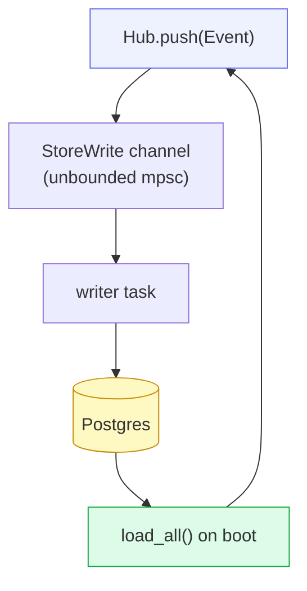

# Storage

cowboy is an **event-sourced stateful daemon**: growing event logs, mobile
pagination, restart recovery. Persistence is **Postgres** (optional — passed via
`--postgres-url`); with no URL the daemon runs fully in-memory and forgets on
restart. The deployed service uses the host's service-private Postgres.

## Write-behind

The Hub never blocks on the database. It emits a `StoreWrite` intent onto an
unbounded mpsc channel; a background **writer task** (`run_store_writer()`) drains
the channel and executes the corresponding `Store` method.

Tradeoff: writes land within milliseconds of the Hub push, but a daemon crash
*between* a push and its flush can lose the very latest events. Accepted for v0 —
the cost of synchronous writes on the streaming hot path is not worth it.

## Schema

Built incrementally by the `migrations/*.sql` files (sqlx applies them on boot):

| Migration | Adds |
|---|---|
| `0001_init` | `sessions` (id, provider, cwd, title, origin, status, next_seq, timestamps) + `events` (session_id, seq, payload JSONB, ts; PK `(session_id, seq)`) |
| `0002_agent_session_id` | `agent_session_id` — the resume bridge |
| `0003_pending` | `queue` + `drafts` JSONB arrays |
| `0004_session_position` | `position` for user reordering |
| `0005_session_soft_delete` | `deleted_at` — soft-delete for the purge window |
| `0006_auto_resume` | `auto_resume` per-session override |
| `0007_inference` | `inference_config` + `inference_secrets` tables |
| `0008_turn_verdict` | `awaiting_user` + `done` (persisted confirm verdict) |
| `0009_judge_runs` | `judge_runs` JSONB history |
| `0010_system_session` | `system` flag (the memory janitor session) |

The design keeps the event log lean: **token deltas are never persisted.**
Live streaming chunks are broadcast from memory only; once a turn completes, the
coalesced final message and tool calls (in their final state) are what land in
`events`. This keeps replay fast and the DB small without hurting the live feel.

## Store API surface

`load_all()` returns every session's metadata + event log + queue/drafts/judge
runs in one restore. Mutations mirror the `StoreWrite` variants: `insert_session`,
`append_event`, `update_status`, `update_verdict`, `update_title`,
`update_agent_session_id`, `delete_session`, `update_pending`,
`update_session_order`, `update_auto_resume`, `update_judge_runs`, plus settings
(`load_settings` / `put_setting`) and inference (`load/put_inference_config`,
`load/put_inference_secret`). `purge_deleted()` hard-deletes soft-deleted rows.

## NUL-byte stripping

Postgres `jsonb`/`text` reject `U+0000`, but agent stdout occasionally carries
stray NUL bytes. `strip_nul()` / `strip_nul_str()` drop them before write so one
bad byte can never poison a row's durability — a row that would otherwise fail to
insert is kept (minus the NULs) instead of lost.

## Retention

Deletes are **soft** (`deleted_at` stamp), so a mis-tap is recoverable. A
**purge sweeper** (`run_purge_sweeper()`, every 6h) hard-deletes sessions past a
3-day retention window. `/api/metrics` exposes `db_bytes`, `events_rows`,
`sessions_live`, `sessions_deleted`, and `daemon_rss_bytes` for monitoring.

## Why not file-as-truth (the omega rule)

omega is a near-stateless config panel, so file-only fits it. cowboy's
access pattern — high-rate streaming appends, paginated reads, search, restart
recovery — is exactly a database's job. A pure-file fallback (`events.jsonl` +
`meta.json` per session) is possible, but pagination and search would then be
hand-rolled. Postgres earns its place here.
