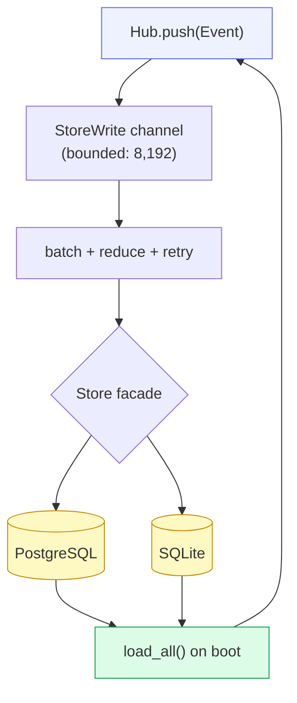

# Storage

cowboy is an **event-sourced stateful daemon**: growing event logs, mobile
pagination, restart recovery. Persistence is optional and selected by
`--database-url`: PostgreSQL (`postgresql://...`) and SQLite (`sqlite://...`)
implement the same stable `Store` API. With no URL the daemon runs fully
in-memory and forgets on restart. The deployed Hawk service continues to use
its service-private PostgreSQL database. The legacy `--postgres-url` and
`COWBOY_POSTGRES_URL` spellings remain accepted for deployment compatibility.

Regenerable Code review data is intentionally separate from durable product
state. Saved files and lazy directory pages use the bounded Hawk-local
`data_dir/code-cache` SQLite/CAS store described in
[13-code-review.md](13-code-review.md). It can be deleted without losing user
state; Zed owns unsaved buffers.

## Write-behind

The Hub never blocks on the database. It emits a `StoreWrite` intent onto a
bounded mpsc channel (8,192 intents); a background **writer task** drains small
batches, reduces high-frequency events, and executes the corresponding `Store`
operations. Queue overflow or a batch that exhausts four retries marks
persistence degraded through `/healthz` and `/api/metrics`.

Writes normally land within milliseconds. On SIGTERM the HTTP/WS server closes
connections and waits up to ten seconds for the writer to drain. A hard crash can
still lose the latest in-memory batch; synchronous token-path writes would couple
live fan-out latency to storage, so cowboy keeps that window observable and bounded.

## Schema

Each backend has one immutable SQLx baseline: PostgreSQL uses
`migrations/0034_baseline.sql`, while SQLite uses
`migrations/sqlite/0008_baseline.sql`. Each baseline preserves the former
incremental statements in their original order, so fresh-database defaults,
data normalization, constraints, and indexes remain identical.

Before applying the consolidated baseline, Cowboy recognizes only the complete,
checksum-verified predecessor histories (PostgreSQL 1–33 and SQLite 1–7).
Those databases receive the new baseline marker without replaying schema or
data statements. A partial or modified predecessor ledger fails closed.
Fresh databases also receive compatibility ledger rows for the predecessor,
allowing the immediately previous controller binary to roll back safely.

The writer UPSERTs consecutive message/thought chunks into their first sequence
row, folds tool updates into the initial call, and stores only the sequence
watermark for usage/session-info telemetry. Live WS clients still see every
frame. On restore, only the latest 1,000 rows within the serialized-byte cap per
session enter the Hub; older rows stay in the durable Store and are loaded
through cursor-addressed pages of at most 64 events.
Native Postgres fits this better than a Timescale hypertable: reads and
uniqueness are keyed by `(session_id, seq)`, while the actual cost was redundant
large JSON payloads rather than time-range scans.

SQLite starts from the equivalent current schema in
`migrations/sqlite/0008_baseline.sql`. Its timestamps are Unix milliseconds and
JSON is validated TEXT. WAL, foreign keys, a five-second busy timeout, and a
small connection pool make it suitable for one Cowboy controller. A SQLite file
must never be shared by multiple controllers or placed on a network filesystem.

## Store API surface

The rest of Cowboy calls only the backend-neutral `Store`; its private enum
dispatches to `PostgresStorage` or `SqliteStorage`. `StoreWrite`, the reducer,
retry behavior, DTOs, pagination, and error contracts do not expose the backend.

`load_all()` returns every session's metadata + hot event tail + total event
count + queue/drafts in one restore. Mutations mirror the `StoreWrite`
variants: `insert_session`, batched event UPSERT, `update_status`, `update_title`,
`update_agent_session_id`, `delete_session`, `update_pending`,
`update_session_order`, and Mobile review state. `purge_deleted()` hard-deletes
soft-deleted rows. The legacy `auto_resume`, confirm-verdict, and judge-run
columns and settings table remain deliberately ignored so rollback can still
read the consolidated schema.

## NUL-byte stripping

Postgres `jsonb`/`text` reject `U+0000`, but agent stdout occasionally carries
stray NUL bytes. `strip_nul()` / `strip_nul_str()` drop them before write so one
bad byte can never poison a row's durability — a row that would otherwise fail to
insert is kept (minus the NULs) instead of lost.

## Retention

Deletes are **soft** (`deleted_at` stamp), so a mis-tap is recoverable. A
**purge sweeper** (`run_purge_sweeper()`, every 6h) hard-deletes sessions past a
3-day retention window. `/api/metrics` exposes storage/session/RSS values plus
persistence queue, drop, and failed-batch counters.

## Why not file-as-truth (the omega rule)

omega is a near-stateless config panel, so file-only fits it. cowboy's
access pattern — high-rate streaming appends, paginated reads, search, restart
recovery — is exactly a database's job. A pure-file fallback (`events.jsonl` +
`meta.json` per session) is possible, but pagination and search would then be
hand-rolled. A relational backend earns its place here; PostgreSQL remains the
production default, while SQLite removes that operational dependency for a
single-controller deployment.

Provider usage rows are the durable, queryable product ledger for both
interactive DeepSeek requests and cache-protection attempts. The
`request_purpose` column keeps those populations disjoint in every aggregate;
background attempts have their own token, outcome, duration, and cost fields.
Both backends store only content-free dimensions and keyed fingerprints. Exact
request snapshots remain bounded gateway memory and are lost deliberately on
gateway restart. VictoriaLogs continues to own high-volume process evidence,
while the Logs UI derives compact cache-protection audit rows from the durable
usage ledger and loads details lazily.
