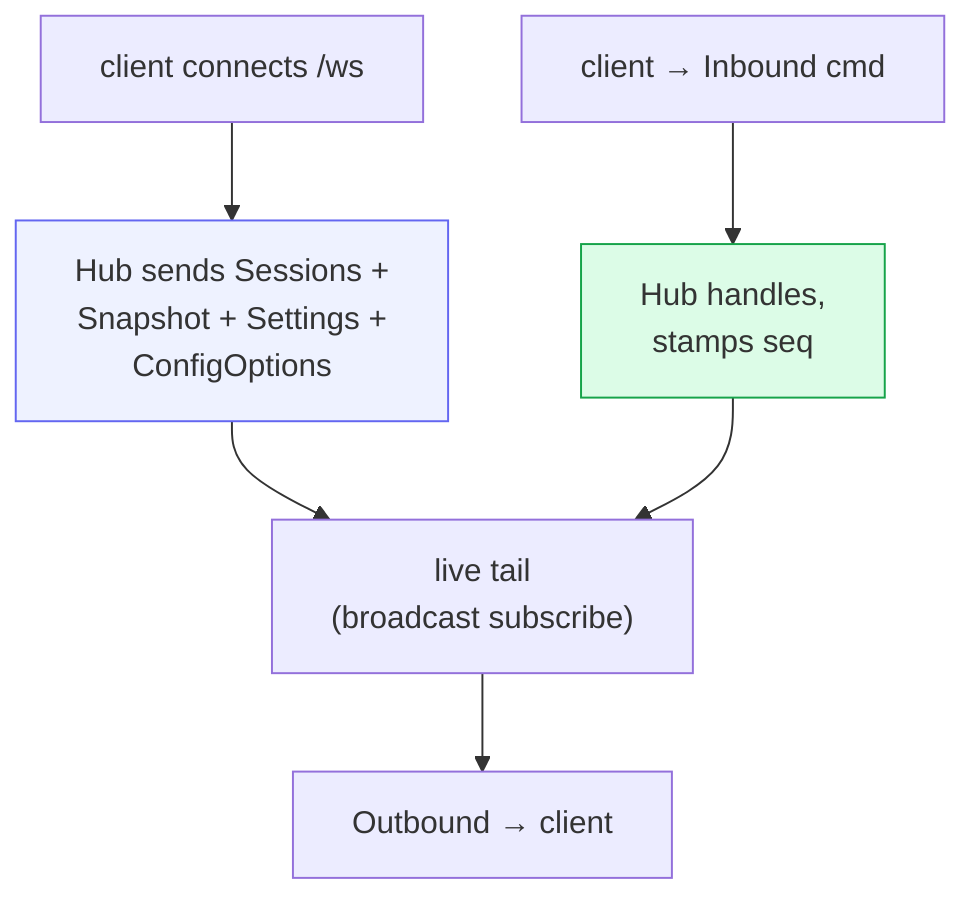

# Server & wire API

`src/server.rs` stands up one **axum** server that exposes REST, hosts the
real-time WebSocket, accepts authenticated Machine connections, and serves the
SPA files under `--web-root`. One process and one port (`:3333`) form the
control plane, while the web files remain an independently replaceable release.

## REST endpoints

| Route | Purpose |
|---|---|
| `GET /healthz` | readiness → `"ok"`, or 503 after persistence loss / exhausted retries |
| `GET /version` | `{ version }` = SHA-256 of `index.html`, for build-id / stale-bundle detection |
| `GET /api/metrics` | storage/session/RSS plus persistence pending, dropped, and failed-batch counters |
| `GET /metrics` | Prometheus controller and runtime metrics |
| `GET /api/usage` | Cached Codex account limits, Claude Agent SDK plan-limit events, and the latest live ACP session usage. Gemini account quota remains absent until its official ACP mode exposes it; Cowboy never reuses provider OAuth credentials against private endpoints. |
| `POST /api/usage` | manually refresh official provider account usage, coalesced and timeout-bounded |
| `GET /api/workspaces` | selectable session roots plus matching central Columbus work items |
| `GET /api/providers` | Provider catalog, Service auth state, and installability |
| `POST /api/providers/{id}/auth/start` | start a Service-owned Provider authentication flow |
| `GET /api/machines` | enrolled Machine health, inventory, components, and Provider state |
| `POST /api/machines/enrollment` | create a short-lived Machine enrollment credential |
| `ANY /api/machine/connect` | authenticated outbound Machine WebSocket |
| `POST /api/sessions` | create a Machine-placed session and return its exact Provider generation |
| `GET /api/sessions/{id}/files?q&limit` | the composer `@` picker (gitignore-aware fuzzy search) |
| `GET /api/sessions/{id}/info` | metadata + event / queue / draft counts |
| `POST /api/sessions/{id}/reload` | atomically rebuild the worker while preserving the Cowboy/native session, transcript, pending state, and saved config |
| `POST /api/sessions/{id}/prompt` | machine-driven session wake |
| `GET /api/history/{id}?before_seq=…` | cursor-addressed, event- and byte-bounded history page |
| `GET /api/code/sessions/{id}/*` | worktree tree/search/manifest/diff/file/LSP data plane |
| `GET /api/artifacts/{name}` | externalized large transcript artifacts |
| `ANY /ws` | WebSocket upgrade |
| `*` (fallback) | files from `--web-root`, with `index.html` fallback for client routes |

Static assets are read at request time. Content-addressed Vite assets receive
immutable caching; shell files revalidate with content ETags. An atomic Web
release can therefore retarget `/run/cowboy-web` without restarting the daemon
or its WebSocket connections.

## The `/api/workspaces` picker

The New Session picker lets you choose **any registered Columbus project**.
Those values are discovery roots, not task directories. When creating a
Machine-backed session, the controller resolves the trusted workspace id and
the Machine fetches the remote default branch into a worktree keyed by the
reserved Cowboy session id. Only that prepared path becomes the persisted
`cwd`, so Codex loads the right guidance without inheriting another task's
uncommitted files. Preparation fails closed; it never silently falls back to
the stable checkout. The old WebSocket creation command is rejected because it
cannot express Machine placement. Direct API/ACP callers may still supply a
caller-owned local workspace. `/etc/nixos` is deliberately not selectable.

## History pagination

The WebSocket `Snapshot` carries a byte- and event-bounded hot tail. Older
history is pulled lazily with `GET /api/history/{id}?before_seq=…`; complete
past pages are immutable, while the live tail remains on WebSocket. The
frontend requests older pages as the user scrolls up. It
uses canonical message/tool rows plus CSS off-screen containment; retaining the
browser's `column-reverse` anchor avoids iOS jumps from unmounting
variable-height rows in a JavaScript virtualizer.

## The WebSocket loop

On connect the Hub pushes the compatibility bootstrap (`Sessions`, per-session
`Snapshot`, `Settings`, and `ConfigOptions`). After that it's symmetric:
the client sends `Inbound` commands, the Hub fans `Outbound` messages back. The
wire types are mirrored in `web/src/protocol.ts`. `protocol_contract` parses the
Rust enums and fails tests when their serialized discriminants differ from the
TypeScript unions; representative field shapes remain covered by Rust serde and
TypeScript checks. See [Core — the Hub](02-core-hub.md) for the full catalogs.

## Background tasks

`serve` spins up, alongside the HTTP server:

- **store writer** — drains `StoreWrite` intents ([Storage](05-storage.md))
- **purge sweeper** — hard-deletes soft-deleted sessions past 3 days (every 6h)
- **dispatcher** — drains the Hub→supervisor hand-off and forwards prompts
- **usage collector** — refreshes provider account limits every five minutes;
  failures remain provider-local and preserve explicit unavailable/stale state
- **Machine broker/control** — authenticates outbound Machine connections,
  reconciles inventory, and routes fenced runtime commands
- **Provider Service** — owns authentication flows, signed catalog state, and
  credential-replica convergence

## Auth

Browser/API access has no Cowboy login boundary; the deployed service therefore
binds localhost and is reached through a trusted Tailscale or reverse-proxy
boundary. Machine access is different: enrollment uses a short-lived,
single-use token, then public-key identity authenticates outbound WSS
connections and supports explicit revocation. Do not expose the controller's
browser/API surface directly to the public Internet.
