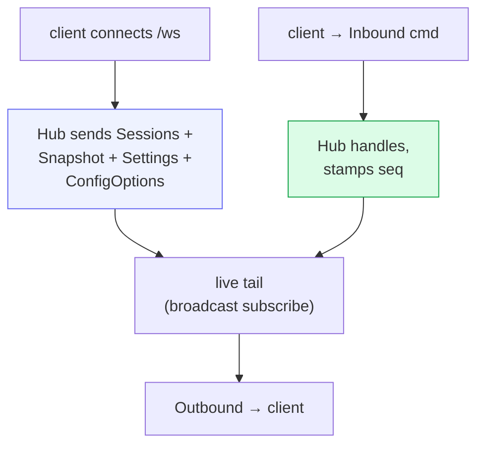

# Server & wire API

`src/server.rs` stands up one **axum** server that exposes REST, hosts the
real-time WebSocket, accepts authenticated Machine connections, and serves the
SPA files under `--web-root`. One process and one port (`:3333`) form the
control plane, while the web files remain an independently replaceable release.

## REST endpoints

| Route | Purpose |
|---|---|
| `GET /healthz` | readiness → `"ok"`, or 503 after persistence loss / exhausted retries |
| `GET /version` | `{ version }` = SHA-256 of `index.html`, for build-id / stale-bundle detection |
| `GET /api/auth/status` | public login state, configured methods, session deadlines, capacity policy, and current principal summary |
| `POST /api/auth/setup` | prove host setup code; 10-minute setup cookie; 403 once a user exists |
| `POST /api/auth/register` | setup-cookie first-run; creates the only user; 403 afterward |
| `POST /api/auth/login` | product login; dummy-verifies unknown users; `cowboy_user` cookie |
| `POST /api/auth/logout` | transactionally revoke the current, all, or one Provider's stable sessions; broader scopes require recent step-up and return an optional RP-initiated logout URL |
| `GET /api/auth/logout/complete` | fixed same-origin completion page for Provider RP-initiated logout |
| `POST /api/auth/providers/{id}/backchannel-logout` | verify a signed OIDC logout token, reject replay, then revoke only the matching Provider sessions |
| `GET /api/auth/me` | current product principal (cookie or Bearer) |
| `POST /api/auth/automation/credentials` | recent-login operator+; issue a short-lived sender-constrained credential from the separate automation pool |
| `GET /api/auth/sessions` | list this account's stable signed sessions and their active-client state |
| `DELETE /api/auth/sessions/{id}` | revoke one owned signed session and fence its leases/waiters |
| `DELETE /api/auth/active-clients/{id}` | manually reclaim one owned active-client lease using its fencing generation |
| `POST /api/auth/tokens` | product operator+; create a `cow_…` token (secret shown once) |
| `GET /api/auth/tokens` | list own token prefixes, names, timestamps |
| `DELETE /api/auth/tokens/{id}` | revoke own token; other users' ids are 404 |
| `GET /api/admin/auth` | public admin login status / bootstrap required / setup pending |
| `POST /api/admin/auth/setup` | `403` complete setup on `/` |
| `POST /api/admin/auth/bootstrap` | `403` complete setup on `/` |
| `POST /api/admin/auth/login` | admin login; `cowboy_admin` cookie |
| `POST /api/admin/auth/logout` | clear admin cookie |
| `GET /api/admin/overview` | admin viewer+ health, persistence, registration |
| `GET /api/admin/sessions` | admin viewer+ live sessions |
| `GET /api/admin/machines` | admin viewer+ enrolled machines |
| `GET /api/admin/accounts` | admin viewer+ admin operators (no hashes) |
| `POST /api/admin/accounts` | `403` single-user |
| `GET /api/admin/registration` | admin viewer+ policy + invite table (always closed) |
| `PUT /api/admin/registration` | `403` single-user |
| `POST /api/admin/registration/tokens` | `403` single-user |
| `DELETE /api/admin/registration/tokens/{id}` | `403` single-user |
| `GET /api/admin/permissions` | admin viewer+ grants |
| `PUT /api/admin/permissions` | `403` single-user |
| `GET /api/admin/session-limits` | admin viewer+ controller limits |
| `PUT /api/admin/session-limits` | admin operator+ replace limits |
| `GET /api/admin/plugins` | admin viewer+ Plugin Catalog |
| `POST /api/admin/plugins/refresh` | admin operator+ rescan external Plugin releases |
| `GET /api/admin/users` | admin operator+ list the only product user |
| `POST /api/admin/users` | `403` single-user |
| `POST /api/admin/users/{id}/disable` | admin operator+ disable + revoke sessions/tokens |
| `POST /api/admin/users/{id}/password` | admin owner set password |
| `GET /api/metrics` | admin operator+ diagnostic JSON (not the scrape path) |
| `GET /metrics` | scrape-only: loopback peer and no forwarded headers, else 404 |
| `GET /api/usage` | Cached Codex account limits, Claude Agent SDK plan-limit events, and the latest live ACP session usage. Refresh metadata is provider-local so clients can distinguish fresh, stale, and retry-scheduled values. Gemini account quota remains absent until its official ACP mode exposes it; Cowboy never reuses provider OAuth credentials against private endpoints. |
| `POST /api/usage` | manually refresh official provider account usage; all callers share a persisted 30-second provider cooldown and one in-process single-flight |
| `GET /api/workspaces` | selectable session roots plus matching central Columbus work items |
| `GET /api/plugins` | Plugin Catalog plus the Agent Provider/auth capability projection |
| `POST /api/providers/{id}/auth/start` | start a Service-owned Provider authentication flow |
| `GET /api/machines` | enrolled Machine health, inventory, components, and Plugin state |
| `GET /api/machines/{id}/plugins` | exact generic Plugin installation inventory |
| `POST /api/machines/enrollment` | create a short-lived Machine enrollment credential |
| `ANY /api/machine/connect` | authenticated outbound Machine WebSocket |
| `POST /api/sessions` | create a Machine-placed session and return its exact Provider generation |
| `GET /api/sessions/{id}/files?q&limit` | the composer `@` picker (gitignore-aware fuzzy search) |
| `GET /api/sessions/{id}/info` | metadata + event / queue / draft counts |
| `POST /api/sessions/{id}/reload` | atomically rebuild the worker while preserving the Cowboy/native session, transcript, pending state, and saved config; an in-flight turn is rejected unless the caller sends `confirm_active_turn=true` to explicitly confirm that it may be stopped |
| `POST /api/sessions` | product operator+; stamps `owner_user_id`; returns authoritative `session_id`, exact `provider_version`, `provider_generation_digest`, and optional `provider_auth_generation` selected transactionally by the Controller |
| `POST /api/sessions/{id}/prompt` | machine-driven session wake |
| `GET /api/history/{id}?before_seq=…` | cursor-addressed, event- and byte-bounded history page |
| `GET /api/code/sessions/{id}/*` | worktree tree/search/manifest/diff/file/LSP data plane |
| `GET /api/artifacts/{name}` | externalized large transcript artifacts |
| `ANY /ws` | product cookie or Bearer; cookie upgrades also check Origin; 401 before upgrade |
| `*` (fallback) | files from `--web-root`, with `index.html` fallback for client routes |

Static assets are read at request time. Content-addressed Vite assets receive
immutable caching; shell files revalidate with content ETags. An atomic Web
release can therefore retarget `/run/cowboy-web` without restarting the daemon
or its WebSocket connections.

## The `/api/workspaces` picker

The New Session picker lets you choose **any registered Columbus project**.
Those values are discovery roots, not task directories. When creating a
Machine-backed session, the controller resolves the trusted workspace id and
the Machine fetches the remote default branch into a worktree keyed by the
reserved Cowboy session id. Only that prepared path becomes the persisted
`cwd`, so Codex loads the right guidance without inheriting another task's
uncommitted files. Preparation fails closed; it never silently falls back to
the stable checkout. The old WebSocket creation command is rejected because it
cannot express Machine placement. Direct API/ACP callers may still supply a
caller-owned local workspace. `/etc/nixos` is deliberately not selectable.

## History pagination

The WebSocket `Snapshot` carries a byte- and event-bounded hot tail. Older
history is pulled lazily with `GET /api/history/{id}?before_seq=…`; complete
past pages are immutable, while the live tail remains on WebSocket. The
frontend requests older pages as the user scrolls up. It
uses canonical message/tool rows plus CSS off-screen containment; retaining the
browser's `column-reverse` anchor avoids iOS jumps from unmounting
variable-height rows in a JavaScript virtualizer.

## The WebSocket loop

On connect the Hub pushes the compatibility bootstrap (`Sessions`, per-session
`Snapshot`, `Settings`, and `ConfigOptions`). After that it's symmetric:
the client sends `Inbound` commands, the Hub fans `Outbound` messages back. The
wire types are mirrored in `web/src/protocol.ts`. `protocol_contract` parses the
Rust enums and fails tests when their serialized discriminants differ from the
TypeScript unions; representative field shapes remain covered by Rust serde and
TypeScript checks. See [Core — the Hub](02-core-hub.md) for the full catalogs.

Product `Outbound::Settings` is an empty compatibility tombstone. Admin
identities, permissions, session limits, and the registration invite table
never ride `/ws`. The retired `Inbound::SetSetting` command is accepted and
ignored so a stale installed PWA cannot restore removed auto-resume behavior.

## Background tasks

`serve` spins up, alongside the HTTP server:

- **store writer** — drains `StoreWrite` intents ([Storage](05-storage.md))
- **purge sweeper** — hard-deletes soft-deleted sessions past 3 days (every 6h)
- **dispatcher** — drains the Hub→supervisor hand-off and forwards prompts
- **usage collector** — refreshes provider account limits every five minutes.
  OpenAI, xAI, and DeepSeek use the same provider-local refresh state for full,
  per-card, and lazy background requests. A timeout, connection failure, 408,
  409, 429, or 5xx keeps the last successful value, marks it stale, and becomes
  eligible for one later background attempt after one minute. Authentication,
  authorization, configuration, and schema failures never borrow a cached value.
  Internal RPC/HTTP details are logged but replaced with a stable public error.
  Reset-credit selection and consumption deliberately bypass cached usage and
  automatic retry because they guard a provider-side mutation.
- **Machine broker/control** — authenticates outbound Machine connections,
  reconciles inventory, and routes fenced runtime commands
- **Provider Service** — owns authentication flows, signed catalog state, and
  credential-replica convergence

## Auth

When product authentication is enabled, accounts are required and there is no
implicit loopback bypass. A product cookie (`cowboy_user`), a browser-approved
device access token plus its per-request Ed25519 proof, or a legacy
`Authorization: Bearer cow_...` token is required on `/ws` and product APIs.
Cookie `/ws` upgrades also run the CSRF Origin allow-list; missing or disallowed
Origin is 403 and does not open a socket. Sender-constrained and legacy bearer
requests skip Origin. Missing, expired, disabled, or invalid principals return
**401 before `on_upgrade`**. A later revoke closes the socket with application
code **4001**. The explicit auth-off deployment flag remains the trusted-intranet
rollback and exposes the synthetic local owner without manufacturing a client
credential.

Native and ACP clients use browser-approved device authorization. The client
generates its Ed25519 key and PKCE verifier; the browser performs the configured
Cardea/password/plugin login and explicitly approves the public-key fingerprint.
The exchange returns a 10-minute access token and an absolute 30-day refresh
token. Every API and WebSocket handshake signs method, path/query, token hash,
timestamp, and a single-use nonce. Refresh tokens are hash-only in storage,
rotate on every use, and revoke the device family on replay. Access tokens are
memory-only and one active token is retained per device. `serve-acp` opens this
flow automatically and retries once after a rejected short access token.

Personal access token endpoints remain only as a hidden migration boundary for
old clients. Their secrets are still hash-only at rest, but normal Account and
Zed setup no longer creates, displays, or asks users to copy one.

Session REST families (`/api/sessions/{id}/*`, `/api/code/sessions/{id}/*`,
`/api/history/{id}`) use `can_see` / `can_mutate`. Product viewers see own
and unowned rows; operators mutate own or unowned; an owner grant sees and
mutates every row. Global `title` / `order` SyncPatches are projected to
visible ids. Reorder merges: submitted ids only permute names they include,
and an omitted visible id is never dropped (`[A,B,C]` + `[C,A]` → `[C,B,A]`).

`GET /api/artifacts/{name}` requires a product principal; the hash is the
capability. `GET /api/machine/service` is public and returns the stable,
non-secret Service id used to isolate one computer's local Machine resources.
Enrollment repeats that id so the Machine can reject a Service switch during
registration. `POST` and `DELETE /api/machines/enrollment` require a product or
admin operator; `DELETE` discards an unconsumed one-time token. Product Machine
lists expose only enrolled outbound Machines; controller-local compatibility
rows remain admin-only. `POST /api/machines/{id}/revoke` accepts a product or
admin operator, then disconnects the Machine and fences its runtime from this
Service without touching another Service or deleting files on the computer. `GET
/metrics` is scrape-only: loopback peer and no `X-Forwarded-*` /
`X-Real-IP`, otherwise 404. `GET /api/metrics` is admin operator+. Unlisted
`/api/*` routes fail closed as admin operator+. Admin writes use
`require_admin_role`; viewers keep read. Admin HTTP and product login stay
separate planes; see [Admin](14-admin.md) and
[Product login](16-product-auth.md).
