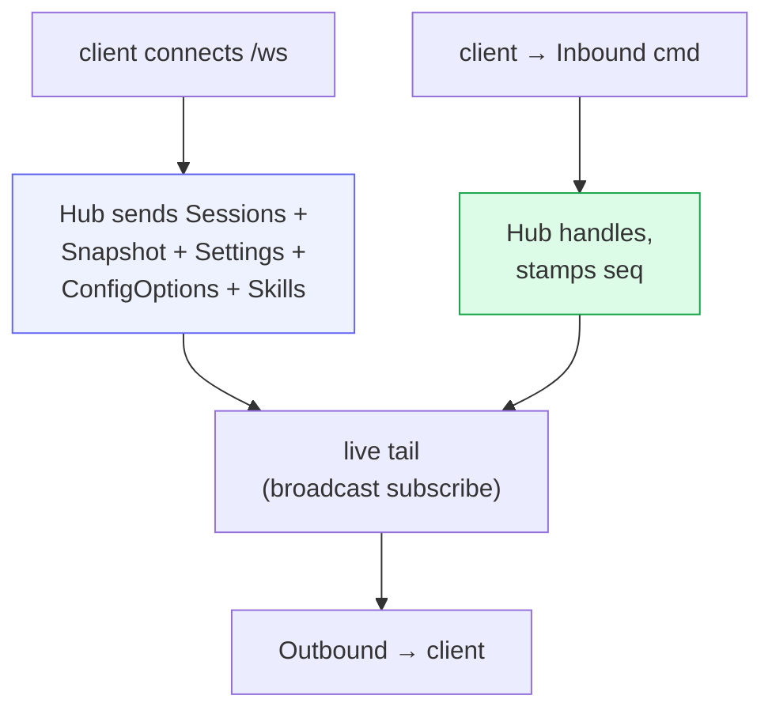

# Server & wire API

`src/server.rs` stands up a single **axum** server that does three jobs at once:
serve the embedded SPA, expose the REST endpoints, and host the WebSocket that
carries the real-time event/command stream. One process, one port (`:3333`) →
the same binary is both frontend and backend.

## REST endpoints

| Route | Purpose |
|---|---|
| `GET /healthz` | readiness → `"ok"`, or 503 after persistence loss / exhausted retries |
| `GET /version` | `{ version }` = SHA-256 of `index.html`, for build-id / stale-bundle detection |
| `GET /api/metrics` | storage/session/RSS plus persistence pending, dropped, and failed-batch counters |
| `GET /api/usage` | Cached Codex account limits, Claude Agent SDK plan-limit events, and the latest live ACP session usage. Gemini account quota remains absent until its official ACP mode exposes it; Cowboy never reuses provider OAuth credentials against private endpoints. |
| `POST /api/usage` | manually refresh official provider account usage, coalesced and timeout-bounded |
| `GET /api/workspaces` | selectable session roots plus matching central Columbus work items |
| `GET /api/sessions/{id}/files?q&limit` | the composer `@` picker (gitignore-aware fuzzy search) |
| `GET /api/sessions/{id}/info` | metadata + event / queue / draft counts |
| `POST /api/sessions/{id}/reload` | atomically rebuild the worker while preserving the Cowboy/native session, transcript, pending state, and saved config |
| `POST /api/sessions` | create a session, returns the cowboy `session_id` |
| `POST /api/sessions/{id}/prompt` | machine-driven session wake |
| `GET /api/history/{id}/{page}` | fixed-size, seq-aligned history page (`immutable` once the next page exists) |
| `ANY /ws` | WebSocket upgrade |
| `*` (fallback) | the embedded SPA (`index.html` for client routes) |

The SPA is embedded at compile time via `rust-embed` (`#[folder = "web/dist"]`),
so a release binary is fully self-contained — no static-file directory to deploy.

## The `/api/workspaces` picker

The New Session picker lets you choose **any registered Columbus project**.
Those values are discovery roots, not task directories. When creating a
Machine-backed session, the controller resolves the trusted workspace id and
the Machine fetches the remote default branch into a worktree keyed by the
reserved Cowboy session id. Only that prepared path becomes the persisted
`cwd`, so Codex loads the right guidance without inheriting another task's
uncommitted files. Preparation fails closed; it never silently falls back to
the stable checkout. The old WebSocket creation command is rejected because it
cannot express Machine placement. Direct API/ACP callers may still supply a
caller-owned local workspace. `/etc/nixos` is deliberately not selectable.

## History pagination

The WebSocket `Snapshot` only carries the last ~200 events. Older history is
pulled lazily over REST: `GET /api/history/{id}/{page}` returns a fixed-size,
seq-aligned page, marked `immutable` once a later page exists (so the client can
cache it forever). The frontend requests older pages as the user scrolls up. It
uses canonical message/tool rows plus CSS off-screen containment; retaining the
browser's `column-reverse` anchor avoids iOS jumps from unmounting
variable-height rows in a JavaScript virtualizer.

## The WebSocket loop

On connect the Hub pushes the full bootstrap (`Sessions`, per-session
`Snapshot`, `Settings`, `ConfigOptions`, `Skills`). After that it's symmetric:
the client sends `Inbound` commands, the Hub fans `Outbound` messages back. The
wire types are mirrored in `web/src/protocol.ts`. `protocol_contract` parses the
Rust enums and fails tests when their serialized discriminants differ from the
TypeScript unions; representative field shapes remain covered by Rust serde and
TypeScript checks. See [Core — the Hub](02-core-hub.md) for the full catalogs.

## Background tasks

`serve` spins up, alongside the HTTP server:

- **store writer** — drains `StoreWrite` intents ([Storage](05-storage.md))
- **purge sweeper** — hard-deletes soft-deleted sessions past 3 days (every 6h)
- **dispatcher** — drains the Hub→supervisor hand-off and forwards prompts
- **usage collector** — refreshes provider account limits every five minutes;
  failures remain provider-local and preserve explicit unavailable/stale state

## Auth

There is **no auth in v0** — a deliberate LAN-only choice. The deployed service
binds localhost and is reached over Tailscale / a reverse proxy (which also
resolves browser mixed-content for `wss://`). Token-based device pairing and
`wss` are a v1 follow-up; the design treats remote exposure as the largest
attack surface, so this is a known gap, not an oversight.
