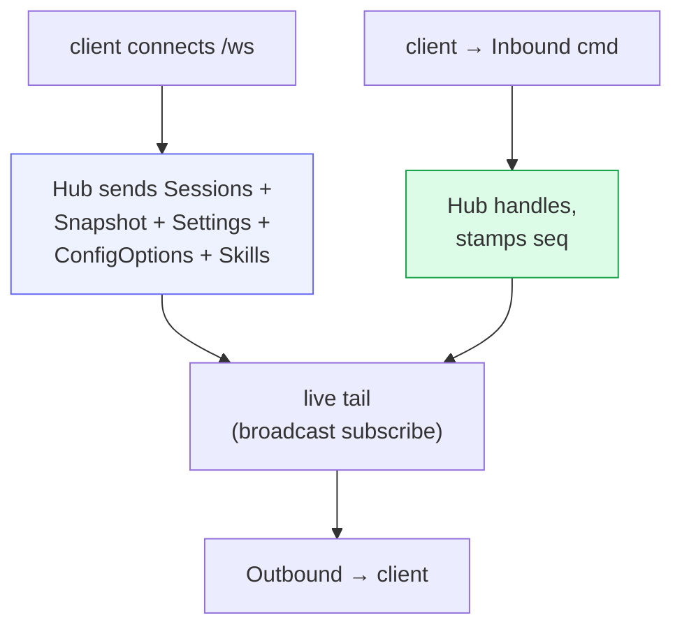

# Server & wire API

`src/server.rs` stands up a single **axum** server that does three jobs at once:
serve the embedded SPA, expose the REST endpoints, and host the WebSocket that
carries the real-time event/command stream. One process, one port (`:3333`) →
the same binary is both frontend and backend.

## REST endpoints

| Route | Purpose |
|---|---|
| `GET /healthz` | liveness → `"ok"` |
| `GET /version` | `{ version }` = SHA-256 of `index.html`, for build-id / stale-bundle detection |
| `GET /api/metrics` | `db_bytes`, `events_rows`, `sessions_live`, `sessions_deleted`, `daemon_rss_bytes` |
| `GET /api/workspaces` | selectable session roots — Columbus projects + `workspace_root` subdirs |
| `GET /api/sessions/{id}/files?q&limit` | the composer `@` picker (gitignore-aware fuzzy search) |
| `GET /api/sessions/{id}/info` | metadata + event / queue / draft counts |
| `POST /api/sessions` | create a session, returns the cowboy `session_id` |
| `POST /api/sessions/{id}/prompt` | machine wake (used by the memory janitor) |
| `POST /api/memory/record` | enqueue a memory proposal (gated by `--memory-enabled`) |
| `POST /api/memory/forget` | soft-archive a memory (gated) |
| `GET /api/history/{id}/{page}` | fixed-size, seq-aligned history page (`immutable` once the next page exists) |
| `ANY /ws` | WebSocket upgrade |
| `*` (fallback) | the embedded SPA (`index.html` for client routes) |

The SPA is embedded at compile time via `rust-embed` (`#[folder = "web/dist"]`),
so a release binary is fully self-contained — no static-file directory to deploy.

## The `/api/workspaces` picker

This is what makes per-project memory + `AGENTS.md` load correctly: the New
Session picker lets you open a session in **any Columbus project's worktree**.
The chosen `cwd` becomes the agent's working directory, so the agent inherits
that project's guidance files and the memory store keys by the cwd-slug.

## History pagination

The WebSocket `Snapshot` only carries the last ~200 events. Older history is
pulled lazily over REST: `GET /api/history/{id}/{page}` returns a fixed-size,
seq-aligned page, marked `immutable` once a later page exists (so the client can
cache it forever). The frontend's virtualized transcript requests older pages as
the user scrolls up, with scroll anchoring so the view doesn't jump.

## The WebSocket loop

On connect the Hub pushes the full bootstrap (`Sessions`, per-session
`Snapshot`, `Settings`, `ConfigOptions`, `Skills`). After that it's symmetric:
the client sends `Inbound` commands, the Hub fans `Outbound` messages back. The
wire types are mirrored in `web/src/protocol.ts` so the TypeScript and Rust ends
stay in lock-step. See [Core — the Hub](02-core-hub.md) for the full command and
message catalogs.

## Background tasks

`serve` spins up, alongside the HTTP server:

- **store writer** — drains `StoreWrite` intents ([Storage](05-storage.md))
- **purge sweeper** — hard-deletes soft-deleted sessions past 3 days (every 6h)
- **dispatcher** — drains the Hub→supervisor hand-off and forwards prompts
- **memory subsystem** — reconcile loop + 12h tidy timer, only when
  `--memory-enabled` ([Memory subsystem](08-memory.md))

## Auth

There is **no auth in v0** — a deliberate LAN-only choice. The deployed service
binds localhost and is reached over Tailscale / a reverse proxy (which also
resolves browser mixed-content for `wss://`). Token-based device pairing and
`wss` are a v1 follow-up; the design treats remote exposure as the largest
attack surface, so this is a known gap, not an oversight.
