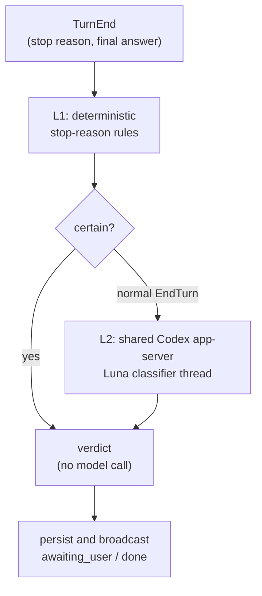

# Confirm detection

At each agent turn end, cowboy classifies whether the agent is waiting for the
user and whether the requested work is done. The verdict drives the status pill,
queue hold, notifications, and persisted judge history.

## Two layers



L1 lives in `src/provider/confirm.rs`. Any non-normal ACP stop reason (cancel,
limit, refusal, or error) deterministically yields neither awaiting nor done. A
normal or absent `EndTurn` remains semantically ambiguous and proceeds to L2.
L1 deliberately does not guess from punctuation or provider-specific prose.

## Shared Codex classifier

`src/inference/codex.rs` owns one long-lived `codex app-server` process and one
ephemeral `gpt-5.6-luna` thread shared across all cowboy sessions. A single
bounded worker serializes judgments on that thread. Stable base/developer
instructions and a calibration example remain at the front; each turn adds only
a compact JSON envelope containing the final answer. The rolling identical
prefix lets Codex reuse its prompt cache, unlike starting one CLI session per
judgment.

The worker starts lazily on the first ambiguous turn, disables memory, exposes
no tools, uses read-only sandboxing, and requests strict structured output:

```json
{ "awaiting_user": true, "done": false, "confidence": 0.0, "reason": "<short>" }
```

Only the latest agent final-answer message is sent. Commentary, tool traffic,
the user prompt, and previous transcript are excluded; oversized answers are
Unicode-safely capped at 4,096 characters while retaining both their beginning
and end. A timeout or malformed response discards the app-server and retries
once with a fresh calibrated thread. Repeated failure is fail-open: cowboy
clears the provisional hold so the queue cannot become permanently stuck.

The Codex executable defaults to `/opt/npm-global/bin/codex` and can be changed
with `COWBOY_CODEX_COMMAND`. Its installation follows Codex's own npm update
channel; Nix owns the service wiring, not the Codex CLI version.

## Results and observability

`src/skills/confirm.rs` validates the structured result and converts it to the
typed verdict. Both verdict fields survive restart (migration `0008`), and the
latest 30 detailed runs per session are retained in `judge_runs` (migration
`0009`). Each run records layer, model, input/output, confidence, reason, latency,
and Codex cache hit/miss tokens for the Judge Inspector.

The `src/skills/` registry broadcasts the classifier prompt and extraction rule
to the Info sheet so the judgment remains inspectable. Provider/model/key editing
and the old inference probe no longer exist; the obsolete provider tables and
stored API secret are dropped by migration `0013`.
