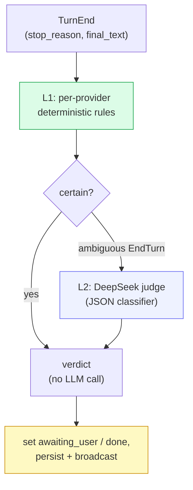

# Confirm-detect & inference

When an agent's turn ends, cowboy needs to know **what the agent wants next**: is
it *waiting for the user* (asked a question, needs a decision), or is it *done*
(task complete)? That verdict drives the turn-status pill, the queue hold, and
notifications. Computing it is the job of the **confirm-detect skill**, backed by
the **inference** layer.

## Two layers



- **L1 (cheap, deterministic)** lives in `src/provider/confirm.rs`. Each provider
  has hand-coded rules keyed on the ACP `stop_reason` and patterns in the final
  text. Clear cases (a hard stop marker, an obvious question) resolve here with
  **no LLM call**.
- **L2 (LLM judge)** runs only when L1 returns `None` — typically an ambiguous
  `EndTurn`. It calls a small, cheap model to classify.

## The L2 judge

`src/skills/confirm.rs` implements `classify(provider, stop_reason, inference,
final_text)`. It sends the agent's final text to DeepSeek with a stable Chinese
classifier system prompt and asks for strict JSON:

```json
{ "awaiting_user": true, "done": false, "confidence": 0.0, "reason": "<≤8 chars>" }
```

The parser is **robust to truncation**: the two booleans appear first in the JSON
and are parsed first; `confidence` / `reason` are best-effort. Because the system
prompt is stable (longest, first) and only the per-turn text varies, DeepSeek's
**prefix cache** makes each call cheap.

The verdict feeds back into the session: `awaiting_user` holds the queue and
shows a "waiting for your reply" widget; `done` drives the green "done" pill and
future notifications. Both are persisted (migration `0008`) so the state survives
a restart, and every run is recorded in the **judge-runs** history (capped 30 per
session, migration `0009`) backing the Judge Inspector widget in the UI.

## The inference layer

`src/inference/` is a small, portable abstraction over LLM providers, separate
from the agent providers in `src/provider/`:

```rust
trait InferenceProvider {
    fn id(&self) -> &str;
    fn models(&self) -> ModelSource;          // static list, or future endpoint
    async fn complete(&self, req: CompleteRequest) -> CompleteResponse;  // portable core
    async fn raw(&self, body: Value) -> Value; // unclamped vendor escape hatch
}
```

`complete()` is the portable path (messages, JSON mode, temperature, max tokens);
`raw()` is the escape hatch that passes a vendor-native body through unchanged, so
provider-specific features are reachable on day one without widening the trait.

### DeepSeek

`src/inference/deepseek.rs` targets DeepSeek's OpenAI-compatible
`/chat/completions`. Both `ChatRequest` and `ChatResponse` are fully typed. Two
models are offered: `deepseek-v4-pro` (default; thinking, accurate) and
`deepseek-v4-flash` (fast, cheap). The typed `Usage` surfaces DeepSeek's
prefix-cache accounting (`cache_hit_tokens` / `cache_miss_tokens`), which is what
makes the stable-prefix judge prompt economical.

## Configuration

Inference config (provider, model, params) and secrets (API keys) are persisted
in their own tables (migration `0007`) and edited from the Info sheet. The wire
**never carries the key** — `InferenceConfig` reports only the model and whether a
key is set. `InferenceProbe` lets the UI test a provider (returns the completion
text plus cache-token counts) before relying on it.

## Skills registry

The confirm-detect skill is registered through `src/skills/` as a `SkillMeta`
(id, title, description, prompt template, extraction rule) and broadcast to the
UI once on connect via the `Skills` message. The registry is the seam for adding
more turn-analysis skills later; v1 ships exactly the one.
