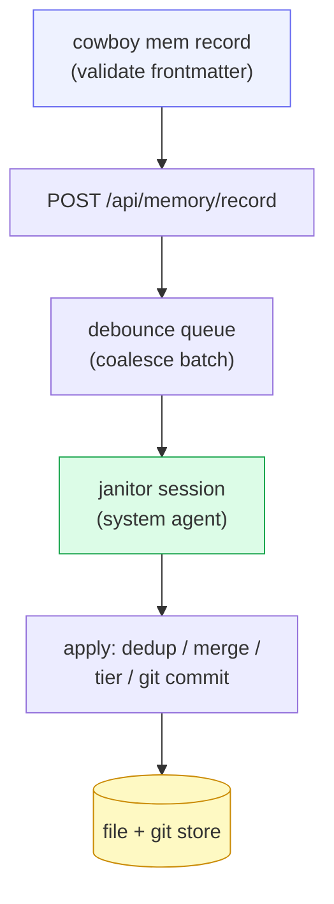

# Memory subsystem

cowboy hosts the machine-level **agent memory** store — the in-process fold of
mnemosyne (the "p5" port). Agents that cowboy spawns inherit
`CLAUDE_CODE_REMOTE_MEMORY_DIR`, so their auto-memory lands in this store, keyed
by the session's cwd-slug. The whole subsystem is **off by default** and only
runs under `--memory-enabled`.

The defining guardrail: **the daemon, never the CLI, writes memory files.** A
`cowboy mem record` call only *proposes*; an in-process **janitor** (itself an
agent session) judges, dedups, merges, and commits.

## Modules

| Module | Role |
|---|---|
| `store.rs` | the file + git store — a `Memory { name, description, type, body, tier }`, `Tier` (machine / project), `ensure_git_repo()`, commit/read |
| `tier.rs` | routes a proposal (provider + cwd) to its target tier — machine or a specific project |
| `queue.rs` | a debounce queue — batches mutations and fires a wake callback on coalesce |
| `index.rs` | a keyword index for fast recall (`IndexEntry`, `Hit { name, description, sim }`) |
| `apply.rs` | the resolve-op applier — dedup, merge, tier, commit |
| `janitor.rs` | the in-process judge session that runs the apply pipeline |

## Write path

`cowboy mem record --name <kebab> --description "…" --type {user|feedback|project|reference}
[--tier <project-slug>] -- <body>` validates the frontmatter locally (kebab name,
non-empty description, one of the four types, optional tier), then POSTs the
proposal to the running daemon. The daemon enqueues it; the debounce queue
coalesces a batch; the janitor runs the apply pipeline. `cowboy mem forget <name>`
soft-archives (moves to `archive/`). Reads do **not** go through cowboy at all —
agents just `rg`/`cat` over the store, which the `memory` skill teaches them to do.

## The janitor session

`setup_memory()` wires the subsystem on `serve`:

1. init the file + git store, build the keyword index;
2. **reuse** a persisted system session matching `system && cwd == memory_root &&
   provider == configured` — else create a new one
   (`new_session(origin = Api, system = true)`);
3. spawn the **reconcile loop** (queue batch → `run_janitor`) and a **tidy timer**
   (12h interval, a soft-archive housekeeping pass).

Because the janitor is an ordinary supervised session marked `system`, it gets
all the restart-recovery and auto-approve behavior for free
([Supervisor](03-supervisor.md)) — its permission requests are auto-approved in
the ACP handler, and it is hidden from the normal session list.

## Tiers

Memories live in two tiers. **machine** memories are host-wide facts; **project**
memories are scoped to one Columbus project (keyed by cwd-slug). `tier.rs` routes
each proposal to the right one based on where the proposing session was running,
so a fact learned while working in project X doesn't leak into the global store
unless it belongs there.

## Why a janitor instead of direct writes

Letting every agent append raw memory files would produce duplicates,
contradictions, and churn. Funneling proposals through one judging session means
dedup and merge happen **once, centrally**, with a git history of every change —
the store stays coherent no matter how many agents are writing into it
concurrently.
