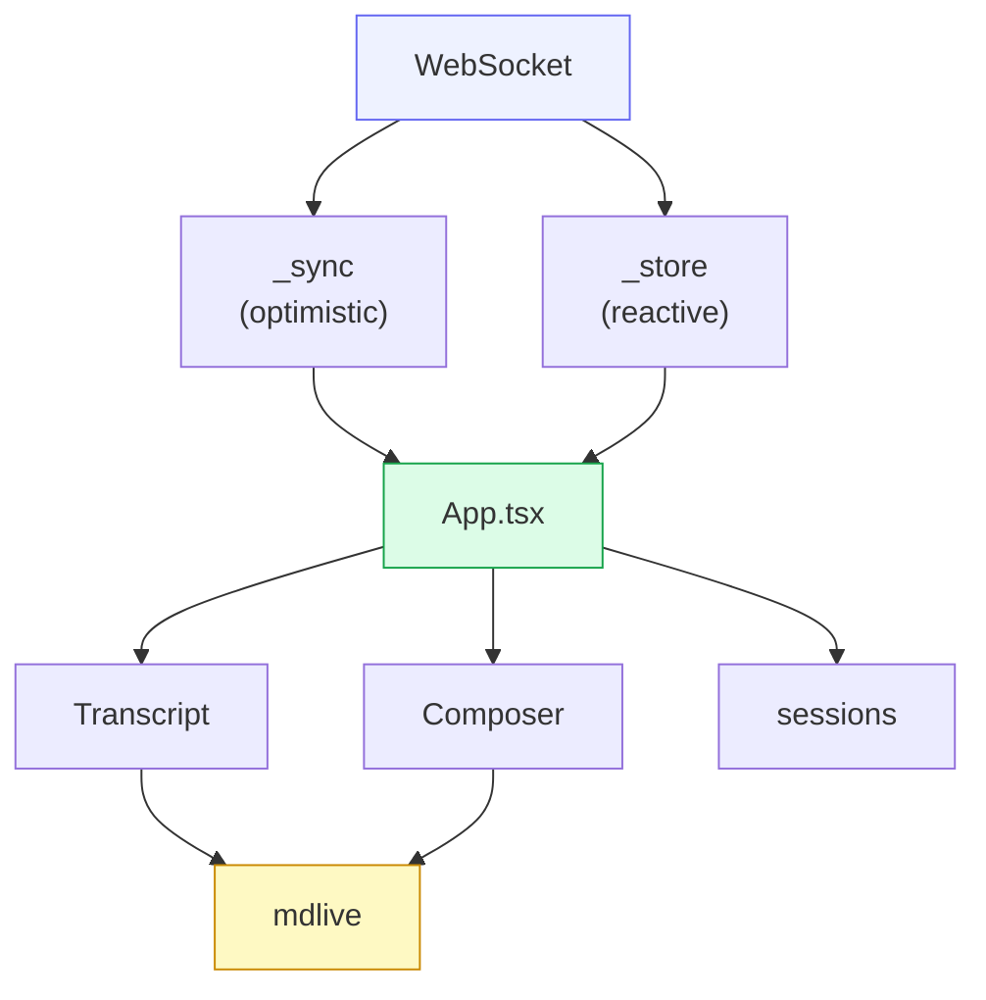

# Frontend

The frontend is a **React + MUI + CodeMirror 6** PWA, built with **Deno + Vite**,
then embedded into the Rust binary via `rust-embed`. "PC" and "phone" are the
**same app at different widths**, not separate builds. A Tauri native shell wraps
the same bundle for the desktop/iOS app where the PWA's platform limits bite.

The lives-or-dies fact: **one process serves frontend + backend**, so a
daemon-down state is a white screen. The robustness layers (service-worker shell
cache, `AppErrorBoundary`, `ConnectionBanner`, store NUL-strip / skip-bad-row)
exist to catch exactly that — they are load-bearing, not decoration.

## Layered architecture

## Global type and icon scaling

The user-selected global font size is an application-wide readability control,
not a transcript-only preference. `useGlobalFontScale` changes the root
`<html>` font size and publishes `--cowboy-font-scale`; text, editor content,
keycaps, and every functional icon glyph must respond to it together.

This is a core visual invariant:

- Size functional icons with `rem`/`em`, or with
  `calc(<baseline px> * var(--cowboy-font-scale, 1))` when browser minimum-font
  behavior requires explicit geometry. Do not introduce a fixed-pixel glyph
  size for an interactive action. Transcript status marks (Provider activity
  and thought signals) are optical glyphs, not actions: keep their authored
  pixel size so enlarging reading text does not turn a Grok mark into a heading.
- Framework defaults are not exempt. MUI `Button` assigns fixed-pixel sizes to
  start/end icons, so the Cowboy theme overrides those descendants globally.
  Component-level `sx` may choose a different optical size, but it must retain a
  root-relative unit or the shared scale variable.
- Keep hit-target geometry separate from glyph geometry. Mobile controls retain
  their 40–44 px minimum physical target while the icon inside scales with the
  global font size; enlarging text must not shrink the target or clip the glyph.
- Non-semantic pixel geometry such as a progress stroke, chart mark, or
  alignment hairline may remain fixed only when it is not the action's readable
  symbol. Document and regression-test any interactive exception.

Verify new or changed controls at the smallest and largest supported global font
sizes on both Desktop and Mobile. Acceptance includes icon/label proportion,
no clipping, stable touch targets, and no fixed-size icon left behind while text
scales.

## State: store + sync

Two vendored copies of the shared `@shared-utils` engines back all state:

- **`_store`** (`persisted()` + `useStore()`) — per-device reactive state that
  reads/writes `localStorage`. Sticky viewport state such as transcript scroll
  and Mobile drawer/navigation details live here.
- **`_sync`** — a client-local optimistic-mutation engine (a Replicache-shaped
  model): apply a mutation locally for instant UI, send it to the daemon arbiter,
  then rebase on the broadcast `SyncPatch`. The **arbiter lives in Rust** (the
  Hub's per-state sync arbiter), so the client never resolves conflicts itself —
  it just mirrors. Session list, ordering, queue, and drafts all flow through
  this as sync states (e.g. `queue:<sid>`). Mobile Code Review additionally uses
  `mobile-review:<sid>` for its tabs, active source, mode, and review progress;
  Desktop deliberately does not consume that state.

`web/src/protocol.ts` mirrors the Rust `Inbound`/`Outbound`/`Envelope`/`SessionMeta`
types so the wire contract is checked at both ends.

## Transcript

`Transcript.tsx` renders the session timeline (user messages, agent chunks, tool
calls, plan, permissions) as a **column-reverse, paged list**. Desktop settled
rows keep paint containment. On Mobile the peek collapses that containment at
rest so a swipe does not restyle N tiles on the first frame. A followed live
tail recycles older **mounted** rows into a measured spacer; do not
JS-virtualize this scroller. It must handle three chat-log realities: variable
row heights (dynamic measurement), stick-to-bottom during live streaming
(releasing when the user scrolls up), and scroll anchoring on prepend so
loading older history (via `GET /api/history/:id/:page`) never jumps the view.

**Jank-free horizontal swipe is a core Mobile requirement.** Sessions and
Review drawers, and the Agent↔Review pager, must track the finger on the
compositor whether the peek is Transcript, README, or CodeMirror
source/diff. A surface that hitchs only while sliding is unfinished.
Mobile Sessions/Review drawers, swipe tracking, frost, the standing peek
layer, CodeMirror overflow flatten, and the no-React-on-finger-down rule
are the contract in
[`mobile-spatial-presentation.md`](../mobile-spatial-presentation.md). Read
that before changing drawer motion, Transcript paint budget, or the
Review editor. Do not `setState` on transcript `touchstart` to make a
swipe cheaper.

The live-turn waiting row above the composer is a compact status line, not a
brand stamp. `ThinkingIndicator` renders the Provider `loading` activity with
Cowboy-owned mark size, caption weight, and pulse geometry: the mark stays a
quiet signal, asset pulses breathe opacity only, and the wrapper keeps a tight
`py` so the row sits with the transcript instead of floating as a padded badge.

User-role rows are not all human. `derive` attaches a `promptOrigin` (`human` /
`cowboy` / `agent`) from the persisted update, or recovers it from the older
`autoResumed` flag and `<system-reminder>` markup. Only `actor: human` uses the
right-aligned primary bubble and starts an Explore question page. Cowboy
auto-resume and schedule notes stay on the human rail as muted cards. Agent
runtime injections sit on the agent rail: left-aligned, with the provider mark
(the Grok / xAI logo for Grok) and a short sender label, never a human bubble.

## Composer

The composer (`Composer.tsx`, `ComposerEditor.tsx`, `FullscreenComposer.tsx`) is a
**CM6 + Obsidian-style live-preview** editor — the vendored `mdlive/*` stack
renders markdown as you type. It carries the model/mode/effort chips, the `@` file
picker (backed by `/api/sessions/{id}/files`), attachments, optimistic send, and
the queue/drafts UI. At PC width it injects a **vim** layer
(`@replit/codemirror-vim`); mobile falls back to a plain surface.

> ⚠️ The composer's iOS-WebKit behaviour (IME, caret, paste menu, widget render,
> the `translateZ(0)` compositing hack) is **coupled** — fixing one symptom
> routinely breaks another. `web/src/mdlive/PITFALLS.md` is the authoritative
> map; read it before any composer change and re-verify the whole iOS matrix.

### Composer toolbar contract

The collapsed inline composer and expanded fullscreen composer have different
space budgets and purposes. Their target design therefore uses two independent,
persisted ordered command lists rather than one shared toolbar configuration:

- collapsed defaults to the compact trigger/attachment set; only its left
  content-command group is configurable and horizontally scrollable;
- expanded owns the long-form formatting set and an opt-in persisted wrap mode
  that reveals all configured buttons across multiple rows;
- the inline send/queue, save-draft, jump-to-front, and force-push actions are
  stateful primary actions, remain pinned on the right, and never appear in the
  configurable command registry;
- toolbar settings expose collapsed and expanded configuration separately, and
  unknown persisted command ids continue to be filtered during deserialization.

The current single `composerToolbarConfig` and hardcoded collapsed content group
are implementation debt against this contract. Implementation and acceptance
belong to an ordinary Codex task, not durable coordination metadata. Verify
independent persistence across reload, both expanded overflow modes at phone
width, and an empty collapsed command list with the fixed action cluster still
visible.

### Confirmation surfaces

Clear / Compact / Stop / Reload / discard / delete / update / Provider
auth-or-uninstall prompts are compact decisions, not workbenches. On the
Mobile and tablet products they always rise as Cowboy's Obsidian-style
inset card (`ObsidianSheet` via `ConfirmSheet` in `web/src/Sheet.tsx`),
including iPhone landscape: docked to the bottom with an 8px edge gap,
safe-area padded inside the card so it occupies the bottom of the
screen, content-hugging, opaque `background.paper` (no frost / no
see-through hollow), a 1px hairline around the card, 18px all-around
radius, left/right Cancel/Confirm, and the same iOS cubic
(`cubic-bezier(0.32, 0.72, 0, 1)` at 240ms) the drawers already use. Do not route these prompts through
DetentSheet's floating footer overlay — that pads ~110px of empty body
under a short confirm. Desktop keeps the centered dialog. A centered
MUI `Dialog` is still the wrong grammar on a phone-width surface.
Desktop-only chrome such as `DesktopTopBarControls` may keep Dialog
because that product never becomes Mobile by shrinking the window.
Cover/workbench sheets (Settings, New Session) stay on DetentSheet.

A Settings drill-in (Machines, About, Logs) keeps the same sheet and
turns the footer island into Back. Do not dismiss the whole sheet from
that island while a nested page is showing.

Composer controls, editor chrome, and inline image surfaces must derive colors,
contrast, borders, and state layers from MUI theme tokens. Do not add hardcoded
light- or dark-only colors; visually verify both themes when these surfaces
change.

### Network action feedback

Every button whose action crosses the network uses one shared asynchronous
feedback grammar on Desktop and Mobile. Local navigation and disclosure controls
do not use it.

1. **Pressed / pending is immediate.** The activated control keeps its geometry,
   becomes lower-emphasis, exposes `aria-busy`, and is non-interactive so a slow
   round trip cannot produce duplicate mutations. Preserve at least 90 ms of
   tactile visual response even when the acknowledgement is effectively instant.
2. **Progress is delayed.** Do not flash a spinner for the common fast path. If
   the action is still pending after 180 ms, fade a compact progress glyph into
   the existing control without moving its label or adjacent layout.
3. **Visible progress is stable.** Once painted, keep progress visible for at
   least 280 ms so it reads as state rather than a rendering glitch.
4. **Completion is authoritative.** Resolve from the server acknowledgement or
   the corresponding broadcast/store projection. Animation timers never claim
   that a network mutation completed. Optimistic rows may appear immediately,
   but the originating control remains pending until their mutation id is
   confirmed.
5. **Failure recovers in place.** A send failure or bounded acknowledgement
   timeout restores the control and surfaces the existing app notice. Never
   leave a button inert indefinitely.

`NetworkActionFeedback.tsx` owns these timings and visual states. New network
buttons must compose that primitive (or its hook when gesture/ref handling
requires retaining the native MUI button) rather than implementing private
spinners, disabled delays, or timeout guesses.

## Turn status & confirm

The turn-status pill (`SegmentedPill.tsx`) reflects the confirm-detect verdict
([Confirm-detect & inference](07-confirm-inference.md)): busy (spinner), "waiting
for you" (`awaiting_user`), "done" (`done`), or "judging…" during L2 inference. A
long-press opens `JudgeInspector.tsx` — the per-session judge-run history (raw
I/O, confidence, L1-vs-L2 layer, model). `PermissionOverlay.tsx` renders the
floating Allow/Reject buttons; first-response-wins clears them on every surface at
once.

## PWA & native shell

The service worker (`web/public/sw.js`) caches the app shell so a daemon-down load
still paints, and gates bundle updates: web changes reach an installed PWA only
when its `VERSION` string bumps, which fires the foreground update-check and
auto-reload onto the fresh bundle. `nativeShell.ts` detects the **Tauri** wrapper
and routes to native commands where the PWA can't reach (lock-screen, native file
picker). `AppErrorBoundary` + `ConnectionBanner` degrade gracefully when the WS
drops.

The iOS shell must tame the document `WKWebView.scrollView` so it does not
compete with JS spatial drawers. Safari/PWA has no extra 150ms
`delaysContentTouches` gate on an `overflow: hidden` page; Wry's WKWebView
still does. After construction (and again on the next main-queue turn, because
Wry 0.55.1 writes `bounces` after `init` returns) set
`delaysContentTouches = NO`, `canCancelContentTouches = NO`, and disable
document rubber-band (`bounces` / `alwaysBounceVertical` /
`alwaysBounceHorizontal`). Inner Transcript/Code overflow stays on
`WKChildScrollView` and keeps native edge elasticity. This is a native-shell
contract and requires a SideStore release plus physical-device acceptance.

## A house rule worth knowing

`web/src/App.tsx` is a **4-space-indent outlier** (the rest of `src/` is 2-space)
and must never be run through `deno fmt` — it would reflow ~3700 lines. A fresh
worktree also lacks `src/_shell` (the shared UI package); it is symlinked in
manually and gitignored. The web quality gate is `deno check` + `oxlint`, never a
repo-wide format.
