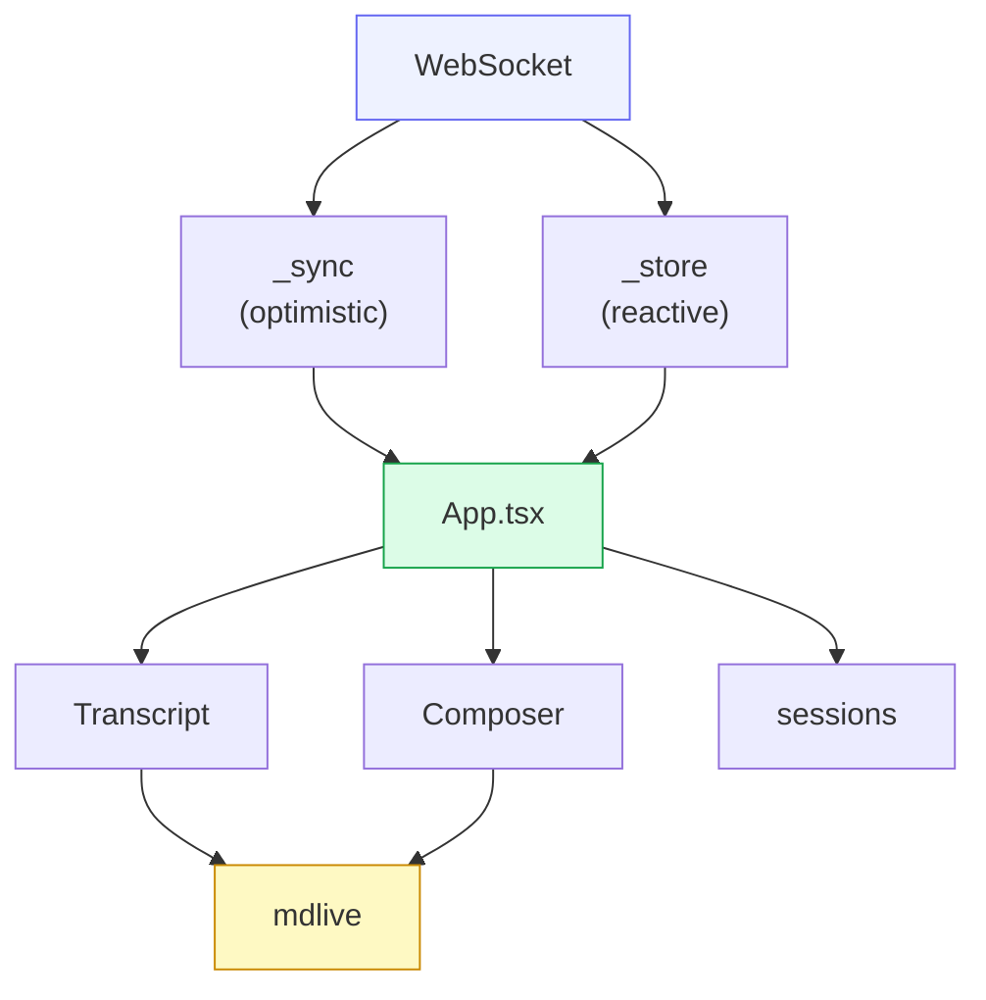

# Frontend

The frontend is a **React + MUI + CodeMirror 6** PWA, built with **Deno + Vite**,
then embedded into the Rust binary via `rust-embed`. "PC" and "phone" are the
**same app at different widths**, not separate builds. A Tauri native shell wraps
the same bundle for the desktop/iOS app where the PWA's platform limits bite.

The lives-or-dies fact: **one process serves frontend + backend**, so a
daemon-down state is a white screen. The robustness layers (service-worker shell
cache, `AppErrorBoundary`, `ConnectionBanner`, store NUL-strip / skip-bad-row)
exist to catch exactly that — they are load-bearing, not decoration.

## Layered architecture

## State: store + sync

Two vendored copies of the shared `@shared-utils` engines back all state:

- **`_store`** (`persisted()` + `useStore()`) — per-device reactive state that
  reads/writes `localStorage`. Sticky viewport state such as transcript scroll
  and Mobile drawer/navigation details live here.
- **`_sync`** — a client-local optimistic-mutation engine (a Replicache-shaped
  model): apply a mutation locally for instant UI, send it to the daemon arbiter,
  then rebase on the broadcast `SyncPatch`. The **arbiter lives in Rust** (the
  Hub's per-state sync arbiter), so the client never resolves conflicts itself —
  it just mirrors. Session list, ordering, queue, and drafts all flow through
  this as sync states (e.g. `queue:<sid>`). Mobile Code Review additionally uses
  `mobile-review:<sid>` for its tabs, active source, mode, and review progress;
  Desktop deliberately does not consume that state.

`web/src/protocol.ts` mirrors the Rust `Inbound`/`Outbound`/`Envelope`/`SessionMeta`
types so the wire contract is checked at both ends.

## Transcript

`Transcript.tsx` renders the session timeline (user messages, agent chunks, tool
calls, plan, permissions) as a **column-reverse, paged list with off-screen CSS
containment**. It must handle
three chat-log realities: variable row heights (dynamic measurement),
stick-to-bottom during live streaming (releasing when the user scrolls up), and
scroll anchoring on prepend so loading older history (via
`GET /api/history/:id/:page`) never jumps the view.

## Composer

The composer (`Composer.tsx`, `ComposerEditor.tsx`, `FullscreenComposer.tsx`) is a
**CM6 + Obsidian-style live-preview** editor — the vendored `mdlive/*` stack
renders markdown as you type. It carries the model/mode/effort chips, the `@` file
picker (backed by `/api/sessions/{id}/files`), attachments, optimistic send, and
the queue/drafts UI. At PC width it injects a **vim** layer
(`@replit/codemirror-vim`); mobile falls back to a plain surface.

> ⚠️ The composer's iOS-WebKit behaviour (IME, caret, paste menu, widget render,
> the `translateZ(0)` compositing hack) is **coupled** — fixing one symptom
> routinely breaks another. `web/src/mdlive/PITFALLS.md` is the authoritative
> map; read it before any composer change and re-verify the whole iOS matrix.

## Turn status & confirm

The turn-status pill (`SegmentedPill.tsx`) reflects the confirm-detect verdict
([Confirm-detect & inference](07-confirm-inference.md)): busy (spinner), "waiting
for you" (`awaiting_user`), "done" (`done`), or "judging…" during L2 inference. A
long-press opens `JudgeInspector.tsx` — the per-session judge-run history (raw
I/O, confidence, L1-vs-L2 layer, model). `PermissionOverlay.tsx` renders the
floating Allow/Reject buttons; first-response-wins clears them on every surface at
once.

## PWA & native shell

The service worker (`web/public/sw.js`) caches the app shell so a daemon-down load
still paints, and gates bundle updates: web changes reach an installed PWA only
when its `VERSION` string bumps, which fires the foreground update-check and
auto-reload onto the fresh bundle. `nativeShell.ts` detects the **Tauri** wrapper
and routes to native commands where the PWA can't reach (lock-screen, native file
picker). `AppErrorBoundary` + `ConnectionBanner` degrade gracefully when the WS
drops.

## A house rule worth knowing

`web/src/App.tsx` is a **4-space-indent outlier** (the rest of `src/` is 2-space)
and must never be run through `deno fmt` — it would reflow ~3700 lines. A fresh
worktree also lacks `src/_shell` (the shared UI package); it is symlinked in
manually and gitignored. The web quality gate is `deno check` + `oxlint`, never a
repo-wide format.
