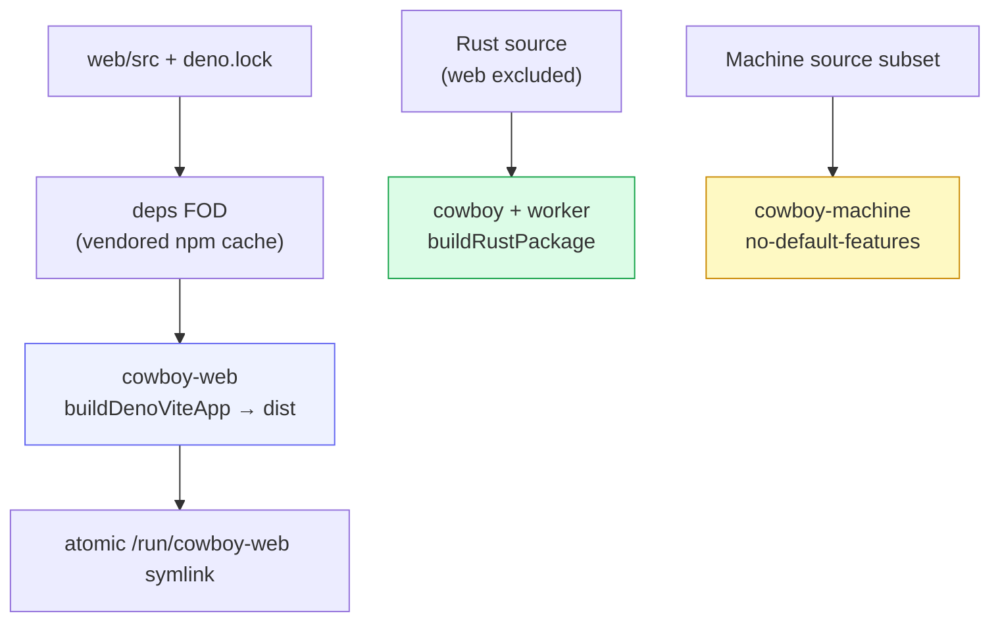

# Build & deploy

cowboy ships as three independent Nix artifacts: the HTTP/control-plane + worker
package, a narrowly sourced stable Machine package, and the React SPA. This keeps
frontend, broker, and session-runtime update frequency independent.

## The build graph



- **`cowboy-web`** uses the shared `buildDenoViteApp` builder from the
  `shared-utils` flake — a deps-only FOD (vendored npm cache, keyed by
  `depsHash`) plus a normal offline build. The builder also stages the
  `@shared-utils/ui` SDK into `web/src/_shell`. Refresh `depsHash` only when
  `web/deno.lock` or `web/package.json` change.
- **`cowboy`** is a `buildRustPackage` whose source filter excludes frontend
  files except the TypeScript protocol fixture used by Rust contract tests.
  It pins crates via **`cargoHash` / `fetchCargoVendor`** (not
  `cargoLock`): crates.io now 403s the download endpoint for requests with no
  User-Agent, and the plain-fetchurl `cargoLock` path sends none.
- **`cowboy-machine`** uses a source fileset containing only the Machine host,
  broker, runtime wire contract, installer, and entry point. It builds with
  `--no-default-features --features machine-host`; the control-plane package
  does not compile or install Machine-host entry points, so an
  ordinary Cowboy code change does not alter the broker's store path.
- **`cowboy-web`** is switched by atomically replacing `/run/cowboy-web`; the
  backend reads assets at request time and computes ETags/version IDs from their
  bytes.

## Dev workflow

The `justfile` is the task surface (run inside `nix develop`):

| Task | Does |
|---|---|
| `just install` | `deno install` → `web/node_modules` |
| `just dev` | `cargo run --locked -- serve` (foreground daemon) |
| `just dev-web` | Vite dev server with HMR, proxying `/ws` + `/healthz` to the daemon |
| `just build-web` | build the SPA bundle |
| `just build` | `build-web` then `cargo build --release --locked` |
| `just check` | `fmt` + `lint` (clippy `-D warnings` + deno lint) + `typecheck` |

Local Rust builds use Cargo incremental compilation. `just build-cached`
explicitly disables incremental compilation and enables sccache for measured
clean-rebuild experiments at a stable target path. On 2026-07-18, a full
`--all-targets --all-features` cold build took 28.20s with plain Cargo; rebuilding
the cleared same-path target took 16.41s with 282 Rust cache hits. The hermetic
`nix build` uses Nix's own Cargo dependency caching instead.

## CLI / daemon flags

`cowboy serve` is the daemon. The flags that shape a deployment:

| Flag | Default | Purpose |
|---|---|---|
| `--bind` | `127.0.0.1:3333` | listen address |
| `--workspace-root` | `.` | root the session pickers scope to |
| `--postgres-url` | — | enable persistence ([Storage](05-storage.md)); in-memory if absent |
| `--web-root` | `web/dist` | separately deployed SPA directory |
Other subcommands: `serve-acp` (the ACP server face for Zed), `try-agent`
(one-shot provider smoke test).

`serve-acp` is a thin stdio bridge to the running daemon, not a second cowboy
instance. Register one Zed External Agent entry per provider:

```text
cowboy serve-acp --provider codex
cowboy serve-acp --provider claude-code
cowboy serve-acp --provider gemini
```

Each entry filters `session/list` and `session/load` to that provider, which
keeps imported threads under the correct agent identity. The bridge implements
the standard pending-`session/prompt` lifecycle plus the optional
`_cowboy/session/status` request and `_cowboy/session/status_changed`
notification for clients that need an out-of-band status snapshot.

Use independent custom IDs (`cowboy-codex`, `cowboy-claude`, and
`cowboy-gemini`) when the native Registry agents must remain available. Zed
gives those settings its generic sparkle icon because custom agents have no
icon field. Reusing the official provider IDs preserves their icons but replaces
the native agents; distinct Cowboy provider icons require published Registry
entries.

The stdio ACP process outlives daemon WebSocket disconnects. It publishes a
`reconnecting` status, retries with bounded exponential backoff, buffers commands,
then bootstraps again and reopens every attached session. A daemon restart
therefore does not become Zed's terminal `Failed to Launch` state.

TODO: expose Codex `subAgentActivity` and `thread/backgroundTerminals/list`
through the upstream Codex ACP adapter, then populate the bridge's currently
unknown `backgroundRunning` field. Until then `turnRunning` is authoritative,
but the bridge intentionally does not claim that detached background work is
idle.

## NixOS service shape

cowboy is consumed by the hawk config via a `git+file://` flake input from this
repo. To ship a change: commit here, then on hawk `nix flake update cowboy` +
`nixos-rebuild`. The system `cowboy.service` runs **as the human SSH user** (so
the API and Zed-over-SSH share one identity). A lingered user manager owns
`cowboy-machine.service`, `cowboy-agents.slice`, and the
transient per-session workers. Agent-owned local state remains in the user's
normal tool-managed home.

See [Zero-interruption rolling updates](12-rolling-updates.md) for ownership,
drain, rollback, monitoring, and failure semantics.

## Safe activation from a cowboy session

A direct `nixos-rebuild switch` runs inside the invoking agent's service cgroup.
When activation stops cowboy, it can kill its own activation process after the
system profile moved but before `/run/current-system` and restarted units
converged. A dropped approval channel therefore proves neither success nor
failure.

Build as the normal user, then dispatch activation into an independent root
systemd unit:

```bash
cd /etc/nixos
sudo nixos-rebuild build
just sys-activate ./result
```

`hawk activate` resolves the already-built closure, then the transient unit sets
the system profile and runs that closure's `switch-to-configuration`. The unit is
under `system.slice`, not `cowboy.service`, so a cowboy restart cannot kill it.
Verify the unit journal and `/run/current-system`; never blindly re-run a switch.
Web changes still require a `sw.js` VERSION bump so installed PWAs reload, but
they do not restart Cowboy or the detached runtime.
