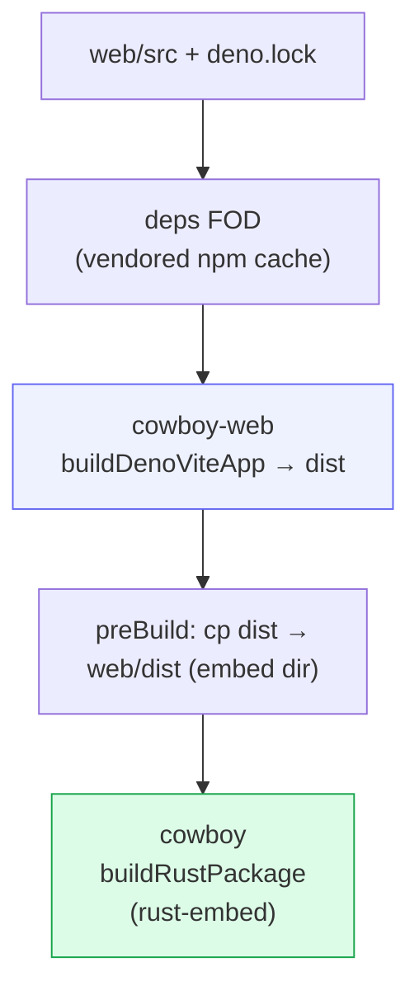

# Build & deploy

cowboy ships as a **single self-contained binary**: the React SPA is built and
**embedded** into the Rust executable, so there is no static-asset directory to
deploy alongside it. It runs as a NixOS systemd service on hawk (`:3333`).

## The build graph



- **`cowboy-web`** uses the shared `buildDenoViteApp` builder from the
  `shared-utils` flake — a deps-only FOD (vendored npm cache, keyed by
  `depsHash`) plus a normal offline build. The builder also stages the
  `@shared-utils/ui` SDK into `web/src/_shell`. Refresh `depsHash` only when
  `web/deno.lock` or `web/package.json` change.
- **`cowboy`** is a `buildRustPackage`. Its `preBuild` copies the web output into
  `web/dist`, which the `#[folder = "web/dist"]` `rust-embed` macro embeds at
  compile time. It pins crates via **`cargoHash` / `fetchCargoVendor`** (not
  `cargoLock`): crates.io now 403s the download endpoint for requests with no
  User-Agent, and the plain-fetchurl `cargoLock` path sends none. `git` is on the
  build's `nativeBuildInputs` because the memory store's unit tests `git init` a
  temp store offline.

## Dev workflow

The `justfile` is the task surface (run inside `nix develop`):

| Task | Does |
|---|---|
| `just install` | `deno install` → `web/node_modules` |
| `just dev` | `cargo run -- serve` (foreground daemon) |
| `just dev-web` | Vite dev server with HMR, proxying `/ws` + `/healthz` to the daemon |
| `just build-web` | build the SPA bundle |
| `just build` | `build-web` then `cargo build --release` |
| `just check` | `fmt` + `lint` (clippy `-D warnings` + deno lint) + `typecheck` |

All Rust builds in the dev shell go through **sccache** (`RUSTC_WRAPPER`), with
`CARGO_INCREMENTAL=0` because incremental compilation and sccache conflict —
disabling it maximizes cache hits. The hermetic `nix build` uses Nix's own
crane/cargo caching instead.

## CLI / daemon flags

`cowboy serve` is the daemon. The flags that shape a deployment:

| Flag | Default | Purpose |
|---|---|---|
| `--bind` | `127.0.0.1:3333` | listen address |
| `--workspace-root` | `.` | root the session pickers scope to |
| `--postgres-url` | — | enable persistence ([Storage](05-storage.md)); in-memory if absent |
| `--memory-enabled` | off | turn on the memory subsystem ([Memory](08-memory.md)) |
| `--memory-root` | `~/.agents/memory` | the memory store path |
| `--memory-janitor-provider` | `codex` | which agent runs the janitor |

Other subcommands: `serve-acp` (the ACP server face for Zed), `try-agent`
(one-shot provider smoke test), `mem` (the memory write CLI).

## NixOS service shape

cowboy is consumed by the hawk config via a `git+file://` flake input from this
repo. To ship a change: commit here, then on hawk `nix flake update cowboy` +
`nixos-rebuild`. The unit runs **as the human SSH user** (so the agent and a
Zed-over-SSH session share one identity and one view of the files), points
`--workspace-root` under that user's home, and sets
`CLAUDE_CODE_REMOTE_MEMORY_DIR` so spawned agents' auto-memory lands in the
machine store.

## Safe activation from a cowboy session

A direct `nixos-rebuild switch` runs inside the invoking agent's service cgroup.
When activation stops cowboy, it can kill its own activation process after the
system profile moved but before `/run/current-system` and restarted units
converged. A dropped approval channel therefore proves neither success nor
failure.

Build as the normal user, then dispatch activation into an independent root
systemd unit:

```bash
cd /etc/nixos
sudo nixos-rebuild build
just sys-activate ./result
```

`hawk activate` resolves the already-built closure, then the transient unit sets
the system profile and runs that closure's `switch-to-configuration`. The unit is
under `system.slice`, not `cowboy.service`, so a cowboy restart cannot kill it.
Verify the unit journal and `/run/current-system`; never blindly re-run a switch.
Web changes still require a `sw.js` VERSION bump so installed PWAs reload.
