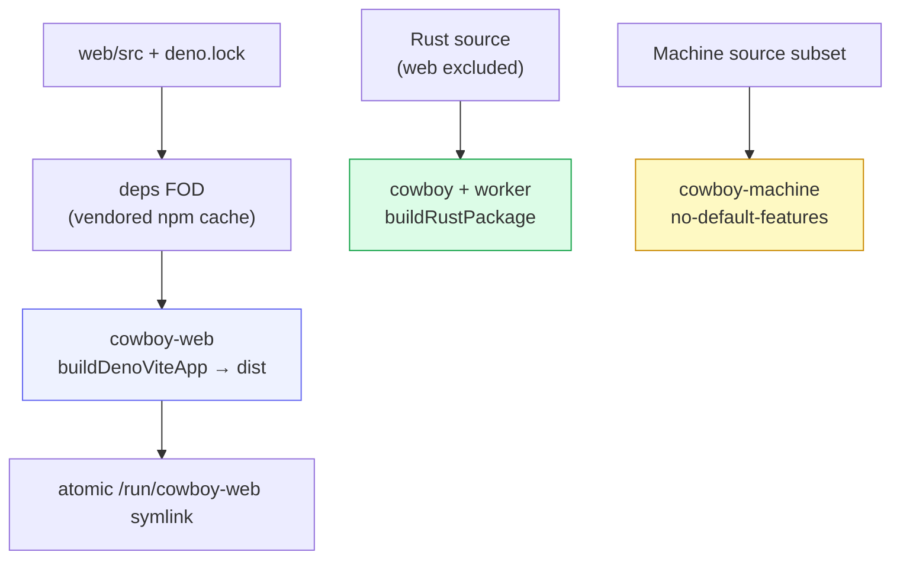

# Build & deploy

cowboy ships as three independent Nix artifacts: the HTTP/control-plane + worker
package, a narrowly sourced stable Machine package, and the React SPA. This keeps
frontend, broker, and session-runtime update frequency independent.

## The build graph



- **`cowboy-web`** uses Cowboy's local `nix/deno-vite-app.nix` builder — a
  deps-only FOD (vendored npm cache, keyed by `depsHash`) plus a normal offline
  build. UI and state components are publishable source packages under
  `components/` and are linked through `web/package.json`. Refresh `depsHash`
  only when `web/deno.lock` or `web/package.json` change.
- **`cowboy`** is a `buildRustPackage` whose source filter excludes frontend
  files except the TypeScript protocol fixture used by Rust contract tests.
  It pins crates via **`cargoHash` / `fetchCargoVendor`** (not
  `cargoLock`): crates.io now 403s the download endpoint for requests with no
  User-Agent, and the plain-fetchurl `cargoLock` path sends none.
- **`cowboy-machine`** uses a source fileset containing only the Machine host,
  broker, runtime wire contract, installer, and entry point. It builds with
  `--no-default-features --features machine-host`; the control-plane package
  does not compile or install Machine-host entry points, so an
  ordinary Cowboy code change does not alter the broker's store path.
- **`cowboy-web`** is switched by atomically replacing `/run/cowboy-web`; the
  backend reads assets at request time and computes ETags/version IDs from their
  bytes.

## Dev workflow

The `justfile` is the task surface (run inside `nix develop`):

| Task | Does |
|---|---|
| `just install` | Verify isolation, then install a checkout-local `web/node_modules` |
| `just dev` | `cargo run --locked -- serve` (foreground daemon) |
| `just dev-web` | Vite dev server with HMR, proxying `/ws` + `/healthz` to the daemon |
| `just build-web` | build the SPA bundle |
| `just build` | `build-web` then `cargo build --release --locked` |
| `just check` | `fmt` + `lint` (clippy `-D warnings` + deno lint) + `typecheck` |

Local Rust builds use Cargo incremental compilation. `just build-cached`
explicitly disables incremental compilation and enables sccache for measured
clean-rebuild experiments at a stable target path. On 2026-07-18, a full
`--all-targets --all-features` cold build took 28.20s with plain Cargo; rebuilding
the cleared same-path target took 16.41s with 282 Rust cache hits. The hermetic
`nix build` uses Nix's own Cargo dependency caching instead.

Deno's global cache (`DENO_DIR`) is safe to share between same-user worktrees,
but every worktree owns its real `web/node_modules` directory and its `file:`
links back into that worktree's `components/`. `just install` rejects a
checkout-level `node_modules` symlink during checks; the install path removes
only that borrowed link, leaves its target untouched, and creates a local
dependency view. It then verifies every local package link after installation.
The same preflight rejects and the install path removes the obsolete,
gitignored `web/src/_shell` link left by the retired cross-repository UI seam.
Deno 2.9.5 is pinned because it includes the upstream hardlink-overwrite
repair needed before a same-filesystem cache can populate worktrees with clone
or hardlink fallbacks.

## CLI / daemon flags

`cowboy serve` is the daemon. The flags that shape a deployment:

| Flag | Default | Purpose |
|---|---|---|
| `--bind` | `127.0.0.1:3333` | listen address |
| `--workspace-root` | `.` | root the session pickers scope to |
| `--database-url` | — | enable PostgreSQL or SQLite persistence ([Storage](05-storage.md)); in-memory if absent |
| `--web-root` | `web/dist` | separately deployed SPA directory |

The hidden legacy `--postgres-url` spelling remains accepted for existing
deployments.

Other subcommands: `serve-acp` (the ACP server face for Zed), `login` (complete
browser-approved client authorization ahead of first use), and `try-agent`
(one-shot provider smoke test).

`serve-acp` is a thin stdio bridge to the running daemon, not a second cowboy
instance. Register one Zed External Agent entry per provider:

```text
cowboy serve-acp --provider codex
cowboy serve-acp --provider claude-code
cowboy serve-acp --provider gemini
cowboy serve-acp --provider grok
```

No copied API token is required. The first authenticated connection opens the
server's normal Cardea/password login and explicit device-approval page, then
stores a sender-constrained rotating credential locally. Use
`cowboy login https://cowboy.example` to pre-authorize a computer. A remote
origin must use HTTPS; an explicitly auth-off local Service remains anonymous
local-owner by policy.

Each entry filters `session/list` and `session/load` to that provider, which
keeps imported threads under the correct agent identity. The bridge implements
the standard pending-`session/prompt` lifecycle plus the optional
`_cowboy/session/status` request and `_cowboy/session/status_changed`
notification for clients that need an out-of-band status snapshot.

Use independent custom IDs (`cowboy-codex`, `cowboy-claude`, `cowboy-gemini`,
and `cowboy-grok`) when the native Registry agents must remain available. Zed
gives those settings its generic sparkle icon because custom agents have no
icon field. Reusing the official provider IDs preserves their icons but replaces
the native agents; distinct Cowboy provider icons require published Registry
entries.

The stdio ACP process outlives daemon WebSocket disconnects. It publishes a
`reconnecting` status, retries with bounded exponential backoff, buffers commands,
then bootstraps again and reopens every attached session. A daemon restart
therefore does not become Zed's terminal `Failed to Launch` state.

TODO: expose Codex `subAgentActivity` and `thread/backgroundTerminals/list`
through the upstream Codex ACP adapter, then populate the bridge's currently
unknown `backgroundRunning` field. Until then `turnRunning` is authoritative,
but the bridge intentionally does not claim that detached background work is
idle.

## NixOS service shape

The aggregate machine flake carries only a pinned cold-start recovery release.
Ordinary application changes do not update its lock. From a clean committed
Cowboy task worktree, build the narrowest affected project-owned release:

```bash
nix build .#cowboy-web-release --out-link result-web
nix build .#cowboy-controller-release --out-link result-controller
nix build .#cowboy-machine-release --out-link result-machine
```

The target's machine-owned activator moves a stable Nix profile, verifies the
running release, rolls back failure, pins the Cowboy commit, and records a
receipt. Web activation changes only the atomic `/run/cowboy-web` link;
controller activation restarts only `cowboy.service`; Machine activation is an
explicit maintenance transaction. A commit may be activated before it is
pushed, but the deploying task still owns publication or a descendant revert.
Machine success additionally requires the controller's Machine inventory to
report the release's active worker generation; process liveness alone is not a
release boundary.
The additional `cowboy-machine-bootstrap-release` output is recovery-only: Nix
uses it to initialize an absent profile without silently authorizing a resident
Machine restart, and the component activator refuses it as an ordinary release.

The system `cowboy.service` runs **as the human SSH user** (so
the API and Zed-over-SSH share one identity). A lingered user manager owns
`cowboy-machine.service`, `cowboy-agents.slice`, and the
transient per-session workers. Agent-owned local state remains in the user's
normal tool-managed home.

Do not hot-deploy Cowboy with `systemctl edit --runtime` or a store-path
`ExecStart` override. Such a drop-in outranks the newly activated NixOS unit and
can leave an older controller running behind a healthy endpoint. Temporary
integration releases use the same committed component transaction; push
remains optional until that transaction has passed. Change the aggregate
machine configuration only when the service contract, bootstrap recovery pin,
or host integration itself changes.

See [Zero-interruption rolling updates](12-rolling-updates.md) for ownership,
drain, rollback, monitoring, and failure semantics.

## Safe activation from a cowboy session

A direct `nixos-rebuild switch` runs inside the invoking agent's service cgroup.
When activation stops cowboy, it can kill its own activation process after the
system profile moved but before `/run/current-system` and restarted units
converged. A dropped approval channel therefore proves neither success nor
failure.

After committing the Cowboy change, build its immutable release and dispatch it
into an independent root systemd unit through the current machine interface:

```bash
cd /home/draven/worktrees/cowboy/<task>
nix build .#cowboy-web-release --out-link result-web
nix develop /home/draven/columbus/machines -c \
  just --justfile /home/draven/columbus/machines/justfile \
  cowboy-web-activate "$(readlink -f result-web)"
```

Use `cowboy-controller-activate` for the controller output and
`cowboy-machine-activate` for an explicitly approved Machine maintenance
release. The detached unit is under `system.slice`, so a controller restart
cannot kill it. The target serializes activation, rejects divergent lane
history, rolls back failed health checks, and writes a component receipt. Verify
the receipt and unit journal; never blindly repeat an activation. Web changes
still require a `sw.js` VERSION bump so installed PWAs reload, but they restart
neither Cowboy nor the detached runtime.
