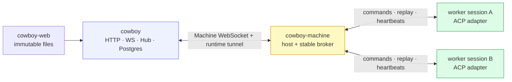

# Zero-interruption rolling updates

Cowboy separates request handling from ACP process lifetime so a control-plane
or frontend rollout does not terminate an in-flight agent turn.

## Process ownership

- `cowboy.service` owns the API, WebSocket connections, Hub, scheduler, judge,
  and Postgres write-behind. It does not parent ACP workers in production.
- `cowboy-machine.service` is owned by the user's systemd manager and reconnects
  outbound to the Cowboy controller.
- `cowboy-machine` is a narrow, separately built host. Its broker owns routing and a
  single fenced controller lease, but no transcript business state.
- Every session is a sibling transient user unit in `cowboy-agents.slice`.
  Its worker owns the ACP adapter and remains alive when either daemon exits.
- `/run/cowboy-web` is an atomically replaced symlink to an immutable web
  output. Frontend-only updates change no service unit.

The user manager has linger enabled. This is required: otherwise logging out
would terminate Machine and every transient worker even though the system daemon
remained up.

Machine has `restartIfChanged = false`; a generic Nix switch never restarts it
in the same uncontrolled batch as Cowboy. Machine-host updates use its signed
component lifecycle and readiness gate; worker sibling units stay up throughout.
The roll trigger covers both the Machine package and its effective adapter/PATH
configuration, so a real low-frequency configuration change cannot remain
silently unapplied. The worker slice itself also has `restartIfChanged = false`:
generic activation never tears down its task-owning members.

## Runtime invariants

1. One worker epoch owns a session at a time. A second epoch is rejected until
   the old epoch is fenced or gone.
2. Only one Cowboy controller lease is active. A newly connected controller
   fences the old one.
3. Worker events have a monotonic `runtime_seq`. Workers retain every unacked
   event in an in-memory outbox and replay it after Cowboy or Machine reconnects.
4. Runtime commands carry stable command IDs. Controller resends and broker
   queues are deduplicated; a live worker never submits one command to ACP twice.
5. A worker snapshot includes its launch spec, agent session ID, turn ID,
   pending permissions, live config/context state, generation, and concrete
   executable. Machine can rebuild routing and rollback state solely from
   reconnecting workers after a restart.
6. A worker at `Busy` or with a pending permission is never stopped for a normal
   rollout. There is deliberately no maximum drain deadline for healthy work.
7. Once drain begins, new prompts wait in Machine. Cancel and permission replies
   still reach the old worker so the current turn can reach a safe boundary.
8. Worker state transitions are sent before command acceptance is ACKed. During
   graceful shutdown Cowboy drains dispatcher/runtime commands first and closes
   the Postgres writer last, eliminating the normal send-vs-deploy race.
9. On every broker reconnect Cowboy re-declares launch metadata with an
   additive `adopt_only` flag. Machine rebuilds its registry but never interprets
   a worker that is merely late to reconnect as permission to spawn a second
   owner. A subsequent user-driven EnsureSession can still recover a worker
   that genuinely never returned.

The IPC protocol is length-prefixed JSON with an explicit min/max version
handshake. Version 1 evolves additively: new fields are optional with serde
defaults. A release must retain overlap with every still-live worker generation.

## Worker generation rollout

The Nix flake computes `workerGeneration` only from code that runs inside a
detached ACP session. UI and control-plane-only edits therefore do not drain the
pool. The adapters under `/opt/npm-global` retain their own update channel; an
adapter upgrade is validated first and then paired with an explicit worker
generation bump, rather than automatically draining healthy workers while npm
may still be mid-update. Bump `worker-generation.txt` for that deliberate roll.

```mermaid
stateDiagram-v2
    [*] --> Running
    Running --> Draining: desired generation differs
    Busy --> Busy: mark drain; finish current turn
    Busy --> Draining: turn + permissions complete
    Draining --> StartingNew: stop old worker cleanly
    StartingNew --> Running: new worker reports Ready
    StartingNew --> Rollback: spawn/handshake timeout or crash
    Rollback --> Running: previous executable reports Ready
    Rollback --> Crashed: previous generation also fails
```

Machine retains a generation-to-executable map from the controller and worker
snapshots. A candidate must report `Running`, `Busy`, or `Draining` within the
readiness deadline. Failure marks that provider/generation unhealthy and starts
the previous known executable. A healthy fallback is pinned for that rollout,
so it is not immediately drained again; the next desired generation clears the
pin. The worker reports what failed generation it is backing up, so Machine can
reconstruct the quarantine after its own restart. Failed candidates are fenced
before fallback so late frames cannot corrupt the replacement session.

## Update behavior

| Change | What restarts | In-flight result |
|---|---|---|
| SPA only | no daemon; web symlink changes | turn and WS remain connected |
| HTTP/Hub/control plane | `cowboy.service` | worker continues; events replay; clients reconnect |
| ACP/worker generation | idle workers roll immediately; busy workers drain | current turn and permission responders finish on old generation |
| Machine host code | Machine restarts after readiness-gated activation | workers and core reconnect to the new broker |
| Postgres | independent existing service policy | Cowboy health degrades; no runtime ownership change |
| host reboot / user-manager loss | all processes stop | existing persisted Interrupted/Crashed recovery applies |

## Failure handling

| Failure | Handling |
|---|---|
| New web output fails to build | system activation never retargets the symlink; old UI remains |
| New Cowboy fails its 60 s `/healthz` gate | systemd stops/retries the core; workers remain independent, and an operator may roll the NixOS generation back without losing the turn |
| Machine exits | systemd restarts it; peer reconnect loops use bounded backoff without spawning duplicate workers |
| New Machine starts and immediately crashes | readiness-gated activation retains the previous host generation while detached workers retain turns/events |
| Candidate worker cannot exec, handshake, or becomes `Exited/Crashed` before ready | fence/stop candidate, mark generation unhealthy, launch previous generation |
| Worker IPC heartbeat missing for 45 s | isolate and stop only that session unit; publish `Crashed` to the controller |
| Runtime protocol has no overlap | reject the peer; do not reinterpret frames |
| Controller disconnects after receiving but before ACK | worker replays its retained suffix after reconnect |
| Prompt arrives during drain | hold and deduplicate it; release only after replacement registers |
| Core and Machine reconnect in opposite order | bootstrap briefly settles and buffers snapshots/events before Hub reconciliation |
| Cowboy controller restarts | Machine presence stays `reconnecting` for a 15 s grace; a successful reconnect returns it to `online`, while grace expiry marks it `offline` |
| A declared worker never reconnects for 45 s | stop that session's transient unit and publish `Crashed`; this is the explicit session-level extreme fallback, preventing a second owner |
| Core shuts down while a prompt is being handed off | drain to worker ACK, or retain broker-owned prompts; only demonstrably unsent prompts return to the durable queue |
| Unknown/extreme inconsistency | kill the affected worker and use the prior Interrupted/Crashed recovery path |

Normal deployment relies on Cowboy's graceful shutdown to drain the Postgres
writer before the core exits. The worker outbox survives core and broker
restarts, not worker process death or host reboot. A hard kill in the narrow
window between applying an event and durably recording its receipt can retain
the pre-existing at-least-once edge behavior; that is intentionally classified
as an extreme failure and recovered by terminating the affected session rather
than risking a globally wedged rollout.

## Observability

`/healthz` is unhealthy while the detached runtime is disconnected. `/metrics`
exports runtime connectivity, worker count, busy count, draining count,
broker-sensitive handoff count, and pending-command count. Machine also enforces
heartbeats independently of the ACP turn, so a long healthy turn is not
mistaken for a hang.

The safe operational signals are:

- `cowboy_runtime_connected == 1`;
- pending commands return to zero after a handoff;
- draining workers eventually return to zero, except intentionally long turns;
- `cowboy_runtime_handoff_workers == 0` before a Machine-host binary roll;
- candidate failure logs are paired with either fallback readiness or a
  session-level `Crashed` state.

Never force-stop a healthy busy worker merely to make the draining gauge reach
zero. For an explicitly accepted extreme case, stop that one transient unit and
let the existing recovery behavior take over.

## First activation

The old monolith's agents are children of `cowboy.service`; no new architecture
can retroactively detach those already-running processes. The first activation
is therefore a one-time migration boundary and must be done with old sessions
idle (or with the previously accepted kill/recovery behavior). After that
cutover, every newly created session is a sibling worker and subsequent core,
web, broker, and worker-generation rolls use the invariants above.
