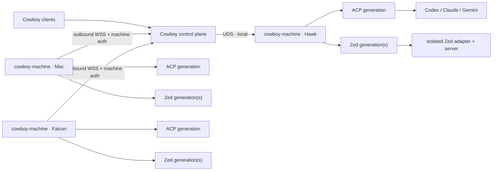

# Multi-machine runtime

Cowboy evolves from one Hawk-local runtime into a control plane that can route
sessions and code-intelligence work to independently operated macOS and Linux
machines. The durable boundary is a small `cowboy-machine` host agent. Agent
CLIs, ACP adapters/workers, and Zed are payloads supervised by that host; they
are not linked into the Cowboy HTTP daemon and do not share an update
generation.

This design extends the existing `runtime_wire` fencing, command idempotency,
worker snapshots, event replay, and safe drain rules. It does not introduce a
second session protocol or proxy ACP itself over the public network.

## Topology



Remote agents initiate the connection. A machine opens no public listener and
does not need a per-machine public domain. The configured endpoint is the
Cowboy control-plane domain, for example
`wss://cowboy.example/api/machine/connect`. This works through NAT and avoids
turning every development host into an Internet-facing service.

SOCKS is not a runtime transport. It can carry arbitrary TCP, but it provides
none of the machine identity, lease fencing, command deduplication, event
replay, capability negotiation, or component lifecycle semantics Cowboy needs.
The local fast path remains a Unix-domain socket. Remote machines use the same
length-bounded application frames over WebSocket/TLS.

## Stable host, replaceable payloads

`cowboy-machine` owns only mechanisms expected to remain stable:

- machine identity, enrollment, credential rotation, and revocation;
- one reconnecting control-plane connection and heartbeat;
- content-addressed downloads with digest/signature verification;
- atomic generation activation, health probes, drain, and rollback;
- process supervision, per-runtime state roots, logs, and resource reporting;
- the existing detached ACP worker pool and its replay/fencing contract;
- provider and Zed authentication orchestration without reading credentials
  into Cowboy's database or event stream.

It does **not** contain provider-specific UI rules or Zed protocol logic. Those
live in independently versioned payloads:

| Payload domain | Contents | Roll trigger |
|---|---|---|
| `acp-runtime` | ACP SDK, worker, provider launch policy | ACP SDK/worker change |
| `provider-adapter:<id>` | `codex-acp`, `claude-agent-acp`, or native Gemini ACP entry | adapter release |
| `provider-cli:<id>` | Codex, Claude Code, or Gemini CLI | provider release |
| `zed-adapter:<abi>` | Cowboy's GPL-isolated stable product adapter | adapter contract change |
| `zed-server:<zed-version>` | official server matching one Zed revision | matching Zed client/update |

Each domain has its own desired generation, readiness gate, drain set, rollback
target, and update policy. Updating Zed must not drain ACP turns. Updating
Codex must not restart Claude/Gemini workers or Zed language servers. Updating
the Machine host must leave all content-addressed payload executables running;
the replacement host adopts them from snapshots after reconnect.

## Zed is a version set, not one global binary

Zed remote development requires the remote server version to exactly match the
connecting Zed client. Cowboy's Code Provider also pins a Zed server and a
matching `cowboy-zed-adapter` revision. Therefore a machine may retain several
Zed server generations concurrently:

```text
payloads/zed-server/<platform>/<zed-version>/<sha256>/bin/zed-remote-server
payloads/zed-adapter/<adapter-abi>/<sha256>/bin/cowboy-zed-adapter
state/zed/<adapter-abi>/<worktree-id>/...
```

The Machine Agent never mutates Zed's user-owned `~/.zed_server` directory.
Zed's native SSH client may continue to own that location. Cowboy-managed Zed
state stays under the Machine Agent root and is selected by an explicit
generation lease. This preserves the existing ownership boundary and keeps the
GPL adapter/process isolated from the MIT Cowboy daemon.

## Provider distribution

The Machine Agent uses a private tool root and never depends on an interactive
shell's `PATH`, Homebrew state, or `npx latest` in the session-start path:

```text
payloads/<component>/<version>/<digest>/...
active/<component> -> ../../payloads/<component>/<version>/<digest>
state/<provider>/...       # provider-owned auth/config, mode 0700
```

- **Codex:** prefer the official standalone macOS/Linux release artifact. It is
  a single native executable and avoids Node/Homebrew coupling.
- **Claude Code:** until Anthropic's native installer leaves its documented
  alpha status, install the official npm package into a Machine-owned prefix.
  Its own auto-updater is disabled; Cowboy stages and activates reviewed
  versions explicitly.
- **Gemini:** install the official stable npm package into a Machine-owned
  prefix. OAuth remains inside the official CLI. API-key/Vertex modes remain
  supported provider choices.
- **ACP adapters:** install as explicit versioned payloads. Session startup
  executes the active immutable path directly; it never installs packages.

The managed Node runtime, when needed, is itself a versioned payload. macOS and
Linux therefore use the same lifecycle. Brew/Nix may bootstrap
`cowboy-machine`, but they are not part of provider runtime correctness.

## Authentication

Credentials stay on the execution machine in provider-owned state. Cowboy only
stores and displays a redacted status such as `signed_out`, `pending`,
`signed_in`, `expired`, or `error`, plus non-secret account labels returned by
the provider.

### Provider usage ledger

Provider-owned account facts and Cowboy-observed activity are separate data
planes. DeepSeek gateways expose only official balance fields through
`/provider-info`. After a completed inference response, a gateway submits a
content-free usage event to the local Machine Unix socket. Machine commits it
to a SQLite WAL before acknowledging the gateway, replays ordered batches over
Machine protocol v2, and deletes them only after the controller commits and
acknowledges the sequence watermark. PostgreSQL uniqueness on Machine,
producer, and sequence makes reconnect replay idempotent.

The UI labels these aggregates `Cowboy measured`; they cover only requests
observed by reporting Cowboy Machines and never imply provider-wide billing
usage. VictoriaLogs remains operational observability and is not a product data
source. Protocol v1 Machines remain compatible but do not contribute usage.
The UI window is 14 days; the internal ledger is pruned after 30 days by the
existing Cowboy database sweeper.

Login is capability-driven:

- Codex App Server exposes account status plus a device-code flow. The Machine
  Agent returns the verification URL and user code to Cowboy; Mobile opens the
  URL and shows a copyable code, then listens for completion.
- Claude owns its browser login flow. The Machine captures both output streams,
  extracts only the verification URL/code, and leaves credentials in the
  official CLI's state. Cowboy must not scrape or copy token files.
- Gemini currently has no stable login/status subcommand. Its OAuth or API-key
  setup remains in the official CLI on that Machine. Cowboy infers only a
  redacted readiness state from the selected auth method, credential-file
  presence, and relevant environment presence; it never reads credential
  contents. Machines gives the exact local remediation and refreshes status.

Every login request has an id, expiry, cancellation, and one active owner.
Login frames are never replayed into a different UI client after expiry.

## Enrollment and transport security

HTTPS alone authenticates the Cowboy server, not the machine. Remote mode uses:

1. a short-lived, single-use enrollment token created in Cowboy;
2. a new random Ed25519 key generated through the operating system's OpenSSH
   implementation and stored in a mode-0700 Machine state root with a mode-0600
   private key;
3. strict Web PKI validation for the configured `wss://` endpoint, with no
   insecure or plaintext remote override;
4. a server nonce signed by the enrolled machine key on every connection;
5. controller-issued machine identity, key rotation, immediate revocation, and
   an auditable last-seen/source record.

Enrollment is an HTTPS POST; the secret never enters the reconnecting WebSocket
protocol. Cowboy stores only its SHA-256 digest and consumes it atomically. A
successful connection receives a fresh epoch, so a superseded socket cannot
mark its replacement offline when it finally closes.

The signed version-one proof is a canonical, domain-separated transcript. It
binds the challenge id, nonce, expiry, machine id, platform, architecture,
connection mode, Machine protocol range, runtime protocol range, and host
build. It deliberately excludes the mutable display name and inventory. A
captured signature therefore cannot be replayed as another Machine or reused
to negotiate downgraded protocol capabilities.

Cowboy exposes the conventional OpenSSH `SHA256:...` public-key fingerprint for
human verification. An active public key is never replaced by ordinary
enrollment: rotation is the explicit sequence revoke, create a new one-time
token, enroll the replacement key, and verify the new fingerprint. Revocation
clears the current connection epoch and the controller fences the live socket
within two seconds; unused enrollment tokens for that Machine are discarded in
the same transaction. Re-enrollment with the revoked public key is rejected, so
rotation cannot accidentally reactivate a credential that may be compromised.

Production may additionally require mTLS at the reverse proxy, but application
machine identity remains mandatory so credentials can be rotated and revoked
without coupling the product protocol to one proxy. Local UDS mode relies on
filesystem ownership and peer credentials and does not require enrollment.

The server authorizes canonical workspace roots per machine. A session request
contains a `machine_id` and a machine-local workspace id; arbitrary client-sent
absolute paths are rejected. After the server reserves the session id, the
Machine Agent rechecks the canonical source root, fetches its remote default
branch, and prepares a session-owned Git worktree under its private state root.
The prepared path is separately trusted for worker and adapter requests. A
non-Git root remains shared and is reported as non-isolated; a Git fetch or
worktree failure aborts creation instead of falling back to the source root.

## Protocol layers

There are three deliberately separate compatibility contracts:

1. **Machine control protocol:** identity, inventory, component reconciliation,
   login actions, health, and multiplexed runtime frames. Additive v1 fields
   default safely; min/max negotiation rejects non-overlap.
2. **ACP runtime protocol:** the existing `runtime_wire` contract between the
   controller and detached workers. Machine transport carries these frames
   without reinterpreting ACP updates.
3. **Zed adapter contract:** Cowboy product requests such as open worktree,
   hover, symbols, and navigation. Raw Zed protobuf never crosses the Cowboy
   control-plane boundary.

ACP SDK code is bundled in the `acp-runtime` payload, not in the stable Machine
host. Zed protobuf code is bundled only in the GPL-isolated Zed adapter. This is
what lets ordinary provider/Zed upgrades avoid a Machine Agent release.

## Scheduling and session ownership

Every session persists its immutable `machine_id`. The default for a new
session is the UI's current/local machine when healthy, otherwise the most
recently used healthy compatible machine. A machine is selectable only when it
reports:

- online and not draining;
- the requested provider capability installed and authenticated;
- the selected workspace available and trusted;
- compatible machine/runtime protocol versions;
- sufficient free capacity for a new worker.

Once created, a session never silently migrates to another machine: the agent's
native session store, session worktree, credentials, and running tools are local. A
future explicit migration operation must first prove provider resume support,
workspace identity, and credential compatibility. Offline sessions remain
bound and show a recoverable Machine Offline state.

## Update coordination

Cowboy publishes signed desired manifests; each Machine Agent independently
downloads, verifies, stages, runs the manifest-bound executable probe, and
reports readiness. Activation is
explicitly either `manual` (the Machines UI requests reconciliation) or
`automatic` (the signed manifest entry is sent after authentication), and never
means "latest at process start". Busy ACP generations still drain through the
runtime broker rather than inventing a third component-policy state.

Automatic entries without a probe are rejected. Probe failure leaves the
previous active generation and rollback link untouched. For ACP payloads, the existing safe-drain invariants apply. Busy workers finish
on their current immutable generation; new sessions use the activated
generation; failed candidates roll back. Zed worktrees are leased and drain
independently. Old payloads are retained while referenced by a live process or
rollback slot, then evicted by size/age policy.

Cowboy itself may update without changing the Machine desired manifest. Machine
Agents may update at a slower cadence as long as protocol ranges overlap. The
control plane must retain at least one protocol version accepted by every
enrolled online machine before removing an old version.

## Product surfaces

- Session rows and headers show a compact machine tag only when more than one
  machine exists or the bound machine is not local.
- New Session groups `Machine`, `Workspace`, and `Provider`; changing Machine
  refreshes the other two from that machine's capability snapshot. Current
  machine is preselected.
- Machines lists connectivity, platform/architecture, capacity, allowed
  workspaces, provider install/auth/version state, ACP generation, Zed
  generations, pending updates, and last error.
- Login and update actions are explicit sheets/dialogs with progress and
  cancellation. Secret material is never rendered after submission.
- Offline, incompatible, draining, and revoked are visually distinct and carry
  a concrete remediation action.

## Implemented boundary

The controller and Machine now implement immutable session placement, outbound
authenticated WSS enrollment, epoch fencing, runtime replay, session-owned Git
worktrees from trusted remote workspaces, provider inventory/login actions, signed independently activated
components, Code Adapter routing, isolated Zed adapter/server supervision,
capacity/drain-aware scheduling, Machines UI, and user-scoped macOS/Linux
installation. The stable Machine wire remains additive and distinct from ACP
runtime and Zed adapter contracts.

Operational rollout is deliberately separate from implementation. A target is
selectable only after its one-time enrollment, signed desired manifest,
provider login, workspace declaration, and capacity report are healthy. An
unreachable target remains offline; Cowboy never falls back to a different
machine or silently runs its session on Hawk.

## Upstream contracts

- [Codex installation](https://github.com/openai/codex/blob/main/README.md)
  and [App Server account/login API](https://github.com/openai/codex/blob/main/codex-rs/app-server/README.md)
- [Claude Code setup and update channels](https://docs.anthropic.com/en/docs/claude-code/getting-started)
- [Gemini CLI releases and authentication](https://github.com/google-gemini/gemini-cli)
- [Zed remote development and exact server matching](https://zed.dev/docs/remote-development)
- [Zed release artifacts](https://github.com/zed-industries/zed/releases)
