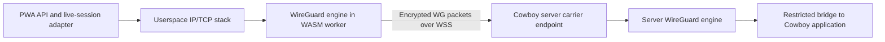

# Browser userspace WireGuard for Cowboy

Research date: 2026-10-03. Scope: the PWA owns its Cowboy tunnel without an
installed VPN client, on an already reachable LAN. No production implementation
or activation is included. This updates the PWA conclusion in the
[native transport investigation](wireguard-transport.md).

## Conclusion

A normal browser can run WireGuard's cryptography and protocol in WebAssembly.
It cannot create a system TUN interface or send raw UDP through ordinary web
APIs. A browser-compatible carrier and an application-local network stack bridge
that gap. The server can accept that carrier itself, so a separate relay network,
VPN control plane, discovery service or NAT traversal system is unnecessary for
Cowboy's directly reachable client/server topology.

The earlier conclusion that a PWA necessarily needs an installed VPN client was
too narrow: it applies to using system routes, not to a userspace tunnel inside
the page. This browser tunnel carries the application's own traffic; it does
not become a VPN for other applications.

## Existing implementations and browser transport

Tailscale's SSH Console runs its client, WireGuard, gVisor network stack and SSH
client in WASM. It carries encrypted WireGuard traffic through WebSocket-enabled
DERP. This is evidence that browser-local WireGuard works; Cowboy does not need
the surrounding Tailscale coordination system. [Tailscale engineering account](https://tailscale.com/blog/ssh-console).

NetBird's Browser Client likewise runs `wireguard-go` in WASM, with WebSocket
relay transport and SSH/RDP protocol bridges. Its documented packet path includes
inner TCP, WireGuard, relay frames, WebSocket and outer TLS. These are Go-based
browser implementations; IronRDP's Rust module is the RDP client, not NetBird's
WireGuard engine. [NetBird architecture](https://docs.netbird.io/manage/peers/browser-client/architecture).

| Carrier | Applicability to Cowboy |
| --- | --- |
| Direct raw UDP | Unavailable to an ordinary PWA. Chrome Direct Sockets is an Isolated Web App capability, not a portable PWA API. |
| WSS binary messages | Recommended first experiment: one complete WireGuard packet per binary message, using an endpoint on the Cowboy server. TCP ordering can delay all inner connections under packet loss. |
| WebTransport datagrams | Worth a later comparison: preserves datagram semantics over HTTP/3, but requires a WebTransport server and explicit packet-size handling. It cannot talk directly to a standard WireGuard UDP listener. |
| WebRTC data channel | Possible carrier, but adds signaling and the WebRTC/ICE/DTLS/SCTP stack. It adds work without a demonstrated need for this LAN topology. |

These carrier choices are an architectural recommendation, not measured Cowboy
performance results. [Chrome Direct Sockets](https://developer.chrome.com/docs/iwa/direct-sockets),
[WebTransport specification](https://www.w3.org/TR/webtransport/).
Safari added WebTransport in **26.4**; blanket claims that Safari cannot support
it are outdated. Target Safari/PWA versions still require real-device validation.
[WebKit release notes](https://webkit.org/blog/17862/webkit-features-for-safari-26-4/).

## Rust candidates and local compilation evidence

The [compilation receipt](experiments/browser-wireguard-2026-10-03.json) records
checks using Cowboy's pinned Rust **1.98.1**, extended with the
`wasm32-unknown-unknown` standard library through the same pinned Nix inputs.
All probe crates and dependency patches were temporary; Cowboy's Cargo files
and deployed artifacts were not modified.

| Candidate | Evidence | Assessment |
| --- | --- | --- |
| GotaTun 0.9.2 | Native interoperability was already demonstrated. The upstream crate fails the browser target because `sleepyinstant` has no WASM backend; a temporary clock adapter passes `cargo check`. | Preferred engine to investigate for sharing Rust with the server; browser integration needs upstream-quality adaptation and validation. |
| BoringTun 0.7.1 | The published crate has the same missing clock backend. The corresponding temporary adapter also passes `cargo check`. | Useful alternative/reference, with the same browser portability work. |
| foundation_wireguard 0.0.2 | Its source describes BoringTun + smoltcp + browser WebSocket transport and explicitly mentions patched BoringTun clocks. | Reference design only. It brings a broader mesh framework; its presence on docs.rs is not evidence of a verified standalone browser package. |
| wireguard-go in Tailscale/NetBird | Published browser implementations with application protocol bridges. | Strong feasibility evidence; adopting their complete clients would import unrelated platform machinery. |

The Rust probes enabled `getrandom`'s browser backends and `ring`'s browser
support. GotaTun used `default-features = false, features = ["ring"]`, avoiding
its default AWS-LC backend. Both unmodified crates then failed with `E0433` at
`inner::Instant` in `sleepyinstant/mod.rs`. The experimental changes were:

1. Supply `web_time::Instant` as the WASM clock backend.
2. Use `web_time::SystemTime` for the handshake timestamp on WASM, instead of
   `std::time::SystemTime`.
3. Add `web-time = 1.1.0` only for the WASM target.

`cargo check` passed for both adapted crates. This is **type-check evidence**;
it is not a linked/browser-executed tunnel or an audit. Clock behavior after
suspension, wall-clock changes, RNG operation, timers/rekeying and cryptographic
interoperability must be exercised in an actual browser. Test-only mock clocks
are not a production solution.

Source references: [GotaTun manifest](https://github.com/mullvad/gotatun/blob/ad58de51e859f458384fe4759eabdff478a6b133/gotatun/Cargo.toml),
[GotaTun clocks](https://github.com/mullvad/gotatun/blob/ad58de51e859f458384fe4759eabdff478a6b133/gotatun/src/sleepyinstant/mod.rs),
[BoringTun clocks](https://github.com/cloudflare/boringtun/blob/051c9d47dc9c5cb36e461b7d36dcd673820dc98b/boringtun/src/sleepyinstant/mod.rs),
[foundation browser module](https://docs.rs/foundation_wireguard/0.0.2/foundation_wireguard/wasm/index.html),
[web-time](https://docs.rs/web-time/1.1.0/web_time/).

## Proposed Cowboy path

The same server owns the WSS endpoint and terminates WireGuard. A WebSocket
adapter here is a data-plane ingress, not a distributed relay/control service.
It can feed the userspace engine directly, without creating system interfaces
or changing host routes. A separate implementation experiment must establish
that path; the earlier native TUN probe does not test it.

A proposed browser profile would identify a carrier such as
`wss://cowboy.example.com/api/transport/wireguard`, the pinned server public key,
the browser-owned private key and static inner addresses. A hostname or IP is
possible, subject to the browser's TLS certificate validation. `host:51820`
alone describes a native UDP endpoint and is insufficient for an ordinary PWA.
These are design fields, not accepted Cowboy configuration today.

Each server still needs a small local list of authorized peer keys/addresses,
and each browser needs a trusted server key. Manual/static provisioning is
sufficient for the first experiment. Bind peer authority to Cowboy's existing
account/device authentication before any application dispatch. This does not
require central enrollment, address allocation, discovery or mesh management.

## Application integration and trust boundaries

WireGuard transports IP packets. Reusing Cowboy's HTTP and live WebSocket
protocols therefore needs a userspace IP/TCP stack (for example smoltcp), plus
HTTP/WebSocket adapters. Sending arbitrary JSON through an encryption primitive
and calling it WireGuard would not establish a normal WireGuard IP tunnel.

Browser-native `fetch` and `new WebSocket` continue using the browser network
stack. They do not inherit routes from WASM. Current integration points include:

- `web/device-proof.js`: signs same-origin API requests, then calls native fetch.
- `web/src/store.ts`: opens the product sync socket using native WebSocket.
- `web/src/auth/authApi.ts`, `passkeyFlow.ts` and `nativeOidcFlow.ts`: HTTP and
  auxiliary WebSocket authentication paths.
- `web/public/sw.js` and protected image/file requests: separate fetch contexts
  and lifecycles that must not accidentally bypass the selected transport.

A transport facade must cover protected API calls, live sessions, streaming
responses, attachments and cancellation while preserving the existing protocol
and reconnect behavior. A service worker can intercept fetches, but it does not
supply a general replacement for the browser WebSocket stack or a permanent VPN
process. Place the tunnel in a worker with explicit page lifecycle handling;
background suspension and multiple tabs need dedicated tests.

PWA delivery, installation, bootstrap and the outer WSS carrier retain HTTPS.
If the inner service is also HTTPS/WSS, its TLS client and certificate validation
must run through the userspace socket adapter; native browser TLS cannot simply
be attached to an arbitrary WASM TCP socket. The research does not authorize
removing HTTPS or weakening application authentication to simplify this bridge.

HttpOnly cookies cannot be read into a JavaScript/WASM HTTP client. A design
using the authenticated outer WSS handshake must deliberately bind that
connection's server-verified principal, device and WireGuard peer to inner
requests. It must preserve authorization, proof/replay checks, expiration and
revocation; caller-supplied identity or forwarding headers are insufficient.

The existing Option 1 P-256 key is a non-exportable WebCrypto key. These Rust
WireGuard engines instead use private-key bytes in WASM memory. Do not describe
that key as equivalently non-exportable or reuse the application's signing key.
Key persistence and trusted server-key provisioning need explicit design.
Furthermore, the origin delivering the PWA/WASM remains trusted: WireGuard
cannot protect the user from malicious replacement application code served by
that origin. An outer proxy that only forwards packets need not decrypt the WG
payload, but a proxy also controlling application delivery has a different trust
position.

## Next bounded experiment

Build a standalone browser fixture with a WASM peer, WSS carrier and native
server peer; no Cowboy production integration is needed for this experiment.
Verify a real handshake, bidirectional IP payloads, wrong-key rejection, replay
rejection, peer removal, rekeying and recovery after the page resumes. Then send
one real Cowboy API request and one live session through the userspace stack,
including account/device proof and the cookie-to-tunnel binding.

Measure bundle/startup cost, latency, large-transfer backpressure and packet-loss
behavior; exercise Safari/PWA alongside desktop browsers. The research supports
this experiment. It does not yet establish a production-ready browser transport.
