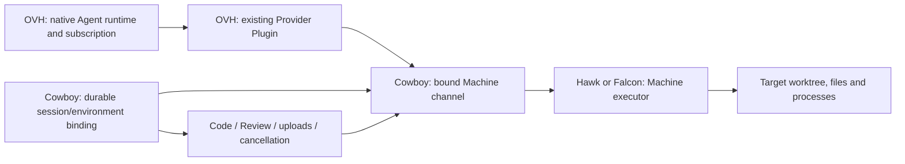

# Native execution environments

Status: Codex native remote execution activated, 2026-10-02. Its runtime and
existing authentication remain on OVH; Hawk and Falcon provide execution. See
the [production receipt](releases/native-execution-rollout-2026-10-02.json).
Claude Code Plugin 3.2.1 (native CLI 2.1.287) is also installed and active on
OVH, with target context and file/process tools. Its verification and limits are
recorded in the
[Claude rollout](releases/claude-native-execution-2026-10-02.md) and
[read-only concurrency rollout](releases/claude-tool-concurrency-2026-10-02.md). Core binding
readers were deployed on 2026-10-01. The implementation adds explicit creation
admission, a target-owned keeper, authenticated routing and a native Provider
bridge. Eighteen native-turn checks pass, including a lost actual start receipt,
35-second transport interruption, image reads and cold resume. These checks do
not establish cross-host latency or production subscription inference. The
separate public-session gate passes nine checks through actual product login, a
temporary signed Plugin and two enrolled Machines, including target edits,
Controller and target Machine restarts, and confirmed deletion while preserving
work. Its fixture Agent performs no model inference. Both gates use disposable
state and do not accept production activation. The native gate also drives the
built Codex ACP artifact through a real new session and cold load; both retain
target guidance and the original filesystem without effect replay. Receipts:
[native worker](experiments/execution-worker-2026-10-02.json) and
[authenticated sessions](experiments/execution-session-2026-10-02.json). The
public-session gate also passes with the built
[cold recovery Controller](experiments/execution-session-cold-floor-2026-10-02.json).
The [Catalog gate](experiments/execution-catalog-readers-2026-10-02.json)
accepts all six exact staged releases against the active reader bridge,
next-transaction recovery reader and built cold reader. These candidate
cold-reader results do not establish that a host has activated that recovery
configuration. See the
[rollout record](releases/native-execution-rollout-2026-10-02.md) for the
current production boundary. The existing Matrix adapter remains available for
retained sessions and unsupported Providers; existing conversations do not move
automatically. The
[Controller release receipt](releases/execution-binding-readers-2026-10-01.md)
records the activated reader revision and connected Code acceptance.

## Product outcome

The Agent runtime stays on OVH. Its model connection, native conversation,
subscription authentication and private runtime state stay with that runtime.
Hawk or Falcon supplies the task's files, shell, tools and processes. A normal
file edit and verification should require the same model-visible operations as
running the Agent beside the files. Network round trips still cost time.

The remote environment represents a real computer, including its native paths,
operating system, users, installed toolchain and services. It is not necessarily
a container or a security sandbox. A container's service manager and filesystem
must not be presented as the host's when the task concerns the actual host.
Repository tasks use target-owned isolated worktrees. Host administration uses
an explicit host-access scope; a repository binding alone does not grant it.

## Ownership decision

Cowboy must understand the environment. A Provider-only SSH wrapper would leave
Code, Review, uploads, process cancellation, reconnect and cleanup pointed at
the OVH entry repository. It would also let a resumed session silently execute
against a different target.

| Concern                                                                         | Owner                                               | Delivery                                     |
| ------------------------------------------------------------------------------- | --------------------------------------------------- | -------------------------------------------- |
| Environment identity, selection, authorization and durable session binding      | Cowboy core                                         | Controller and Machine components            |
| Authenticated routing, streams, cancellation, operation identities and recovery | Cowboy core                                         | Existing Machine transport and lifecycle     |
| Target worktree, file identity and process ownership                            | Target Machine                                      | Machine-owned execution implementation       |
| Codex environment protocol and Claude tool translation                          | Respective Agent Provider                           | Existing signed Agent Plugins                |
| Code, Review, resource views and target health                                  | Cowboy core and their existing capability consumers | Existing Web, Controller and Code boundaries |
| Physical placement and provisioned logical interfaces                           | Columbus / Stormbird                                | Machine-owned infrastructure configuration   |
| Project identities, display groups and runtime policy                           | Cowboy core                                         | Native Machine registry and Service policy    |

Do not add a separately installed SSH Plugin for these native Machines. Do not
put arbitrary process execution into `workspace_extension`: that contract is
data-only and provides bounded resource access. A future external environment
backend may become a Plugin when it has an independently useful implementation,
but it must consume the same core binding and authorization contracts and use
the existing signed lifecycle. It cannot own a second installer or supervisor.



Keep upstream protocol codecs outside core routing decisions. A reusable
executor implementation can be an owned, pinned component. Reusing Codex's
executor code does not make the target depend on an installed, authenticated
Codex Agent Plugin, and must not borrow another Plugin's private generation.

The first implementation uses a Provider-neutral Machine execution contract and
a pinned Codex execution protocol inside the Codex Provider. The target's
`components/execution-runtime/lock.json` owns the exact native executor bytes;
the Machine release owns its configuration and retention. It starts only the
native `exec-server`, in a private home without Provider authentication. An
execution-capable Provider explicitly accepts the executor digest. Neither side
reaches into an installed target Agent's private generation.

### Alternatives considered

| Approach                                          | Fit for this requirement                                                                                                                                                           |
| ------------------------------------------------- | ---------------------------------------------------------------------------------------------------------------------------------------------------------------------------------- |
| Model-authored SSH or `mx` wrappers               | Useful compatibility path; leaves routing, quoting and tool choice in each model turn. Native tools and Code can still disagree.                                                   |
| SSHFS or a synchronized local checkout            | Can help browsing, but does not move command execution, hooks, processes or services. Chatty filesystem operations and a second writable view require their own consistency model. |
| Run the whole Agent in the remote VM              | Naturally aligns its tools, but violates the requirement that the Agent runtime and model connection stay on OVH.                                                                  |
| Redirect only the shell through a sandbox hook    | Insufficient coverage: filesystem tools, image reads, guidance, checkpoints and background-task control need the same target.                                                      |
| Native session binding and Provider tool adapters | Chosen direction. Keeps one target filesystem and target-owned processes while retaining the native Agent and subscription on OVH. Requires integration and connected acceptance.  |

## Session identity and routing

The current `SessionMeta.machine_id` describes runtime placement; preserve that
meaning for existing rows and clients. Add a separately versioned execution
binding rather than relabeling that field or guessing placement from a path. The
conceptual binding contains:

```text
session / binding id / binding revision
runtime Machine / exact Provider generation / auth generation / runtime cwd
execution Machine / environment incarnation / executor contract and generation
workspace identity / target worktree identity / target cwd / access scope
```

The metadata codec is now defined in
[`src/execution_environment.rs`](../src/execution_environment.rs): schema 1
records the binding ID/revision, runtime location, target environment identity,
executor digest/protocol, workspace/worktree identity and access scope. The
session retains its existing exact Provider and authentication generations. This
is an identity record, not a Machine execution grant or worker launch contract.
Durable migrations and reader compatibility precede the first writer. Legacy
sessions resolve to their original Machine and cwd. A missing remote target or
unsupported binding must never resolve to OVH by default.

PostgreSQL migration 0053 and SQLite migration 0027 retain this independent
record. Absent fields/SQL NULL mean legacy placement; a present JSON null is an
invalid binding and stays present across metadata serialization and database
restore. Unknown versions and fields are retained without interpretation. The
PostgreSQL-to-SQLite copier carries JSON columns as documents so JSON null
cannot collapse into SQL NULL. Code read/cache scopes include the entire
recognized binding; changes to its revision, environment incarnation, executor
or worktree invalidate previous scopes even when paths match. Missing target
connections never select the runtime connection instead.

Unknown or malformed bindings refuse runtime start, adoption, configuration
replay and native event projection. Recognized bindings additionally require the
session's exact signed Provider generation to accept the executor digest and
protocol. A bound worker requires runtime wire 2; old worker fallback is
refused. New-session placement follows Cowboy’s native Machine policy.
`COWBOY_EXECUTION_RUNTIME_MACHINE` supplies only the bootstrap preference; the
saved policy becomes authoritative. Active/recovery/cold execution readers
remain a prerequisite for compatible deployment.

`POST /api/execution-sessions` persists a non-runnable preparation before
allocating the target worktree. Target preparation is session-owned and reuses
the original identity. A storage compare-and-set commits the exact binding
before launching the Agent. Controller recovery resumes that preparation; it
never switches a missing environment to local execution. Deletion confirms a
target stop before removing the session. Abandoning a pending preparation also
persists a target tombstone so a late request cannot recreate it. Worktrees and
uncommitted files are retained.

The runtime cwd is private OVH state. The execution cwd is a target-native path.
Do not make paths appear equivalent by rewriting arbitrary tool output or
mounting a second writable copy. File URLs, absolute paths, symlinks, temporary
directories and process handles retain their original environment identity.

Consumers use the same core resolver:

- Agent file and shell tools execute against the bound target.
- Code, Review, Git diff and workspace resources select its worktree and
  Machine.
- Uploaded files needed by a command are materialized in that environment;
  model-only attachments remain ordinary Service attachments.
- Artifact reads and image viewing consume original target handles.
- Runtime stop, remote command stop and environment unavailability are distinct
  states. Killing an OVH process alone is not evidence of remote cancellation.
- Restart and resume validate the existing binding and native session together.
  They do not create a fresh worktree or silently switch executors.
- Deleting a session never treats a target source root as disposable runtime
  state. Uncommitted task files survive disconnects and component upgrades.

The New Session surface selects Project, then an installed AI such as
`Claude · OVH`. Cowboy derives Local/Remote from their Machines and checks the
exact installation against the target executor. The compact summary states
where AI runs and where files/commands execute. Both creation APIs enforce the
Service policy. See [native projects](native-projects.md) for registration,
discovery, host-policy persistence, Operator commands and Matrix migration.

Projects are registered on their actual Machine; presentation labels do not
encode routes or depend on an OVH directory layout. Stormbird/Columbus own
network reachability. The Agent receives target cwd, shell, OS and guidance,
and ordinary tools need no SSH host, transfer command or routing argument.
Recommended/configuration refresh changes preferences, not existing placement.
Loading a newer Provider still validates the existing execution contract.

Bind once per session initially. A later environment-switch operation must fence
in-flight tools, retain the origin of existing jobs, replace project guidance
and advance the binding revision atomically. Each admitted tool call captures
its binding. Never implement switching with a process-global variable or assume
`cd` in one shell changes other tools.

## Provider integration

Codex `0.159.3` includes environment selection, remote filesystem and process
interfaces, target instruction loading, and `codex exec-server`. Its upstream
tests include `environments.toml` invoking `ssh ... exec-server --listen stdio`.
The candidate Cowboy Codex adapter forwards the core binding through a private
worker endpoint when starting a thread and on every turn after native resume.
This belongs to its owned source patch and signed release; core routing does not
branch on a Provider ID.

The native turn fixture establishes a more specific requirement: in `0.159.3`,
`thread.environments` is live selection, not durable conversation placement.
After a cold `thread/resume`, it is selected from process defaults. Adding an
`environments` field to that resume request does not restore it. Disable
implicit local execution for a bound worker (`CODEX_EXEC_SERVER_URL=none` in the
accepted fixture), register its one exact target, and supply the core-owned
selection on **every `turn/start`**, including the first turn after resume.
Validate this in the Provider before admitting prompts. Never infer placement
from native thread identity alone, accept user/model overrides of the binding,
or resume into the server's default local environment. This selection is
protocol metadata and requires no extra model turn.

Claude Agent SDK `0.3.284` exposes custom tools, `tools`, `disallowedTools` and
`toolAliases`; the pinned ACP adapter accepts these through session options. Use
a small file/process tool facade with familiar schemas and concise results. An
alias alone does not block harness-internal direct calls. Remove conflicting
local project tools and verify actual dispatch, including background-task tools,
search, images, notebooks and any enabled nested-agent tool path.

For Claude, audit implicit local access separately: project instructions,
settings, hooks, skills, Git context, file checkpoints and language services.
Transport aliases do not redirect these automatically. Explicitly project the
target project guidance into the session and execute project-owned hooks beside
the project. Keep Provider settings, authentication and native session history
owned by OVH. Unsupported project capabilities must be visible; they must not
read or modify the entry repository as a fallback.

The historical `2.1.286` native fixture confirmed a context problem (also
observed in retained `2.1.285`): after disabling local project tools and
settings, and appending target guidance, Claude still injects its **runtime
cwd** into a model-visible user-message environment reminder. Target tool
dispatch and target `CLAUDE.md` content do not remove this contradictory
directory. The receipt explicitly records this blocker and keeps
`remote_execution_ready: false`. A production adapter must establish a
supported, tested projection of target cwd/OS/shell/Git context before this lane
is enabled. Do not accept merely appending another routing instruction,
rewriting arbitrary model output, or disabling the failed assertion as proof of
transparent remote execution. A custom system prompt alone is not evidence that
native user-message context has been replaced. The native task can remain on
OVH; this is a Provider context integration requirement, not a reason to move it
to Hawk. The reproducible fixture separately tests a custom system prompt,
documented attachment/Git/CLAUDE.md suppression, client-composed prompts, and
client-composed prompts with that suppression. Each executes a real native tool
round trip against a scripted API; each still sends the runtime directory. The
official reminder controls do not constitute a target-environment override.

Native `2.1.287` exposes supported Mods hooks at that construction boundary. The
Claude 3.2.0 Plugin uses them for target cwd, platform, Bash, OS, Git status and
ancestor project guidance, independently of authentication/history paths. It
refuses initialization until a zero-inference probe verifies the Mod loaded.
Actual native resume and compaction are part of the worker gate. Reserved `Read`
aliases still trigger native runtime file rereads after compaction, so the
facade uses `ReadFile`, `EditFile`, `WriteFile`, `GlobFiles`, `GrepFiles` and
`EditNotebook`; ordinary operations remain one tool call. Native project hooks,
skills, subagents, plan files and implicit file attachments are disabled.
Guidance is a literal bounded snapshot of ancestor `AGENTS.md`, `CLAUDE.md` and
`.claude/CLAUDE.md`, with identical content deduplicated; automatic `@` imports,
`.claude/rules` and nested-directory instruction discovery are not implemented.
The agent can explicitly read further target guidance with `ReadFile`.

Readiness is per exact Provider generation and execution contract. A blocked
Claude lane must leave existing local sessions usable and must not prevent a
fully accepted Codex lane from being offered. Conversely, successful Codex tests
cannot authorize Claude or DeepSeek. Keep unavailable combinations disabled in
the picker with the missing capability identified before creating a session.

Subscription authentication remains with the unmodified native CLI and its
supported login flow. The executor makes no model requests and needs no model
API key. Do not replace either native runtime with a vendor Managed Agents API
or copy its credentials into the execution environment. The existing
Service-scoped authentication contract remains independently authoritative; this
design does not authorize changing its replication policy.

DeepSeek variants inherit only capabilities accepted for their exact runtime
generation and retain their separate private state. They do not borrow standard
Codex or Claude homes. Capability negotiation must fail before starting a remote
session if its Provider cannot cover the required tool surface.

## Execution contract and efficiency

Core provides an execution capability bound to one session and target; it does
not give the Provider an arbitrary destination URL, SSH command or credential.
Production traffic reuses enrolled Machine connections, with bounded streams and
independent remote process ownership. A direct SSH experiment is protocol
evidence only, not production enrollment or product authorization evidence.

The minimum contract covers reads, atomic conditional edits, search, process
start/input/output/wait/cancel and bounded artifact access. Match native output
conventions. Keep file lookup, edit validation and replacement on the target so
one model edit does not become a read/download/upload conversation. Commands are
transmitted as structured argv or an uninterpreted script body and parsed once
by the selected target shell. Preserve exit status, output order, Unicode,
binary data, stdin and bounded backpressure.

Keep a persistent execution connection. Background jobs have target-owned
handles and bounded output retention. Reconnect may query an original operation
but must not replay an uncertain write or process start. Recovering a transport
is not proof that a job or executor incarnation survived. Caller retries cannot
turn an unknown effect into a second invocation.

The exact upstream executor has a **30-second detached-session lifetime**. The
native lifetime fixture observes the original process survive a short reconnect
and a 35-second attached interval, but observes the session expire and its
process stop after 35 seconds detached. A persistent upstream WebSocket listener
alone therefore does not provide the required job lifetime. The Machine needs a
session-owned target keeper that remains attached while OVH or the Controller is
disconnected. It must outlive ordinary Controller and Machine reconnects, retain
bounded output and effect outcomes, and validate the original binding and
executor incarnation before reconnecting a Provider. Its lifecycle belongs
beside detached workers, independently of the current control connection.

Do not merely increase a timeout or open a replacement upstream session and call
that recovery. If the target keeper or executor is lost, expose that loss and
retain the worktree; surviving processes require independent ownership evidence.
The tested upstream process ID rejects duplicate and changed starts, but that
does not prove file-write idempotency, persistent execution grants, or recovery
after an executor restart. Those remain requirements of the Machine contract.

Expose one project tool surface to the model. Add environment identity outside
model-generated arguments where possible. Load guidance once and on relevant
changes; do not prepend routing instructions, connection logs or inventories to
every result. Preserve native batching and parallel reads, with every request
capturing its target. Shell syntax mistakes remain possible as they are locally.

## Delivery and acceptance

1. Verify pinned native interfaces in disposable fixtures, without production
   credentials, model inference, provider upgrades or daemon restarts. Capture
   executable identities and actual results. Separate protocol proof from
   subscription, token-cost and live-session acceptance.
2. Add the core binding readers and typed Machine execution contract, retaining
   existing local behavior. Accept restart, incarnation loss, unknown outcomes,
   bounded resources and active/recovery/cold readers before writer activation.
3. Prepare target worktrees and connect both Provider adapters through the same
   binding. Bind Code/Review, attachments, artifacts and task cancellation. Core
   must not infer successful routing from a Provider's displayed label.
4. Publish immutable Provider releases after their existing gates and install
   them on OVH through the normal lifecycle. Upgrade native Machine components
   only through their scoped maintenance path, preserving active workers.
5. Enable new remote sessions after connected acceptance. Existing Matrix/mx
   sessions retain their current behavior; their native conversations are not
   silently rebound. Offer migration only after native resume is proven.

Required comparisons use the same model, preferences, project revision and task
against local execution and the candidate environment. Include ordinary edits,
quoted/multiline contents, pinned builds, failures, background processes, target
switch races, uploads, Code/Review consistency and disconnects after effects.
Record model-visible tool calls, model round trips, input/output and cached
tokens, retries, bytes, tool latency and end-to-end time. A no-model protocol
probe cannot establish token savings or subscription billing.

Completion requires both native Providers to retain subscription authentication,
execute all project operations on the intended target, preserve native resume,
and avoid extra model turns for connection setup and transfer. Core routing and
UI must agree after restart. Missing evidence keeps remote session creation
unavailable, not partially redirected.

## Reproducible protocol probe

The following native gates use exact executable digests, fresh private homes and
a network namespace containing only loopback. The two turn fixtures serve fixed
API responses, not model inference; they neither access subscription credentials
nor spend model tokens. Their observed request counts test dispatch overhead in
the scripted sequence, not real model quality, billing or token savings.

| Gate                                                                        | Result                                    | Established behavior                                                                                                                                                                                                                                                                   |
| --------------------------------------------------------------------------- | ----------------------------------------- | -------------------------------------------------------------------------------------------------------------------------------------------------------------------------------------------------------------------------------------------------------------------------------------- |
| [Codex turn receipt](experiments/execution-codex-turn-2026-10-01.json)      | 8 checks                                  | Native patch and ordinary command affect the target, target instructions load, native conversation resumes with target selection reasserted, missing target rejects before the API, and the command is not replayed.                                                                   |
| [Claude turn receipt](experiments/execution-claude-turn-2026-10-01.json)    | 13 observations; remote readiness blocked | Native model-emitted file/shell names dispatch through MCP aliases, runtime files stay unchanged, target project guidance is explicit, disabled local calls fail, and the conversation resumes. Four alternative public context controls still leave the runtime cwd in model context. |
| [Executor lifetime receipt](experiments/execution-lifetime-2026-10-01.json) | 5 checks                                  | Duplicate starts refuse, short reconnect retains the original process, attached ownership survives 35 seconds, and a 35-second detach expires the session and stops its process.                                                                                                       |

Run these from the pinned shell using repository-owned entrypoints, supplying
the complete native binary/resource layout and a new absolute receipt path:

```text
just execution-codex-turn-conformance CLI VERSION SHA256 RECEIPT
just execution-claude-turn-conformance CLI VERSION SHA256 RECEIPT
just execution-lifetime-conformance CLI VERSION SHA256 RECEIPT
```

The fixture model identifiers select native tool metadata; they are not model
availability or entitlement checks. In particular, an unknown Codex model falls
back to metadata that may omit the native patch tool. The accepted Codex fixture
uses `gpt-6-astra` with its bundled metadata. The Claude MCP implementation here
is a deliberately small fixture, not a production file/process facade. These
gates do not establish enrolled execution transport, target keeper behavior,
complete implicit Claude project access, nested agents, images, uploads, native
background-task recovery, signed Provider releases or writer admission.

The Claude fixture used the Linux x64 `2.1.286` artifact from
`components/provider-runtime/lock.json`, verified against its locked SHA-512
archive integrity before extraction; the receipt records its executable SHA-256.
It was extracted into an isolated temporary directory, not installed as a Plugin
or substituted into an existing generation.

The
[native binding receipt](experiments/execution-native-binding-2026-10-01.json)
adds six checks against the exact same native executable. In a disposable
network namespace, with separate closed homes and runtime/target directories,
`environment/add` and `thread/start` retain both locations, load only the
target's `AGENTS.md`, refuse an unknown environment, and do not create global
`environments.toml`. There is no model turn or production authentication. The
native response's top-level `cwd` still describes the runtime; consumers must
use `thread.environments` for execution placement. These checks do not prove
native resume: a thread without a materialized conversation cannot establish
warm or cold conversation recovery.

Run
[`tools/execution_environment_native_probe.py`](../tools/execution_environment_native_probe.py)
inside `unshare --user --map-current-user --keep-caps --net`, enabling only
loopback. Supply the complete native executable/resource layout with
`--native-cli`, its exact `--version` and `--sha256`, and a new absolute
`--receipt` path. It refuses ordinary host networking and inherits no runtime
credentials. This complements the cross-host executor probe below; it does not
exercise an enrolled Cowboy Machine channel or a Provider release.

The [2026-10-01 receipt](experiments/execution-environments-2026-10-01.json)
records two successful runs with the probe process on OVH and native Codex
`0.159.3` execution on each target. Both passed all eight checks, including the
observed target hostname and fixture cleanup. These are small metadata RPCs on
one persistent connection, not Agent task timings or a general network SLA:

| Route                      | Median of 10 sequential metadata requests | Wall time of 10 pipelined metadata requests |
| -------------------------- | ----------------------------------------- | ------------------------------------------- |
| OVH to Hawk                | 402 ms per request                        | 711 ms for the batch                        |
| OVH through Hawk to Falcon | 405 ms per request                        | 722 ms for the batch                        |

The earlier Matrix/SSH command measurements used a different operation and are
not a controlled speedup comparison. Model-visible turns and token usage have
not been measured for this candidate. Claude tool dispatch and subscriptions are
not exercised by these executor probes.

Two packaging/identity observations affect the production contract. Copying the
Falcon executable alone reported `executorVersion: 0.0.0`, despite `--version`
printing `0.159.3`; retaining the original `codex-package.json` and `bin` layout
fixed the handshake. The version check was not weakened. Also, both hosts
reported the same upstream `providerId`, which describes a build rather than
Cowboy Machine identity. Neither that field nor a displayed version is target
authorization or an exact executable digest. The Falcon binary/metadata fixture
was temporary and has been removed; it was not a complete Plugin installation or
a sandbox-runtime acceptance test.

[`tools/execution_environment_probe.py`](../tools/execution_environment_probe.py)
accepts an explicit executor command after `--`. It creates only a uniquely
named temporary fixture, verifies file bytes, structured argv, stdout/stderr, a
nonzero exit, shared file/process cwd, stdin, background cancellation, error
isolation and pipelined reads, and removes its fixture. The current fixture uses
NixOS Linux tool paths. Invoke it from the pinned project shell:

```sh
nix develop -c python3 tools/execution_environment_probe.py \
  --receipt /tmp/execution-probe.json --expected-host hawk \
  -- /absolute/path/to/pinned/codex exec-server --listen stdio
```

The command can instead be an already authorized SSH stdio invocation. This
probe does not enroll a Machine, create a Cowboy session, install or upgrade a
Plugin, modify authentication, or ask a model to perform work. Its receipt
explicitly excludes subscription, token-cost, reconnect and Cowboy integration
acceptance. The executable digest must be checked separately when transporting
the executable for a disposable target probe.

## Sources

- [Core requirements](requirements.md) and
  [core/Plugin ownership](plugin-spatiotemporal-design.md)
- [Existing ACP transport](architecture/01-acp-transport.md)
- [Workspace extension boundary](workspace-extensions.md)
- [Matrix compatibility release](releases/matrix-workspaces-2026-10-01.md)
- [Codex App Server environment interface](https://learn.chatgpt.com/docs/app-server)
- [Pinned Codex executor source](https://github.com/openai/codex/tree/rust-v0.159.3/codex-rs/exec-server)
- [Pinned executor detached-session lifetime](https://github.com/openai/codex/blob/rust-v0.159.3/codex-rs/exec-server/src/server/session_registry.rs)
- [Pinned Claude SDK types](https://unpkg.com/@anthropic-ai/claude-agent-sdk@0.3.284/sdk.d.ts)
- [Claude prompt and reminder controls](https://code.claude.com/docs/en/agent-sdk/modifying-system-prompts)
- [Claude Code subscription hosting conditions](https://code.claude.com/docs/en/legal-and-compliance)
