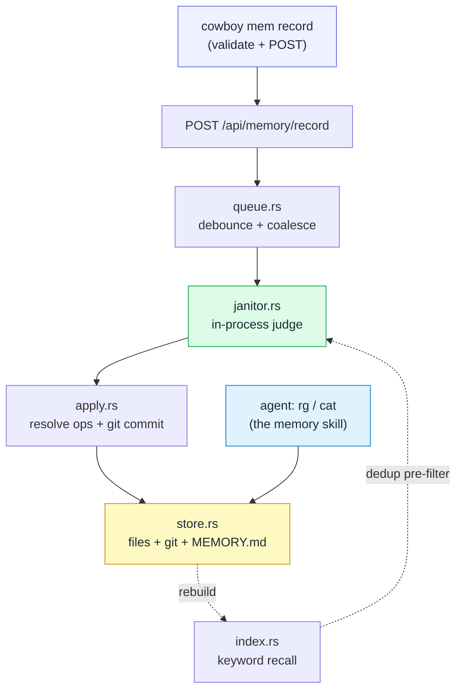

# Memory — overview

cowboy hosts the machine's **agent-memory system**: a single tiered store of
markdown facts under `~/.agents/memory`, shared by every coding agent on the
host (Claude Code, Codex, …). It is the in-process fold of **mnemosyne** (the
"p5" port) — mnemosyne used to be a separate Go daemon serving an MCP; cowboy
now owns the whole thing as a native Rust module, with **zero MCP**.

The subsystem is **off by default**. It only runs under `--memory-enabled`; with
the flag absent, cowboy behaves byte-for-byte as it did before — no store, no
janitor session, no `/api/memory/*` endpoints.

## The one idea: read and write are asymmetric

Everything below follows from a single design choice — reads and writes are
treated differently on purpose:

| | How | Why the constraint exists |
|---|---|---|
| **READ** | agents improvise `rg` / `cat` over the files | reads are cheap and safe → the constraint is a *cost*, so remove it: no daemon, no tool call, read liberally |
| **WRITE** | the validated `cowboy mem` CLI → a judging janitor | writes must stay coherent → the constraint is a *guardrail*: one judge dedups, merges, tiers, and commits so the store never rots |

A raw file edit would bypass the judge — duplicates, contradictions, a stale
`MEMORY.md` index. So the write path is deliberately narrow (a CLI that only
*proposes*) and the read path is deliberately open (plain files an agent already
knows how to grep).

## Why no MCP

mnemosyne exposed `memory_query` / `memory_record` / `memory_resolve` over two
unix-socket MCP servers. Folding into cowboy retired all of it, because:

- **Reads** don't need a tool at all — the store is plain markdown; `rg`/`cat`
  taught by a [skill](02-read-recall.md) is strictly simpler than a resident
  MCP tool definition that costs context on every turn.
- **Writes** are one local `cowboy mem record` → `POST /api/memory/record`.
- **The janitor** reads its judge's reply **in-process** (see
  [the keystone](04-janitor-keystone.md)) — the single capability that made the
  whole subsystem movable into the cowboy binary, and the reason it *had* to
  live there rather than as a separate service.

Skills + a small CLI beat MCP whenever the agent *is* the operator (a personal,
single-tenant tool with no auth boundary to enforce). Memory is exactly that.

## Module map

| Module | Role |
|---|---|
| `store.rs` | the file + git store: `Memory { name, description, mem_type, body }`, `Tier`, parse/render, read/write/list, `ensure_git_repo`, `commit`, `MEMORY.md` index generation |
| `tier.rs` | routes a proposal (caller cwd-slug) to its target tier — machine or a specific project |
| `index.rs` | a keyword index for cheap recall + dedup pre-filter (`query`, `best_duplicate`) |
| `queue.rs` | a debounce queue: batches proposals, fires a wake callback on coalesce |
| `janitor.rs` | the in-process judge session — builds the prompt, reads the reply, parses ops |
| `apply.rs` | the resolve-op applier: write / archive / move + one git commit |

## Where to go next

- [Store, tiers, and frontmatter formats](01-store-tiers-formats.md)
- [Reading: recall and the index](02-read-recall.md)
- [Writing: the CLI, the queue, and debounce](03-write-path.md)
- [The janitor and the in-process keystone](04-janitor-keystone.md)
- [Lifecycle, deploy, and lessons](05-lifecycle-deploy-lessons.md)
