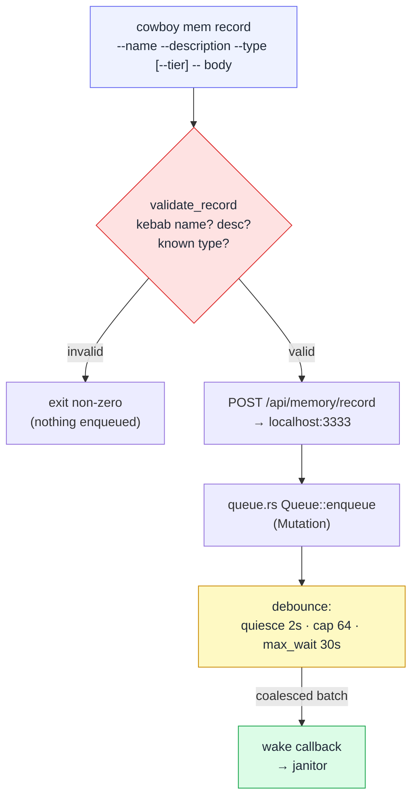

# Writing: the CLI, the queue, and debounce

Writing is the guarded half. An agent never edits a memory file; it **proposes**
one and a judge decides what actually lands. The path from proposal to committed
file has three stages before the janitor even wakes: validate → enqueue →
debounce.



## The CLI

```
cowboy mem record --name <kebab> --description "<one-line hook>"
                  --type <user|feedback|project|reference>
                  [--tier <project-slug>] -- <body…>
cowboy mem forget <name>
```

`validate_record` runs **first, locally**: kebab-case name, non-empty
description, a known `type`, optional tier. Only if it passes does the CLI
`POST /api/memory/record` to the running daemon on `127.0.0.1:3333` (a thin
`reqwest` client). If cowboy isn't running it says so plainly. Omit `--tier` for
the machine tier; pass a project cwd-slug for a project tier. (A slug starts with
`-`, so use `--tier=-home-draven-columbus`, not `--tier -home-…`, or clap reads
it as a flag.)

`forget` `POST`s `/api/memory/forget {name}` → an `Op::Delete` that the janitor
turns into a **soft-archive** (move to `archive/`); memory is never
hard-deleted.

`record` returns immediately with *"queued for the janitor"*. It does **not**
write a file synchronously — do not `cat` the path expecting it right away; the
judge commits it seconds later.

## The queue and debounce

`queue.rs` is a debounce that turns a burst of proposals into one judged batch,
so the model runs once for many records instead of once per record.

- `Queue::new(Config, wake)` holds a `wake: Fn(Vec<Mutation>)` callback and a
  background timer thread (std `thread` + `Condvar`).
- `enqueue(Mutation)` is cheap — no model, no I/O beyond pushing to the pending
  vector — and (re)arms the timer.
- **Coalesce policy** (`Config`): fire after **2s** of quiescence (no new
  proposal), or immediately at a **cap of 64** pending, or after a hard
  **max_wait of 30s** even under a steady stream. Whichever trips first hands
  the whole pending vector to `wake` as one `Vec<Mutation>`.

A `Mutation { op, memory, slug, cmid }` carries the proposed `Op` (Add / Delete),
the `Memory`, and the target `slug` (empty = machine tier).

## Crossing into async

`Queue`'s callback is **synchronous** (it runs on the timer thread); driving the
janitor is **async** (it sends a prompt and awaits a turn). cowboy bridges the
two with a `tokio::mpsc` channel: the wake callback just `tx.send(batch)`, and a
spawned async task `rx.recv().await`s each batch and runs the
[janitor](04-janitor-keystone.md). The endpoint, the queue, and the janitor task
are all wired in `serve()` only when `--memory-enabled` — see
[lifecycle](05-lifecycle-deploy-lessons.md).
