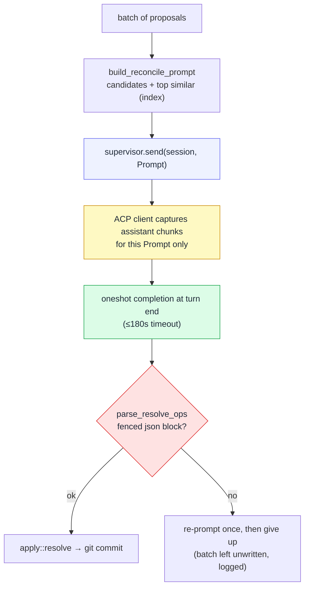

# The janitor and the in-process keystone

The janitor is the judge that turns proposals into committed files. It is an
ordinary cowboy **agent session** (a Codex CLI, by default) marked `system`.
What makes memory able to live *inside* the cowboy binary — rather than as a
separate MCP service — is one capability: cowboy reads that session's reply
**in-process**. That is the keystone.

## Why in-process reply reading is the whole game

mnemosyne's janitor was an MCP client: cowboy woke it, and it called a
`memory_resolve` **tool** back over a socket to write. To fold memory into
cowboy, the judging session's *decision* had to be readable without any tool
round-trip. cowboy already runs the session and owns its event log, so it can:

1. send the session a prompt,
2. wait for that turn to finish,
3. receive the exact turn's assistant text through its completion channel,
4. parse the decision and apply it itself.

No MCP, no socket, no tool the model has to remember to call. The judge just
*answers*, and cowboy acts on the answer.



## `wake_and_read` — the mechanism, exactly

```
(tx, rx) = oneshot()
supervisor.send(session, Prompt(blocks, completion=tx))
reply = timeout(180s, rx)
return error if the turn failed or reply is empty
```

Two details make this robust:

- **Turn-scoped capture.** `AgentCommand::Prompt` carries a one-shot sender. The
  ACP client captures assistant chunks only while that exact prompt is active,
  so bounded hot history, reconnects, and old `TurnEnd` rows cannot truncate or
  contaminate the reply.
- **Failure is explicit.** A failed/cancelled prompt completes the channel with
  an error. The reconcile loop retries the same coalesced batch three times with
  backoff before leaving it unwritten and logging an exhausted-batch error.

An empty reply, a parse failure, or a timeout each leaves the batch **unwritten**
and logged — the janitor never panics and never writes a half-understood
decision.

## The reconcile prompt

`build_reconcile_prompt` renders each candidate (op, tier, name, type,
description, body) **plus** the top similar existing memories pre-retrieved from
the [index](02-read-recall.md) (`best_duplicate` + `query`), so the judge dedups
with **no tool call of its own**. The critical instruction: `write` is the
**default** for a non-duplicate candidate, and an empty `[]` reply *discards*
every candidate. Without that framing, Codex reads "reconcile / merge as
warranted" as "nothing warranted → `[]`" and silently drops new memories — the
tool affordance that used to nudge it (`memory_resolve`) is gone, so the prompt
must carry the obligation. (See [lessons](05-lifecycle-deploy-lessons.md).)

## The resolve-ops protocol

The judge must reply with **only** a fenced ` ```json ` block: an array of ops.

```json
[
  { "kind": "write", "tier": "machine",
    "memory": { "name": "…", "description": "…", "type": "project", "body": "…" } },
  { "kind": "archive", "from": "projects/-home-draven-columbus/memory", "name": "old-dup" },
  { "kind": "move", "from": "machine", "tier": "projects/x/memory", "name": "misfiled" }
]
```

- `write` needs `tier` + `memory`; `archive` needs `from` + `name`; `move` needs
  `from` + `tier` + `name`. A tier is a store-relative string (`machine`,
  `archive`, `projects/<slug>/memory`).
- `parse_resolve_ops` extracts the first fenced block and `serde_json`-decodes it
  into typed `ResolveOp`s. No block → error → **re-prompt once** ("emit ONLY the
  json block"); still no block → give up, batch unwritten.

## The tidy pass

A 12-hour timer runs a conservative housekeeping prompt (`build_tidy_prompt`):
survey the store, condense episodic notes, soft-archive clearly-stale memories.
Same in-process read + resolve-ops apply; when unsure, it leaves things alone.
This is how the store slowly stays tidy without any agent explicitly curating it.
