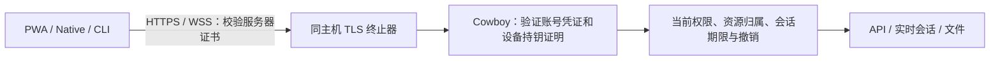

# 安全连接：先完成 Option 1，Option 2 保留为 roadmap

决策日期：2026-10-03。**当前唯一交付方案是 Option 1：强制 HTTPS/WSS、
账号认证和设备持钥证明。Option 2 暂不进入产品实现、配置或部署。**
内网部署也使用同一安全基线；Cowboy 不依赖 Stormbird 或 VPN 才能安全运行。

本文收敛产品方向与验收范围。当前协议细节见
[设备认证与 HTTPS](device-transport-security.md)，既有生产交付见
[Option 1 发布记录](releases/device-transport-security-2026-10-03.md)。
通信和安全仍属于 [Cowboy 核心](plugin-spatiotemporal-design.md)，不进入 Plugin 生命周期。

## 1. Option 1 的安全模型

| 边界 | 必须满足 |
| --- | --- |
| Device 验证 Server | 平台验证证书链、有效期及 hostname/IP；不跳过 TLS 验证 |
| Server 验证 Device | 验证绑定公钥的签名；拿到 cookie/token 或公钥本身不足以访问 |
| Server 验证账号 | 正常登录/授权、未禁用的账号、有效会话或 sender-constrained credential |
| 每次业务操作 | 检查当前权限、对象归属和敏感操作的 recent-login 要求 |
| 连接存续期间 | 保留过期、注销和撤销检查；重新连接不恢复已撤销授权 |
| 内网与公网 | 相同的认证基线；IP 属于内网不是免认证条件 |

HTTPS 负责链路加密和服务器身份。设备签名负责向 Server 证明客户端持有绑定私钥；
它不是 mTLS，也不是另一套自定义链路加密算法。

PWA 使用 origin 内的非导出 WebCrypto P-256 私钥，Server 保存其公钥与账号
cookie 哈希的绑定。CLI/ACP 保留 Ed25519 设备授权与凭证轮换；Manager 保留
其 Keychain P-256 身份。不会为了统一名称而迁移或混用这些私钥。
Server TLS 私钥属于证书终止器，客户端通过平台 TLS 信任机制验证，无需手动向
每台 Device 注册 Server 的 TLS 公钥。

PWA 的设备身份表示浏览器 profile，不是硬件 attestation。Service 运营者、
主机以及提供前端代码的 origin 仍在信任边界内；非导出密钥不能消除 XSS，
也不能承诺业务数据对 Server 保密。

## 2. HTTPS 部署与 PWA 交付是一条完整链路

PWA 首次加载、登录、JS/WASM/Service Worker 更新、API、附件与 WebSocket
都要遵守 HTTPS/WSS 部署。保留 app-shell cache、错误边界、连接状态和版本更新
机制；离线壳可显示缓存界面，不授予离线操作新的服务端权限。

部署者配置可达的 HTTPS origin、匹配的证书与同主机反向代理。代理覆盖转发头；
Controller 不相信来自远程客户端的 `X-Forwarded-Proto`。当前本机 IPC、
health/metrics 与 Machine control 的例外继续保持精确范围，并剥离浏览器账号
cookie。不能为了方便调试把它们扩成私网免认证入口。

domain/IP 描述地址，不建立信任。使用 IP 也需要匹配该 IP、客户端信任的证书；
自签名证书若没有可信分发，不是“只输入 IP 就安全连接”的方案。
改变 origin 会影响 cookie、设备密钥存储和 Passkey；不能静默复制身份或降级。

## 3. Option 1 的验收重点

| 目标 | 验证与失败要求 |
| --- | --- |
| 真实 TLS 信任 | 浏览器开启证书验证；正确证书通过，不受信证书与错误名称被拒绝 |
| 必选安全入口 | auth-off 启动失败；远程明文和伪造转发头被拒绝；历史 bearer-only token 不可作为旁路 |
| 设备绑定 | 有效 cookie + 正确私钥通过；复制 cookie、错误 key、无 proof 被拒绝 |
| 防重放 | 签名绑定方法、路径/query、origin、epoch、时间和 nonce；重放与篡改拒绝 |
| 生命周期 | IndexedDB 跨 tab/reload 一致，Controller 重启保留绑定并更新 epoch；清空存储需要重新登录 |
| 认证路径 | 密码、Passkey、OIDC/native handoff 与管理员 cookie 都保留各自的授权要求 |
| 完整业务路径 | HTTP、WS、图片、文件、流与 SW 路径使用相应认证；失效时不能静默匿名重试 |
| 失败恢复 | 仅明确未分派的 proof 错误可自动刷新后重试；未知业务结果不重复提交副作用 |
| 持续授权 | 注销、过期、禁用、权限收回对新请求和已建立连接生效 |
| 运维 | 组件回滚可读现有安全状态，健康检查有效；Web/Controller 更新不回收 Machine-owned worker |

这张表规定持续验收范围，不等于所有平台已经验收。现有发布回执、后续精确测试
记录与实际运行版本分别提供证据；不能把单元测试、Firefox 实验或 Simulator
结果替代物理 iPhone/Safari PWA 验收。iOS 发布阻塞仍见
[Native README](../apps/native-shell/README.md)。

本次补强了 Option 1 的浏览器验收：保持证书验证开启，仅在临时 profile 信任
fixture CA，实际拒绝 HTTPS/WSS 的不受信证书和错误名称，然后完成原有登录、
设备签名、防重放、OIDC handoff 与 Controller 重启恢复。合计 22 项通过，
见 [精确测试回执](experiments/option1-browser-security-2026-10-03.json)。
这是测试与文档更新，未修改或重新部署生产认证实现。

优先修复有证据的 Option 1 缺陷并补回归。新增抽象须解决当前问题，不为尚未确定
的 WireGuard 路径提前拆分认证协议、增加模式开关或改写客户端网络层。

## 4. Option 2 roadmap：保留研究，重新打开设计问题

目标仍是可达内网中的简洁连接，用户尽可能只配置 domain/IP。Cowboy 不承担
VPN 发现、NAT 穿透、mesh、relay、系统接口/路由或中央组网 control plane。
这些是范围边界；具体产品协议、配置格式、密钥分发和发布方式尚未确定。

| 未决问题 | 恢复实施前必须回答 |
| --- | --- |
| 没有 HTTPS 时 PWA 如何首次加载 | 页面、Worker、WASM 与 SW 从哪里可信交付，首次安装与更新的信任根是什么，是否仍保留 HTTPS |
| 冷启动与信任循环 | 如果代码要先经 WG 下载，而建立 WG 又依赖这些代码，如何完成首次引导与清空缓存后的恢复 |
| 服务器身份与证书 | 只有 domain/IP 时如何可信获得 Server key；私网 CA、自签名证书与 key 轮换如何处理 |
| 浏览器传输 | 普通 PWA 的 carrier、用户态协议栈与生命周期怎样接入；不可把普通 UDP WG 地址直接当浏览器 endpoint |
| Cookie 与应用权限 | HttpOnly 会话如何与通道绑定，如何保留 CSRF、设备证明、过期、撤销与资源授权 |
| 流量覆盖 | API、实时、附件、图片、流、SW/多 tab 如何完整覆盖并避免旁路 |
| 平台与性能 | Safari/PWA、后台挂起、断线恢复、原生客户端、remote Machine 与大文件背压如何验收 |
| 升级与退出 | 公钥轮换、故障恢复、旧客户端、模式迁移、回滚及禁止降级如何落地 |

此前提出的 WSS carrier、临时 peer、内层 HTTP、固定虚拟地址、统一 transport
facade 等仅作为候选思路；本次不将它们确立为已批准的实现契约。
也不承诺 Option 2 可以移除 HTTPS，或仅填一个未知 IP 就能完成可信 PWA 引导。

已有研究资产保留：

- [Rust 与原生互操作调研](wireguard-transport.md)：GotaTun/wireguard-go 的
  8 项隔离检查，证明基本数据通道与 hostname/IP/TLS 实验可行。
- [浏览器用户态调研](browser-wireguard-transport.md)：Firefox Worker 中
  WASM WireGuard 通过 WSS 与 native peer 完成 15 项检查。
- [浏览器运行回执](experiments/browser-wireguard-runtime-2026-10-03.json)：
  使用预置 fixture 信任的 HTTPS/WSS；没有证明脱离 HTTPS 的 PWA 首次加载，
  也没有验证完整 Cowboy 应用或 Safari/物理移动设备。

Option 2 恢复实施需要先形成可评审的 bootstrap/信任模型与平台验收方案。
在此之前只保留 roadmap 和实验记录，Option 1 的交付不依赖它。
